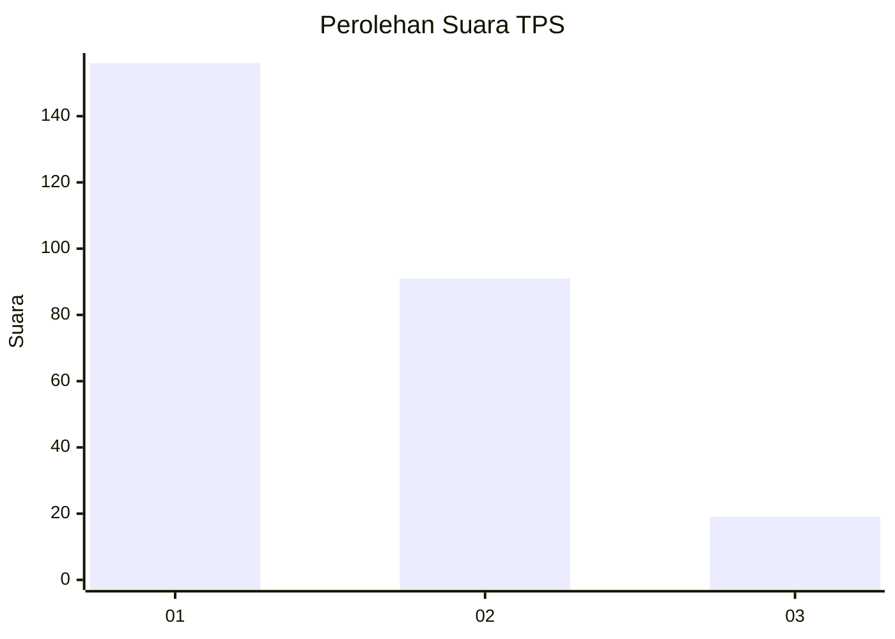
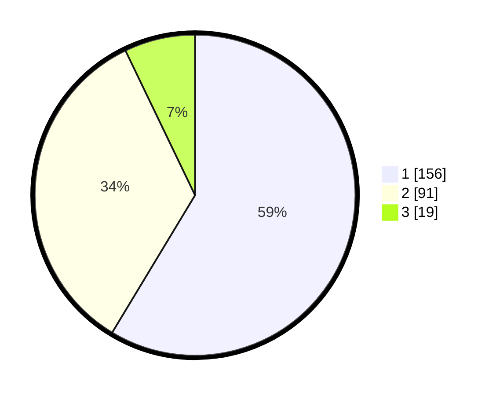

# Hasil

## Grafik

## Tabel

| No. | Nama Paslon    | Suara | Suara (raw) | Persentase |
|:--- |:-------------- | -----:| -----------:| ----------:|
| 1   | ANIES MUHAIMIN | 156   | [156][p-1]  | 58,65      |
| 2   | PRABOWO GIBRAN | 91    | [91][p-2]   | 34,21      |
| 3   | GANJAR MAHFUD  | 19    | [19][p-3]   | 7,14       |

[p-1]: https://github.com/gigit-pemilu/pemilu-2024/blob/main/pilpres/hitung-suara/sub/35-jawa-timur/sub/28-pamekasan/sub/13-pasean/sub/2005-tlonto-raja/sub/031-tps/sub/paslon-1.txt
[p-2]: https://github.com/gigit-pemilu/pemilu-2024/blob/main/pilpres/hitung-suara/sub/35-jawa-timur/sub/28-pamekasan/sub/13-pasean/sub/2005-tlonto-raja/sub/031-tps/sub/paslon-2.txt
[p-3]: https://github.com/gigit-pemilu/pemilu-2024/blob/main/pilpres/hitung-suara/sub/35-jawa-timur/sub/28-pamekasan/sub/13-pasean/sub/2005-tlonto-raja/sub/031-tps/sub/paslon-3.txt

## Foto C Plano

https://sirekap-obj-formc.kpu.go.id/3b2f/pemilu/ppwp/35/28/13/20/05/3528132005031-20240215-111947--70df48a3-2b14-4ffc-a332-1d6dbeebb34f.jpg

https://sirekap-obj-formc.kpu.go.id/3b2f/pemilu/ppwp/35/28/13/20/05/3528132005031-20240215-112105--66d2889b-044c-4f71-b895-59bcf04e2ac1.jpg

https://sirekap-obj-formc.kpu.go.id/3b2f/pemilu/ppwp/35/28/13/20/05/3528132005031-20240215-112142--65ee7f89-884e-43e1-b956-21d9acd491f9.jpg

## Metadata

| Key        | Value               |
| ---------- | ------------------- |
| Time Stamp | 2024-02-24 22:31:28 |

