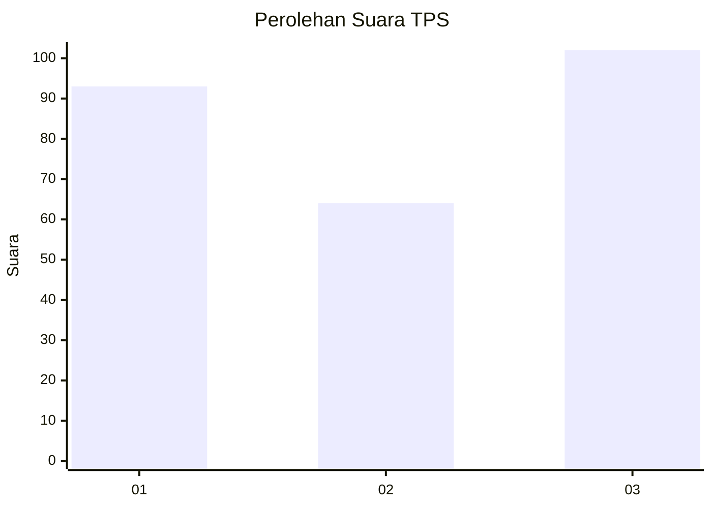
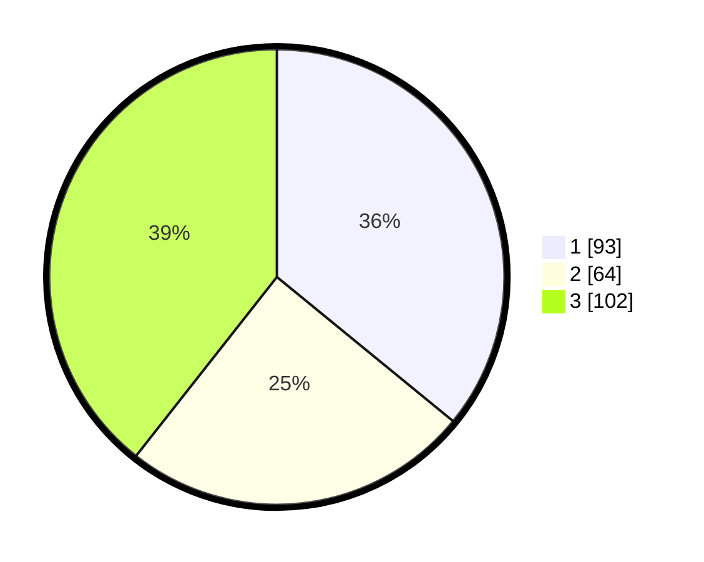

# Hasil

## Grafik

## Tabel

| No. | Nama Paslon    | Suara | Suara (raw) | Persentase |
|:--- |:-------------- | -----:| -----------:| ----------:|
| 1   | ANIES MUHAIMIN | 93    | [93][p-1]   | 35,91      |
| 2   | PRABOWO GIBRAN | 64    | [64][p-2]   | 24,71      |
| 3   | GANJAR MAHFUD  | 102   | [102][p-3]  | 39,38      |

[p-1]: https://github.com/gigit-pemilu/pemilu-2024/blob/main/pilpres/hitung-suara/sub/35-jawa-timur/sub/28-pamekasan/sub/13-pasean/sub/2005-tlonto-raja/sub/033-tps/sub/paslon-1.txt
[p-2]: https://github.com/gigit-pemilu/pemilu-2024/blob/main/pilpres/hitung-suara/sub/35-jawa-timur/sub/28-pamekasan/sub/13-pasean/sub/2005-tlonto-raja/sub/033-tps/sub/paslon-2.txt
[p-3]: https://github.com/gigit-pemilu/pemilu-2024/blob/main/pilpres/hitung-suara/sub/35-jawa-timur/sub/28-pamekasan/sub/13-pasean/sub/2005-tlonto-raja/sub/033-tps/sub/paslon-3.txt

## Foto C Plano

https://sirekap-obj-formc.kpu.go.id/66e6/pemilu/ppwp/35/28/13/20/05/3528132005033-20240214-230343--86818785-848e-4def-a369-4dee9b142098.jpg

https://sirekap-obj-formc.kpu.go.id/66e6/pemilu/ppwp/35/28/13/20/05/3528132005033-20240216-155300--3953a2d6-fbe5-4fa4-b69d-c0fea0b226a2.jpg

https://sirekap-obj-formc.kpu.go.id/66e6/pemilu/ppwp/35/28/13/20/05/3528132005033-20240214-230411--e6e14a18-ea37-41d5-a355-ffe6d11cd603.jpg

## Metadata

| Key        | Value               |
| ---------- | ------------------- |
| Time Stamp | 2024-02-17 11:30:03 |

