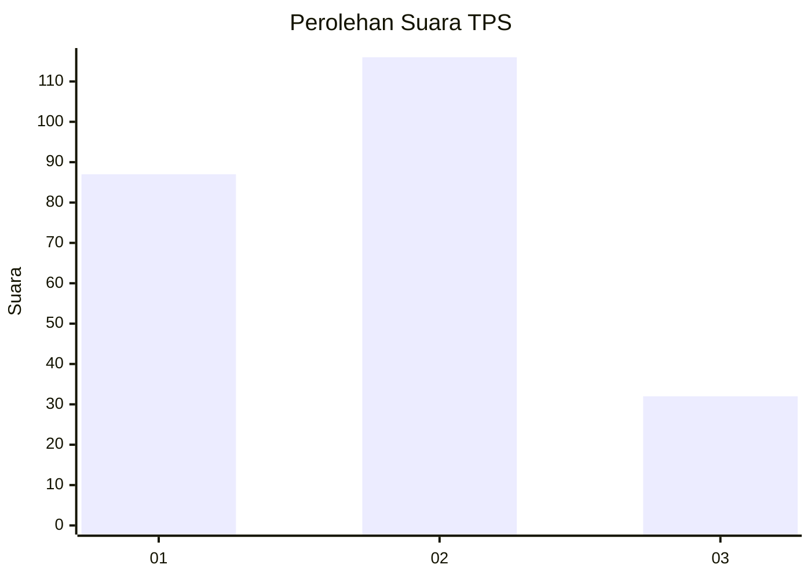
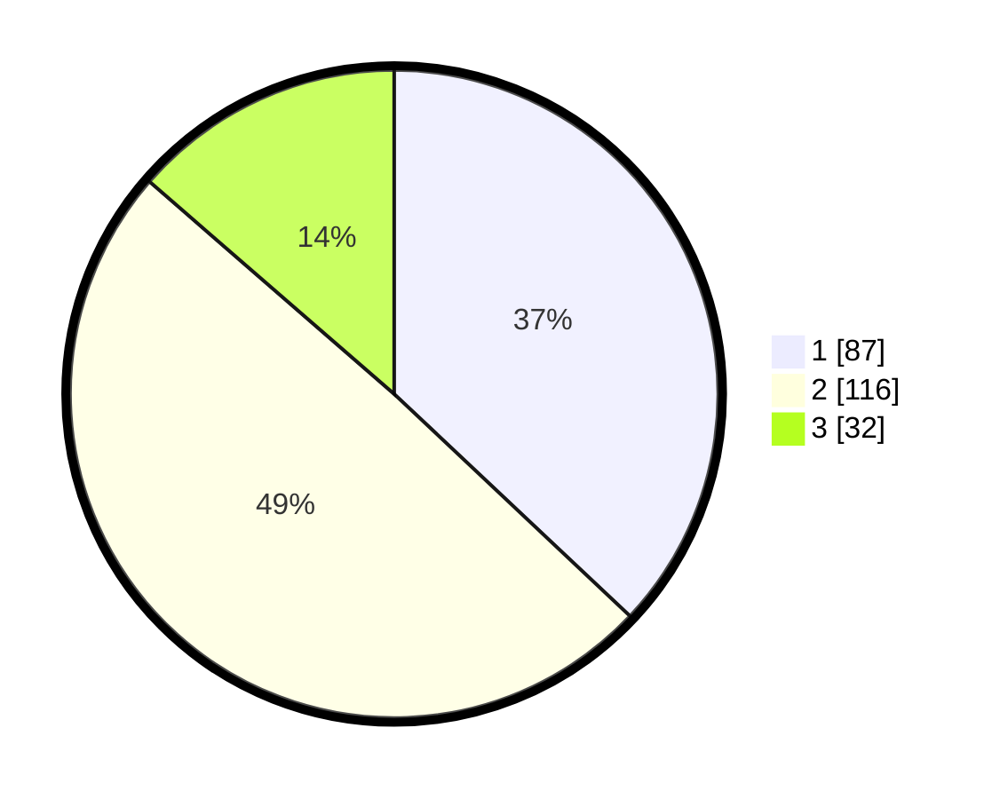

# Hasil

## Grafik

## Tabel

| No. | Nama Paslon    | Suara | Suara (raw) | Persentase |
|:--- |:-------------- | -----:| -----------:| ----------:|
| 1   | ANIES MUHAIMIN | 87    | [87][p-1]   | 37,02      |
| 2   | PRABOWO GIBRAN | 116   | [116][p-2]  | 49,36      |
| 3   | GANJAR MAHFUD  | 32    | [32][p-3]   | 13,62      |

[p-1]: https://github.com/gigit-pemilu/pemilu-2024/blob/main/pilpres/hitung-suara/sub/35-jawa-timur/sub/28-pamekasan/sub/13-pasean/sub/2005-tlonto-raja/sub/034-tps/sub/paslon-1.txt
[p-2]: https://github.com/gigit-pemilu/pemilu-2024/blob/main/pilpres/hitung-suara/sub/35-jawa-timur/sub/28-pamekasan/sub/13-pasean/sub/2005-tlonto-raja/sub/034-tps/sub/paslon-2.txt
[p-3]: https://github.com/gigit-pemilu/pemilu-2024/blob/main/pilpres/hitung-suara/sub/35-jawa-timur/sub/28-pamekasan/sub/13-pasean/sub/2005-tlonto-raja/sub/034-tps/sub/paslon-3.txt

## Foto C Plano

https://sirekap-obj-formc.kpu.go.id/c0c2/pemilu/ppwp/35/28/13/20/05/3528132005034-20240214-233501--fdca234b-f112-4923-b8a1-33b2561d9bc3.jpg

https://sirekap-obj-formc.kpu.go.id/c0c2/pemilu/ppwp/35/28/13/20/05/3528132005034-20240214-233734--d60a9189-7ff6-4f25-9a5b-697a94978e89.jpg

https://sirekap-obj-formc.kpu.go.id/c0c2/pemilu/ppwp/35/28/13/20/05/3528132005034-20240214-233910--aa49633f-5f77-472c-a778-5f29aff3453f.jpg

## Metadata

| Key        | Value               |
| ---------- | ------------------- |
| Time Stamp | 2024-02-15 19:30:26 |

