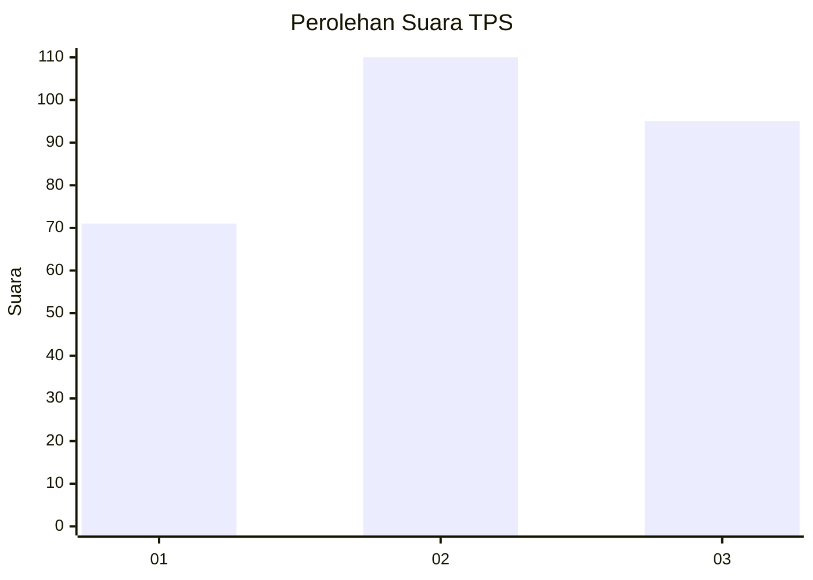
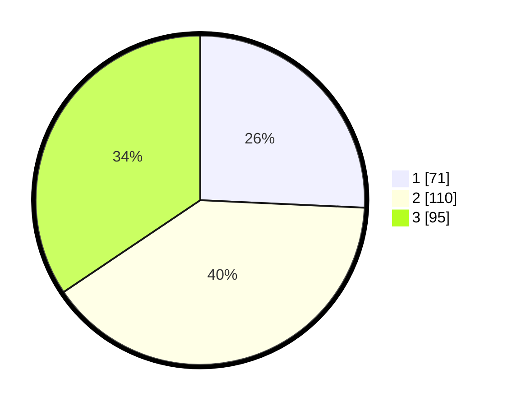

# Hasil

## Grafik

## Tabel

| No. | Nama Paslon    | Suara | Suara (raw) | Persentase |
|:--- |:-------------- | -----:| -----------:| ----------:|
| 1   | ANIES MUHAIMIN | 71    | [71][p-1]   | 25,72      |
| 2   | PRABOWO GIBRAN | 110   | [110][p-2]  | 39,86      |
| 3   | GANJAR MAHFUD  | 95    | [95][p-3]   | 34,42      |

[p-1]: https://github.com/gigit-pemilu/pemilu-2024/blob/main/pilpres/hitung-suara/sub/35-jawa-timur/sub/28-pamekasan/sub/13-pasean/sub/2006-dempo-barat/sub/002-tps/sub/paslon-1.txt
[p-2]: https://github.com/gigit-pemilu/pemilu-2024/blob/main/pilpres/hitung-suara/sub/35-jawa-timur/sub/28-pamekasan/sub/13-pasean/sub/2006-dempo-barat/sub/002-tps/sub/paslon-2.txt
[p-3]: https://github.com/gigit-pemilu/pemilu-2024/blob/main/pilpres/hitung-suara/sub/35-jawa-timur/sub/28-pamekasan/sub/13-pasean/sub/2006-dempo-barat/sub/002-tps/sub/paslon-3.txt

## Foto C Plano

https://sirekap-obj-formc.kpu.go.id/776b/pemilu/ppwp/35/28/13/20/06/3528132006002-20240215-004345--65d70e95-047b-47c4-91a7-d5f93e3dc218.jpg

https://sirekap-obj-formc.kpu.go.id/776b/pemilu/ppwp/35/28/13/20/06/3528132006002-20240214-231003--ba5f1e47-cf4c-40a6-9396-0a18747477b1.jpg

https://sirekap-obj-formc.kpu.go.id/776b/pemilu/ppwp/35/28/13/20/06/3528132006002-20240215-054013--6e9c0d53-d6ae-493a-ad12-18b1c40dd6fa.jpg

## Metadata

| Key        | Value               |
| ---------- | ------------------- |
| Time Stamp | 2024-02-24 22:31:28 |

