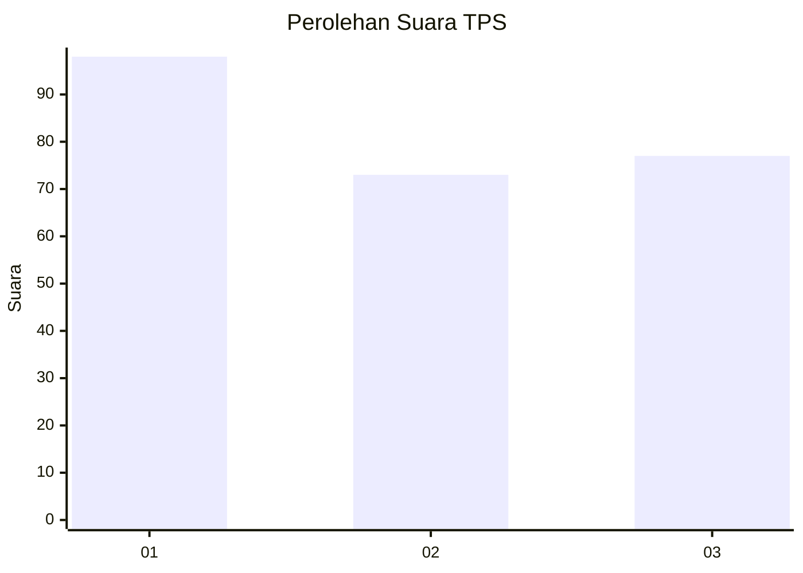
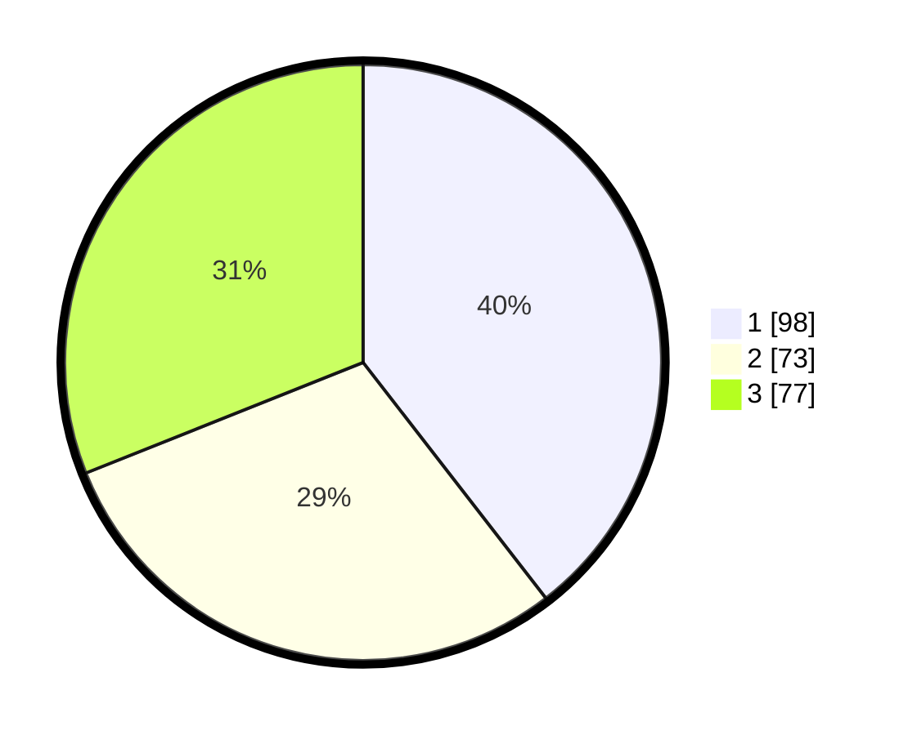

# Hasil

## Grafik

## Tabel

| No. | Nama Paslon    | Suara | Suara (raw) | Persentase |
|:--- |:-------------- | -----:| -----------:| ----------:|
| 1   | ANIES MUHAIMIN | 98    | [98][p-1]   | 39,52      |
| 2   | PRABOWO GIBRAN | 73    | [73][p-2]   | 29,44      |
| 3   | GANJAR MAHFUD  | 77    | [77][p-3]   | 31,05      |

[p-1]: https://github.com/gigit-pemilu/pemilu-2024/blob/main/pilpres/hitung-suara/sub/35-jawa-timur/sub/28-pamekasan/sub/13-pasean/sub/2006-dempo-barat/sub/003-tps/sub/paslon-1.txt
[p-2]: https://github.com/gigit-pemilu/pemilu-2024/blob/main/pilpres/hitung-suara/sub/35-jawa-timur/sub/28-pamekasan/sub/13-pasean/sub/2006-dempo-barat/sub/003-tps/sub/paslon-2.txt
[p-3]: https://github.com/gigit-pemilu/pemilu-2024/blob/main/pilpres/hitung-suara/sub/35-jawa-timur/sub/28-pamekasan/sub/13-pasean/sub/2006-dempo-barat/sub/003-tps/sub/paslon-3.txt

## Foto C Plano

https://sirekap-obj-formc.kpu.go.id/502a/pemilu/ppwp/35/28/13/20/06/3528132006003-20240214-223444--a787db91-ddd5-4e4c-94d9-f13e840f8ea7.jpg

https://sirekap-obj-formc.kpu.go.id/502a/pemilu/ppwp/35/28/13/20/06/3528132006003-20240214-191655--2e22c3fe-d5d9-4a59-bddb-29f5cb13f1d3.jpg

https://sirekap-obj-formc.kpu.go.id/502a/pemilu/ppwp/35/28/13/20/06/3528132006003-20240214-223849--6f727927-6103-431d-b0f6-8a5948c61f01.jpg

## Metadata

| Key        | Value               |
| ---------- | ------------------- |
| Time Stamp | 2024-02-24 22:31:28 |

