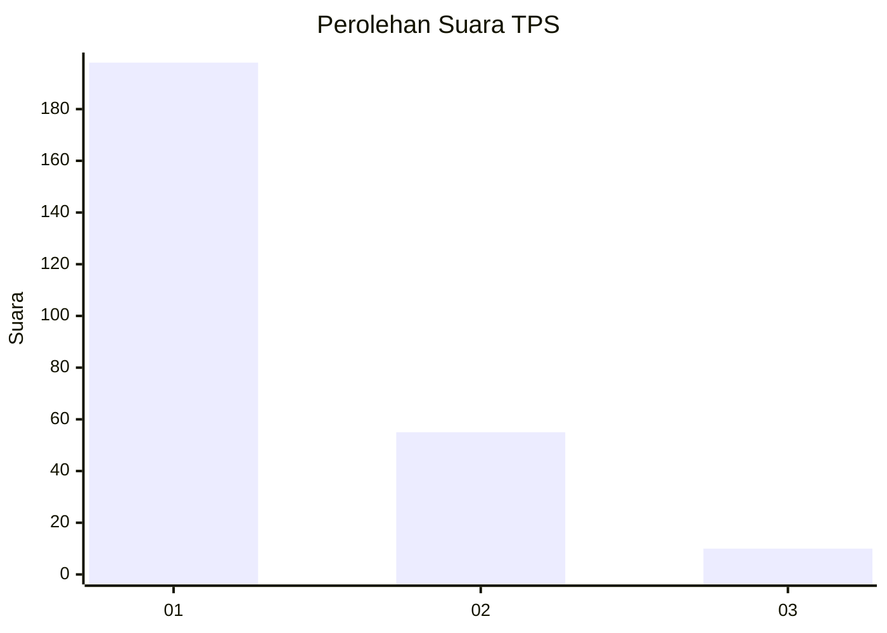
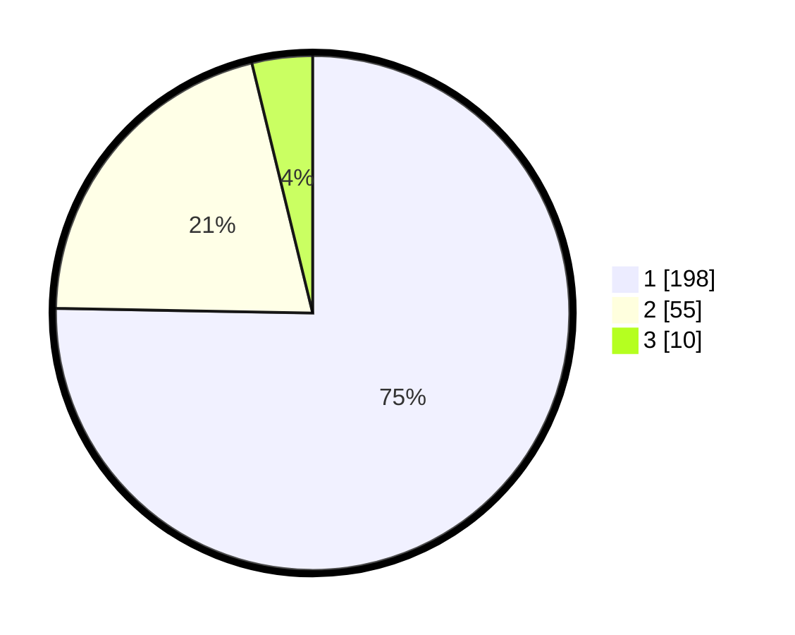

# Hasil

## Grafik

## Tabel

| No. | Nama Paslon    | Suara | Suara (raw) | Persentase |
|:--- |:-------------- | -----:| -----------:| ----------:|
| 1   | ANIES MUHAIMIN | 198   | [198][p-1]  | 75,29      |
| 2   | PRABOWO GIBRAN | 55    | [55][p-2]   | 20,91      |
| 3   | GANJAR MAHFUD  | 10    | [10][p-3]   | 3,80       |

[p-1]: https://github.com/gigit-pemilu/pemilu-2024/blob/main/pilpres/hitung-suara/sub/35-jawa-timur/sub/28-pamekasan/sub/13-pasean/sub/2006-dempo-barat/sub/005-tps/sub/paslon-1.txt
[p-2]: https://github.com/gigit-pemilu/pemilu-2024/blob/main/pilpres/hitung-suara/sub/35-jawa-timur/sub/28-pamekasan/sub/13-pasean/sub/2006-dempo-barat/sub/005-tps/sub/paslon-2.txt
[p-3]: https://github.com/gigit-pemilu/pemilu-2024/blob/main/pilpres/hitung-suara/sub/35-jawa-timur/sub/28-pamekasan/sub/13-pasean/sub/2006-dempo-barat/sub/005-tps/sub/paslon-3.txt

## Foto C Plano

https://sirekap-obj-formc.kpu.go.id/7eff/pemilu/ppwp/35/28/13/20/06/3528132006005-20240215-120456--cdd61c61-1a9a-4ba7-a62d-f10430061797.jpg

https://sirekap-obj-formc.kpu.go.id/7eff/pemilu/ppwp/35/28/13/20/06/3528132006005-20240215-120652--7b7d2fba-68bc-49f4-8a05-b5cf03c53ea6.jpg

https://sirekap-obj-formc.kpu.go.id/7eff/pemilu/ppwp/35/28/13/20/06/3528132006005-20240215-120811--8e5cffd6-a448-4fb7-8dd5-538ea7b5c0df.jpg

## Metadata

| Key        | Value               |
| ---------- | ------------------- |
| Time Stamp | 2024-02-24 22:31:28 |

