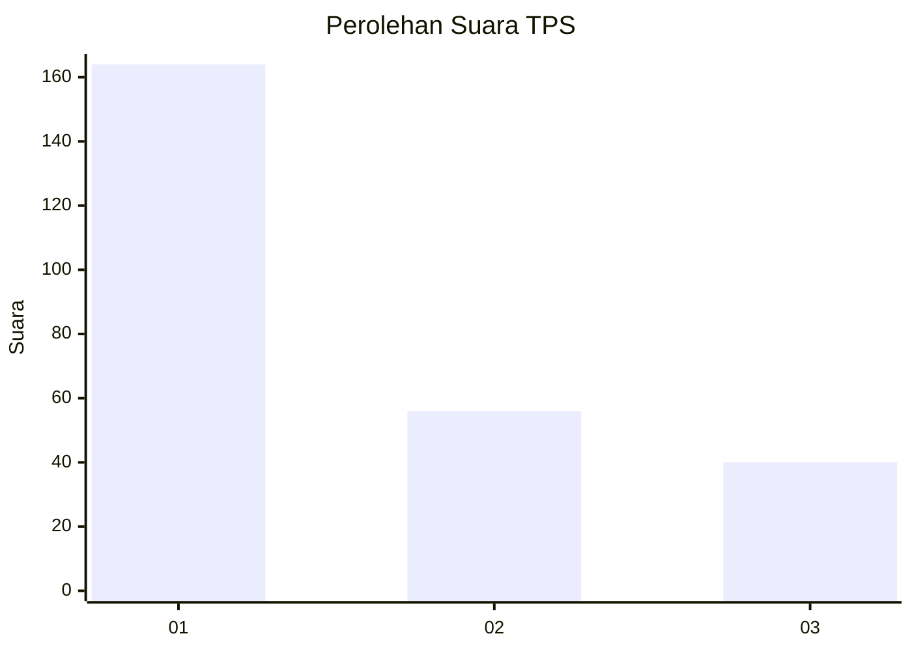
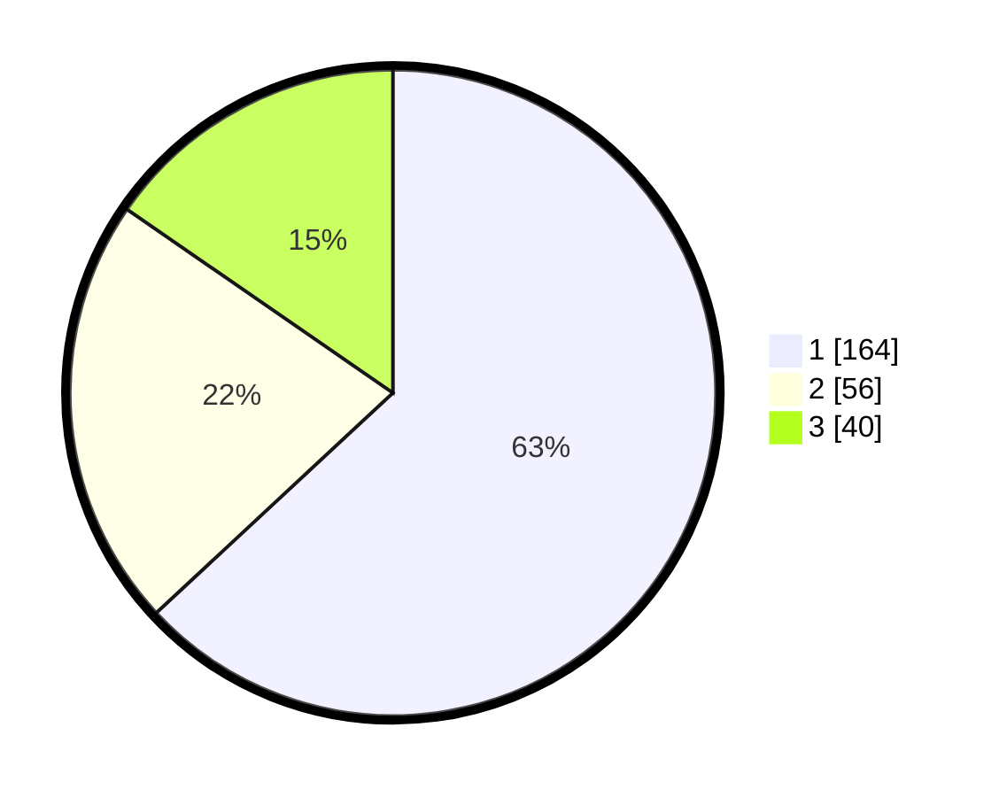

# Hasil

## Grafik

## Tabel

| No. | Nama Paslon    | Suara | Suara (raw) | Persentase |
|:--- |:-------------- | -----:| -----------:| ----------:|
| 1   | ANIES MUHAIMIN | 164   | [164][p-1]  | 63,08      |
| 2   | PRABOWO GIBRAN | 56    | [56][p-2]   | 21,54      |
| 3   | GANJAR MAHFUD  | 40    | [40][p-3]   | 15,38      |

[p-1]: https://github.com/gigit-pemilu/pemilu-2024-35-jawa-timur/blob/main/pilpres/hitung-suara/sub/35-jawa-timur/sub/28-pamekasan/sub/13-pasean/sub/2006-dempo-barat/sub/009-tps/sub/paslon-1.txt
[p-2]: https://github.com/gigit-pemilu/pemilu-2024-35-jawa-timur/blob/main/pilpres/hitung-suara/sub/35-jawa-timur/sub/28-pamekasan/sub/13-pasean/sub/2006-dempo-barat/sub/009-tps/sub/paslon-2.txt
[p-3]: https://github.com/gigit-pemilu/pemilu-2024-35-jawa-timur/blob/main/pilpres/hitung-suara/sub/35-jawa-timur/sub/28-pamekasan/sub/13-pasean/sub/2006-dempo-barat/sub/009-tps/sub/paslon-3.txt

## Foto C Plano

https://sirekap-obj-formc.kpu.go.id/0e5d/pemilu/ppwp/35/28/13/20/06/3528132006009-20240215-112749--091777a1-c857-4f2d-aabd-b114baa3b29e.jpg

https://sirekap-obj-formc.kpu.go.id/0e5d/pemilu/ppwp/35/28/13/20/06/3528132006009-20240215-113333--1469df2f-1dd8-494f-acc2-61ac2e001134.jpg

https://sirekap-obj-formc.kpu.go.id/0e5d/pemilu/ppwp/35/28/13/20/06/3528132006009-20240215-113609--fc77d946-0202-4cc7-adfd-564a57fc3f35.jpg

## Metadata

| Key        | Value               |
| ---------- | ------------------- |
| Time Stamp | 2024-02-24 22:31:28 |

