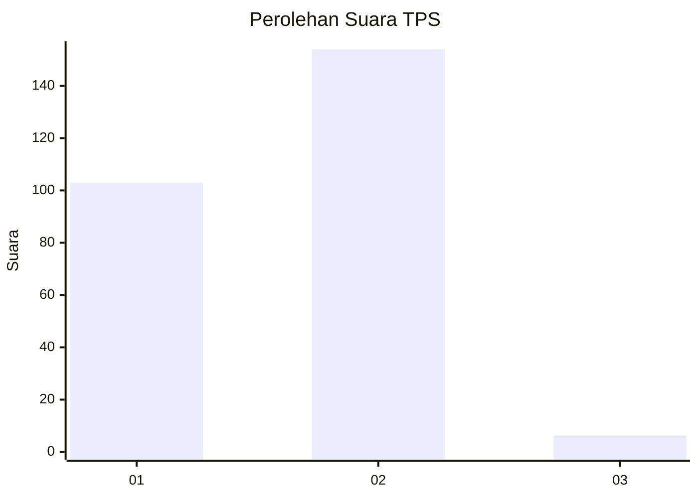
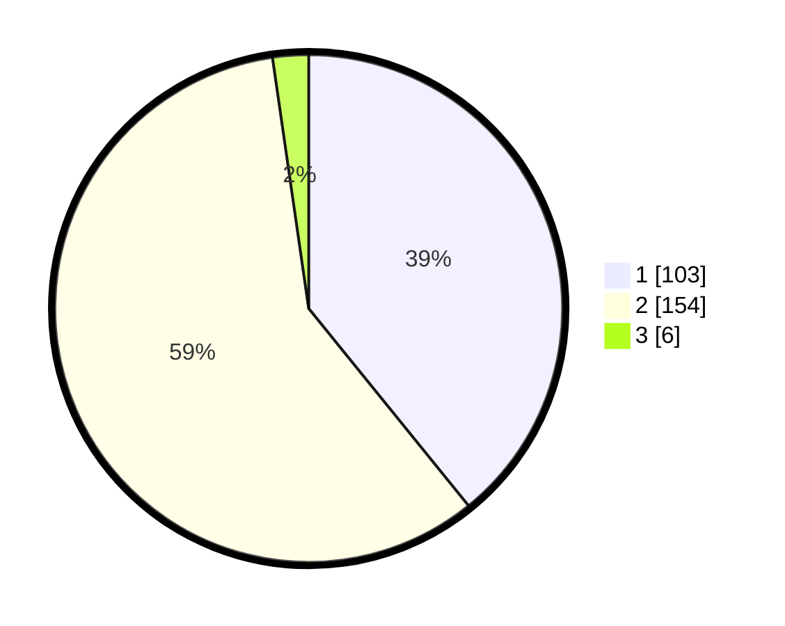

# Hasil

## Grafik

## Tabel

| No. | Nama Paslon    | Suara | Suara (raw) | Persentase |
|:--- |:-------------- | -----:| -----------:| ----------:|
| 1   | ANIES MUHAIMIN | 103   | [103][p-1]  | 39,16      |
| 2   | PRABOWO GIBRAN | 154   | [154][p-2]  | 58,56      |
| 3   | GANJAR MAHFUD  | 6     | [6][p-3]    | 2,28       |

[p-1]: https://github.com/gigit-pemilu/pemilu-2024/blob/main/pilpres/hitung-suara/sub/35-jawa-timur/sub/28-pamekasan/sub/13-pasean/sub/2006-dempo-barat/sub/011-tps/sub/paslon-1.txt
[p-2]: https://github.com/gigit-pemilu/pemilu-2024/blob/main/pilpres/hitung-suara/sub/35-jawa-timur/sub/28-pamekasan/sub/13-pasean/sub/2006-dempo-barat/sub/011-tps/sub/paslon-2.txt
[p-3]: https://github.com/gigit-pemilu/pemilu-2024/blob/main/pilpres/hitung-suara/sub/35-jawa-timur/sub/28-pamekasan/sub/13-pasean/sub/2006-dempo-barat/sub/011-tps/sub/paslon-3.txt

## Foto C Plano

https://sirekap-obj-formc.kpu.go.id/1077/pemilu/ppwp/35/28/13/20/06/3528132006011-20240214-230104--b199770a-3e78-4f38-80b4-ce0a9c79a4a7.jpg

https://sirekap-obj-formc.kpu.go.id/1077/pemilu/ppwp/35/28/13/20/06/3528132006011-20240214-230231--ff7ae27a-24cd-4fad-81ba-8f5e7acab63c.jpg

https://sirekap-obj-formc.kpu.go.id/1077/pemilu/ppwp/35/28/13/20/06/3528132006011-20240214-230353--a1735f64-cece-43be-8ba4-bd2f5b7f221a.jpg

## Metadata

| Key        | Value               |
| ---------- | ------------------- |
| Time Stamp | 2024-02-25 13:00:00 |

