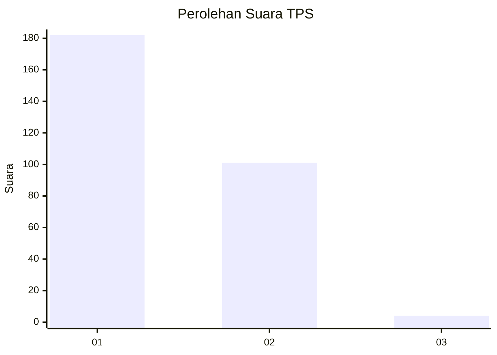
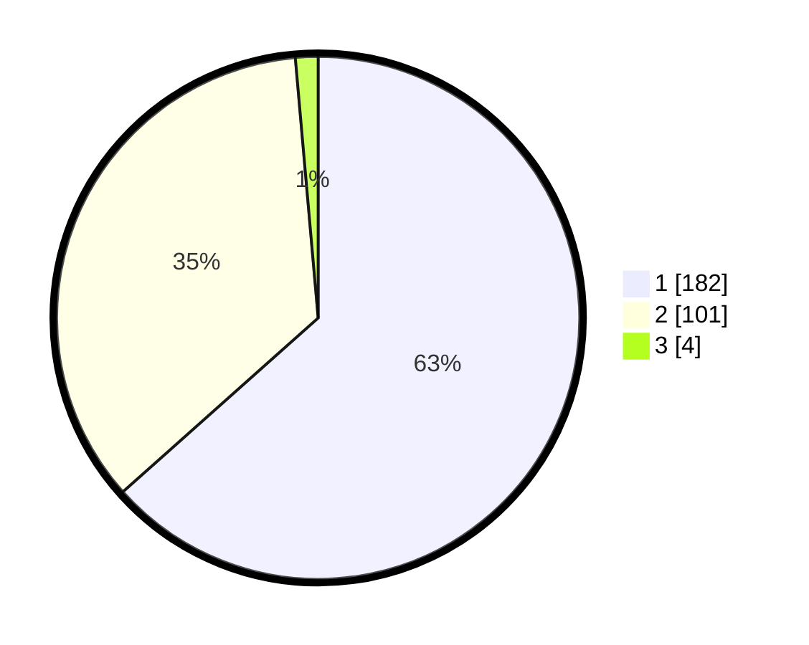

# Hasil

## Grafik

## Tabel

| No. | Nama Paslon    | Suara | Suara (raw) | Persentase |
|:--- |:-------------- | -----:| -----------:| ----------:|
| 1   | ANIES MUHAIMIN | 182   | [182][p-1]  | 63,41      |
| 2   | PRABOWO GIBRAN | 101   | [101][p-2]  | 35,19      |
| 3   | GANJAR MAHFUD  | 4     | [4][p-3]    | 1,39       |

[p-1]: https://github.com/gigit-pemilu/pemilu-2024-35-jawa-timur/blob/main/pilpres/hitung-suara/sub/35-jawa-timur/sub/28-pamekasan/sub/13-pasean/sub/2006-dempo-barat/sub/014-tps/sub/paslon-1.txt
[p-2]: https://github.com/gigit-pemilu/pemilu-2024-35-jawa-timur/blob/main/pilpres/hitung-suara/sub/35-jawa-timur/sub/28-pamekasan/sub/13-pasean/sub/2006-dempo-barat/sub/014-tps/sub/paslon-2.txt
[p-3]: https://github.com/gigit-pemilu/pemilu-2024-35-jawa-timur/blob/main/pilpres/hitung-suara/sub/35-jawa-timur/sub/28-pamekasan/sub/13-pasean/sub/2006-dempo-barat/sub/014-tps/sub/paslon-3.txt

## Foto C Plano

https://sirekap-obj-formc.kpu.go.id/c233/pemilu/ppwp/35/28/13/20/06/3528132006014-20240214-235030--02d96cd7-073b-41e8-bef9-01a2c531433f.jpg

https://sirekap-obj-formc.kpu.go.id/c233/pemilu/ppwp/35/28/13/20/06/3528132006014-20240214-235254--7ab90494-7aa0-47d2-85b8-aa08a2797cca.jpg

https://sirekap-obj-formc.kpu.go.id/c233/pemilu/ppwp/35/28/13/20/06/3528132006014-20240214-235409--40837d91-ac9d-4e6e-9838-fb2a7e475b94.jpg

## Metadata

| Key        | Value               |
| ---------- | ------------------- |
| Time Stamp | 2024-02-25 03:00:00 |

