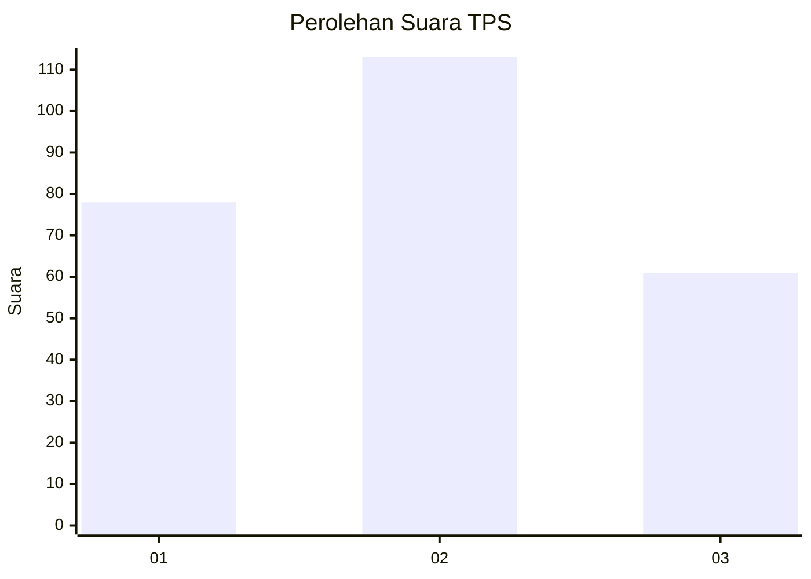
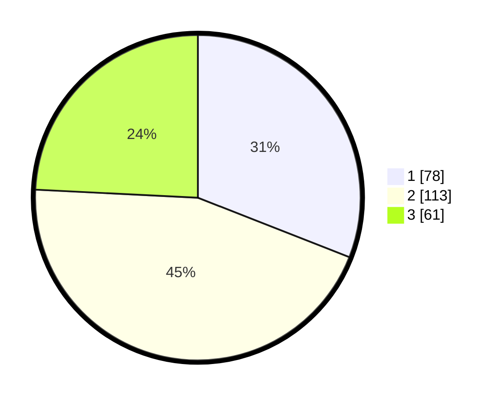

# Hasil

## Grafik

## Tabel

| No. | Nama Paslon    | Suara | Suara (raw) | Persentase |
|:--- |:-------------- | -----:| -----------:| ----------:|
| 1   | ANIES MUHAIMIN | 78    | [78][p-1]   | 30,95      |
| 2   | PRABOWO GIBRAN | 113   | [113][p-2]  | 44,84      |
| 3   | GANJAR MAHFUD  | 61    | [61][p-3]   | 24,21      |

[p-1]: https://github.com/gigit-pemilu/pemilu-2024-35-jawa-timur/blob/main/pilpres/hitung-suara/sub/35-jawa-timur/sub/28-pamekasan/sub/13-pasean/sub/2006-dempo-barat/sub/015-tps/sub/paslon-1.txt
[p-2]: https://github.com/gigit-pemilu/pemilu-2024-35-jawa-timur/blob/main/pilpres/hitung-suara/sub/35-jawa-timur/sub/28-pamekasan/sub/13-pasean/sub/2006-dempo-barat/sub/015-tps/sub/paslon-2.txt
[p-3]: https://github.com/gigit-pemilu/pemilu-2024-35-jawa-timur/blob/main/pilpres/hitung-suara/sub/35-jawa-timur/sub/28-pamekasan/sub/13-pasean/sub/2006-dempo-barat/sub/015-tps/sub/paslon-3.txt

## Foto C Plano

https://sirekap-obj-formc.kpu.go.id/5b17/pemilu/ppwp/35/28/13/20/06/3528132006015-20240214-223204--f5ad2965-434d-4730-ad62-9994f3059e0f.jpg

https://sirekap-obj-formc.kpu.go.id/5b17/pemilu/ppwp/35/28/13/20/06/3528132006015-20240214-223304--1a2f5f30-1938-4cde-a75e-6e65398533ce.jpg

https://sirekap-obj-formc.kpu.go.id/5b17/pemilu/ppwp/35/28/13/20/06/3528132006015-20240214-223404--e4331a86-cac5-43d7-bdee-bfa44611794e.jpg

## Metadata

| Key        | Value               |
| ---------- | ------------------- |
| Time Stamp | 2024-02-24 22:31:28 |

