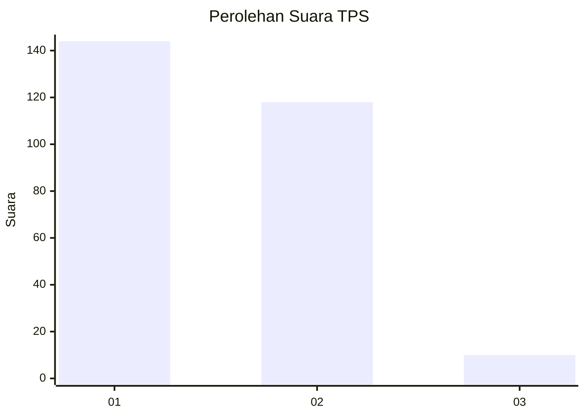
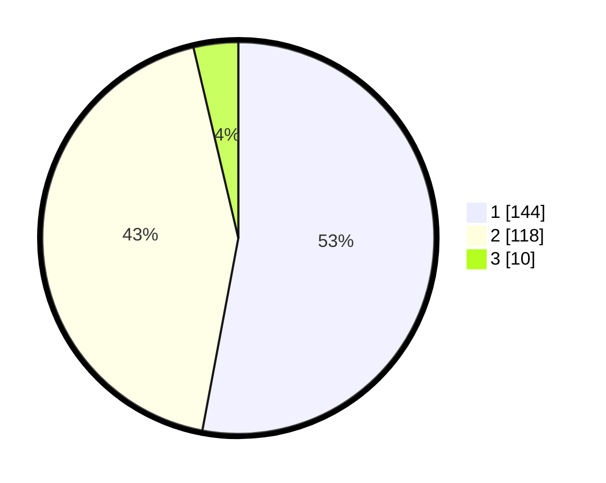

# Hasil

## Grafik

## Tabel

| No. | Nama Paslon    | Suara | Suara (raw) | Persentase |
|:--- |:-------------- | -----:| -----------:| ----------:|
| 1   | ANIES MUHAIMIN | 144   | [144][p-1]  | 52,94      |
| 2   | PRABOWO GIBRAN | 118   | [118][p-2]  | 43,38      |
| 3   | GANJAR MAHFUD  | 10    | [10][p-3]   | 3,68       |

[p-1]: https://github.com/gigit-pemilu/pemilu-2024-35-jawa-timur/blob/main/pilpres/hitung-suara/sub/35-jawa-timur/sub/28-pamekasan/sub/13-pasean/sub/2007-dempo-timur/sub/001-tps/sub/paslon-1.txt
[p-2]: https://github.com/gigit-pemilu/pemilu-2024-35-jawa-timur/blob/main/pilpres/hitung-suara/sub/35-jawa-timur/sub/28-pamekasan/sub/13-pasean/sub/2007-dempo-timur/sub/001-tps/sub/paslon-2.txt
[p-3]: https://github.com/gigit-pemilu/pemilu-2024-35-jawa-timur/blob/main/pilpres/hitung-suara/sub/35-jawa-timur/sub/28-pamekasan/sub/13-pasean/sub/2007-dempo-timur/sub/001-tps/sub/paslon-3.txt

## Foto C Plano

https://sirekap-obj-formc.kpu.go.id/5294/pemilu/ppwp/35/28/13/20/07/3528132007001-20240215-000156--ef64ed27-6a52-49c4-8a08-54cf622c9af7.jpg

https://sirekap-obj-formc.kpu.go.id/5294/pemilu/ppwp/35/28/13/20/07/3528132007001-20240215-000442--09ad15b0-954a-4624-896e-576a2a40e5b7.jpg

https://sirekap-obj-formc.kpu.go.id/5294/pemilu/ppwp/35/28/13/20/07/3528132007001-20240215-000519--04ea9c3b-e928-4bf9-a9d7-979c203fd5d0.jpg

## Metadata

| Key        | Value               |
| ---------- | ------------------- |
| Time Stamp | 2024-02-24 22:31:28 |

