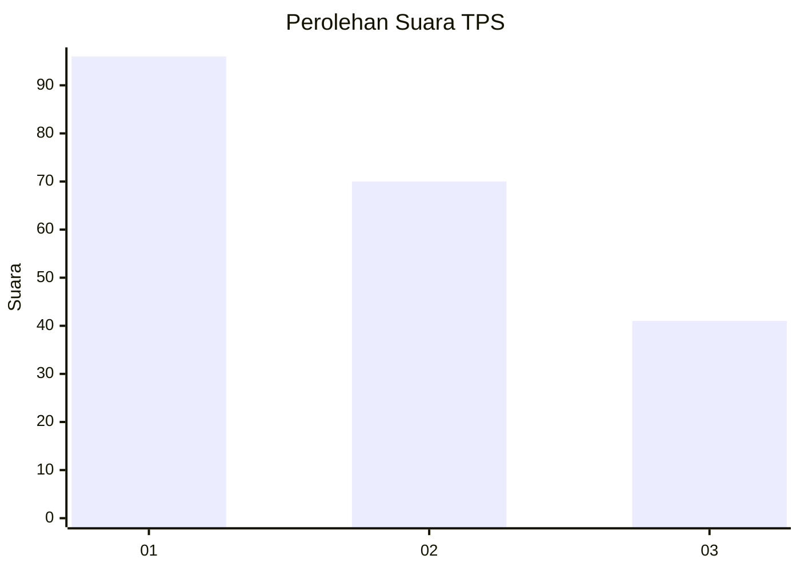
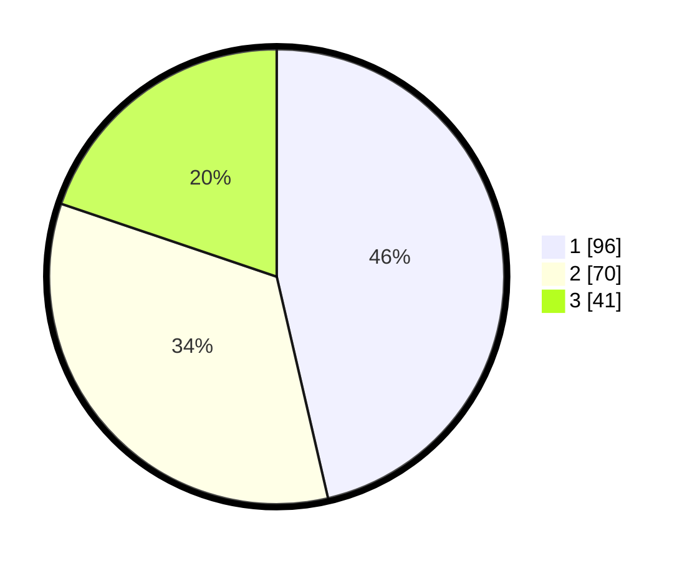

# Hasil

## Grafik

## Tabel

| No. | Nama Paslon    | Suara | Suara (raw) | Persentase |
|:--- |:-------------- | -----:| -----------:| ----------:|
| 1   | ANIES MUHAIMIN | 96    | [96][p-1]   | 46,38      |
| 2   | PRABOWO GIBRAN | 70    | [70][p-2]   | 33,82      |
| 3   | GANJAR MAHFUD  | 41    | [41][p-3]   | 19,81      |

[p-1]: https://github.com/gigit-pemilu/pemilu-2024/blob/main/pilpres/hitung-suara/sub/35-jawa-timur/sub/28-pamekasan/sub/13-pasean/sub/2008-bindang/sub/001-tps/sub/paslon-1.txt
[p-2]: https://github.com/gigit-pemilu/pemilu-2024/blob/main/pilpres/hitung-suara/sub/35-jawa-timur/sub/28-pamekasan/sub/13-pasean/sub/2008-bindang/sub/001-tps/sub/paslon-2.txt
[p-3]: https://github.com/gigit-pemilu/pemilu-2024/blob/main/pilpres/hitung-suara/sub/35-jawa-timur/sub/28-pamekasan/sub/13-pasean/sub/2008-bindang/sub/001-tps/sub/paslon-3.txt

## Foto C Plano

https://sirekap-obj-formc.kpu.go.id/7467/pemilu/ppwp/35/28/13/20/08/3528132008001-20240214-231944--b9a6634c-2726-41de-8ae4-29724b2e9f7b.jpg

https://sirekap-obj-formc.kpu.go.id/7467/pemilu/ppwp/35/28/13/20/08/3528132008001-20240214-232043--f87166a2-af61-4d29-a33c-353238903f56.jpg

https://sirekap-obj-formc.kpu.go.id/7467/pemilu/ppwp/35/28/13/20/08/3528132008001-20240214-232204--ee36f9e7-51eb-439f-b06a-8944a8607fbd.jpg

## Metadata

| Key        | Value               |
| ---------- | ------------------- |
| Time Stamp | 2024-02-15 17:00:25 |

