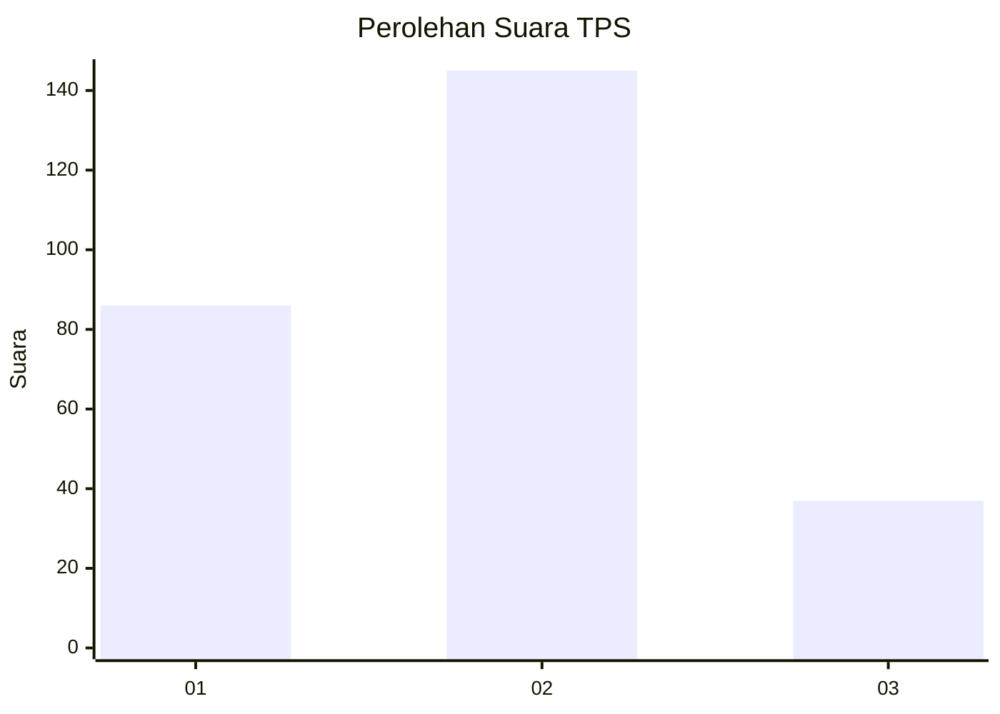
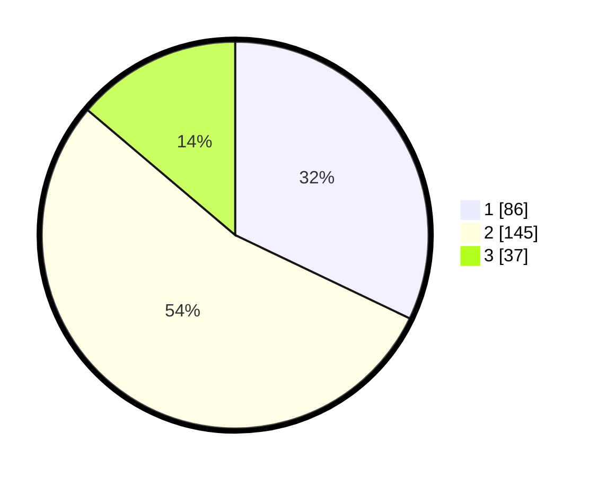

# Hasil

## Grafik

## Tabel

| No. | Nama Paslon    | Suara | Suara (raw) | Persentase |
|:--- |:-------------- | -----:| -----------:| ----------:|
| 1   | ANIES MUHAIMIN | 86    | [86][p-1]   | 32,09      |
| 2   | PRABOWO GIBRAN | 145   | [145][p-2]  | 54,10      |
| 3   | GANJAR MAHFUD  | 37    | [37][p-3]   | 13,81      |

[p-1]: https://github.com/gigit-pemilu/pemilu-2024/blob/main/pilpres/hitung-suara/sub/35-jawa-timur/sub/28-pamekasan/sub/13-pasean/sub/2008-bindang/sub/009-tps/sub/paslon-1.txt
[p-2]: https://github.com/gigit-pemilu/pemilu-2024/blob/main/pilpres/hitung-suara/sub/35-jawa-timur/sub/28-pamekasan/sub/13-pasean/sub/2008-bindang/sub/009-tps/sub/paslon-2.txt
[p-3]: https://github.com/gigit-pemilu/pemilu-2024/blob/main/pilpres/hitung-suara/sub/35-jawa-timur/sub/28-pamekasan/sub/13-pasean/sub/2008-bindang/sub/009-tps/sub/paslon-3.txt

## Foto C Plano

https://sirekap-obj-formc.kpu.go.id/6fd1/pemilu/ppwp/35/28/13/20/08/3528132008009-20240215-092748--78211760-55c5-4b3a-9ec4-48b0aceb85ae.jpg

https://sirekap-obj-formc.kpu.go.id/6fd1/pemilu/ppwp/35/28/13/20/08/3528132008009-20240215-092925--b2568563-9d1c-484b-bf2d-43ee6903683b.jpg

https://sirekap-obj-formc.kpu.go.id/6fd1/pemilu/ppwp/35/28/13/20/08/3528132008009-20240215-093036--6f7affc4-4c27-4062-ba01-b8c866aaf7cb.jpg

## Metadata

| Key        | Value               |
| ---------- | ------------------- |
| Time Stamp | 2024-02-25 16:00:00 |

