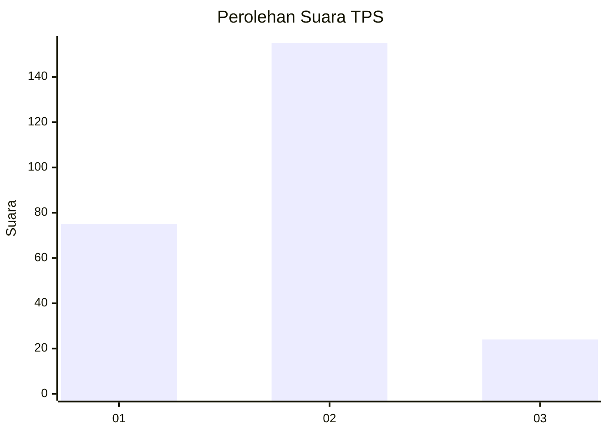
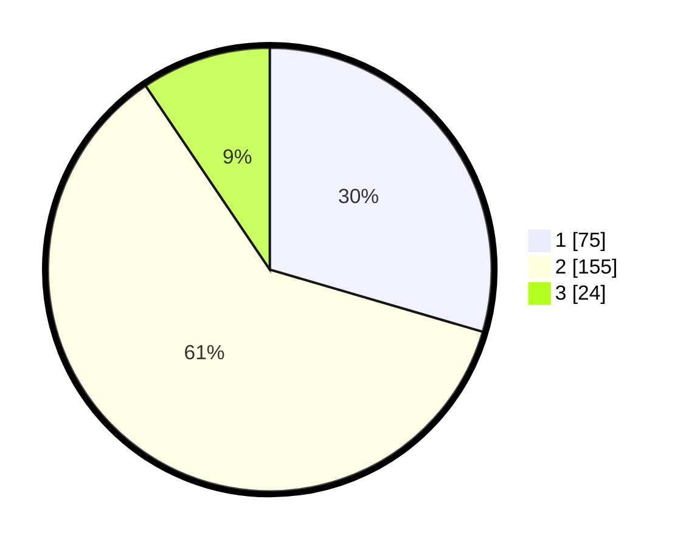

# Hasil

## Grafik

## Tabel

| No. | Nama Paslon    | Suara | Suara (raw) | Persentase |
|:--- |:-------------- | -----:| -----------:| ----------:|
| 1   | ANIES MUHAIMIN | 75    | [75][p-1]   | 29,53      |
| 2   | PRABOWO GIBRAN | 155   | [155][p-2]  | 61,02      |
| 3   | GANJAR MAHFUD  | 24    | [24][p-3]   | 9,45       |

[p-1]: https://github.com/gigit-pemilu/pemilu-2024/blob/main/pilpres/hitung-suara/sub/35-jawa-timur/sub/28-pamekasan/sub/13-pasean/sub/2008-bindang/sub/010-tps/sub/paslon-1.txt
[p-2]: https://github.com/gigit-pemilu/pemilu-2024/blob/main/pilpres/hitung-suara/sub/35-jawa-timur/sub/28-pamekasan/sub/13-pasean/sub/2008-bindang/sub/010-tps/sub/paslon-2.txt
[p-3]: https://github.com/gigit-pemilu/pemilu-2024/blob/main/pilpres/hitung-suara/sub/35-jawa-timur/sub/28-pamekasan/sub/13-pasean/sub/2008-bindang/sub/010-tps/sub/paslon-3.txt

## Foto C Plano

https://sirekap-obj-formc.kpu.go.id/9a2e/pemilu/ppwp/35/28/13/20/08/3528132008010-20240215-150903--de6d0461-6481-4fa7-bc80-3b9b4ff31ff4.jpg

https://sirekap-obj-formc.kpu.go.id/9a2e/pemilu/ppwp/35/28/13/20/08/3528132008010-20240215-150958--5123825a-6691-400a-91e4-857693cb9482.jpg

https://sirekap-obj-formc.kpu.go.id/9a2e/pemilu/ppwp/35/28/13/20/08/3528132008010-20240215-151104--60be171c-0a68-4b97-be64-33b7363644cf.jpg

## Metadata

| Key        | Value               |
| ---------- | ------------------- |
| Time Stamp | 2024-02-15 22:30:27 |

