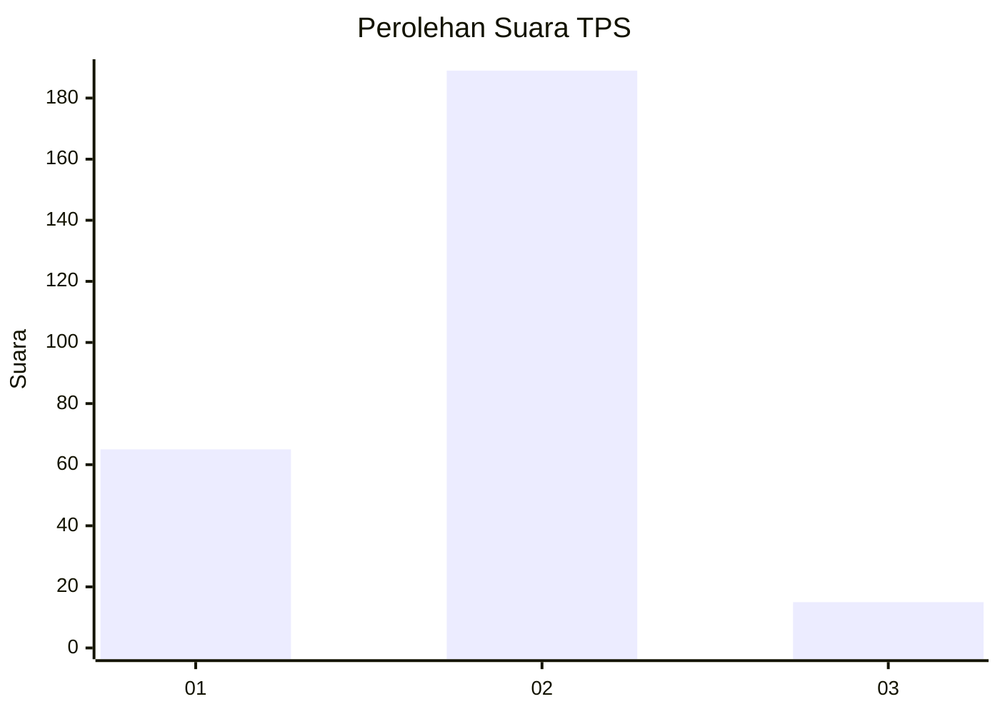
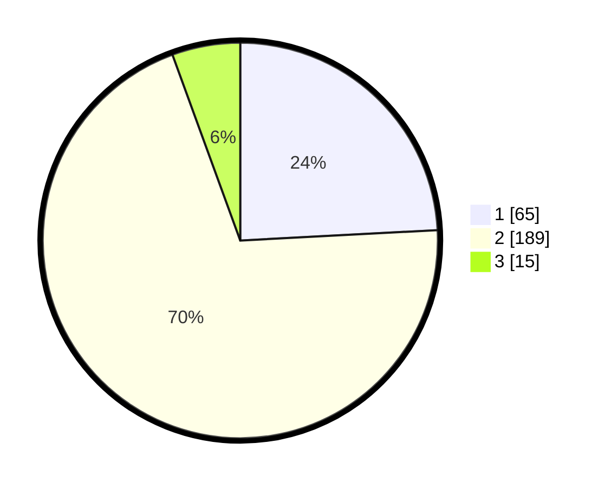

# Hasil

## Grafik

## Tabel

| No. | Nama Paslon    | Suara | Suara (raw) | Persentase |
|:--- |:-------------- | -----:| -----------:| ----------:|
| 1   | ANIES MUHAIMIN | 65    | [65][p-1]   | 24,16      |
| 2   | PRABOWO GIBRAN | 189   | [189][p-2]  | 70,26      |
| 3   | GANJAR MAHFUD  | 15    | [15][p-3]   | 5,58       |

[p-1]: https://github.com/gigit-pemilu/pemilu-2024-35-jawa-timur/blob/main/pilpres/hitung-suara/sub/35-jawa-timur/sub/28-pamekasan/sub/13-pasean/sub/2008-bindang/sub/011-tps/sub/paslon-1.txt
[p-2]: https://github.com/gigit-pemilu/pemilu-2024-35-jawa-timur/blob/main/pilpres/hitung-suara/sub/35-jawa-timur/sub/28-pamekasan/sub/13-pasean/sub/2008-bindang/sub/011-tps/sub/paslon-2.txt
[p-3]: https://github.com/gigit-pemilu/pemilu-2024-35-jawa-timur/blob/main/pilpres/hitung-suara/sub/35-jawa-timur/sub/28-pamekasan/sub/13-pasean/sub/2008-bindang/sub/011-tps/sub/paslon-3.txt

## Foto C Plano

https://sirekap-obj-formc.kpu.go.id/a9a8/pemilu/ppwp/35/28/13/20/08/3528132008011-20240215-071504--a0728e36-0b4f-45ef-85ea-ea9c46bf72f5.jpg

https://sirekap-obj-formc.kpu.go.id/a9a8/pemilu/ppwp/35/28/13/20/08/3528132008011-20240215-071554--f7393db7-a9c4-4476-8b57-70e142138eb2.jpg

https://sirekap-obj-formc.kpu.go.id/a9a8/pemilu/ppwp/35/28/13/20/08/3528132008011-20240215-071626--fde1c9ec-3ed7-4fda-ba74-c7322abae425.jpg

## Metadata

| Key        | Value               |
| ---------- | ------------------- |
| Time Stamp | 2024-02-24 22:31:28 |

