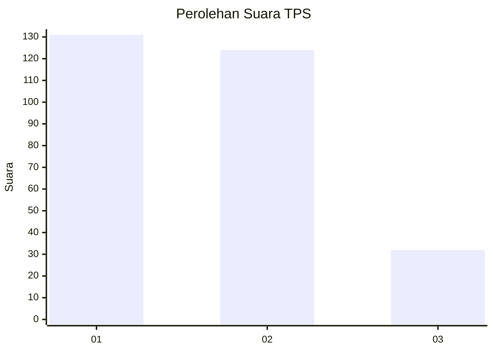
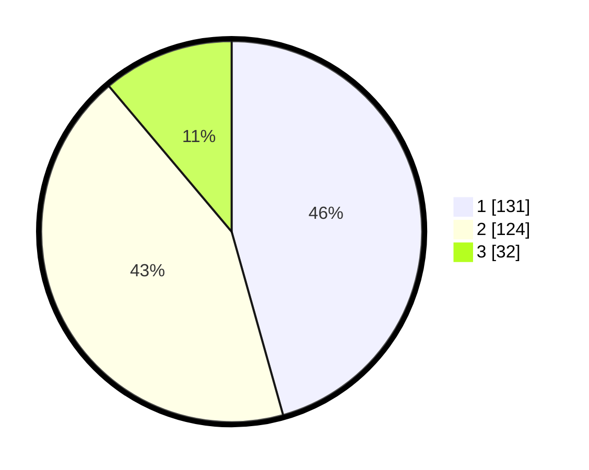

# Hasil

## Grafik

## Tabel

| No. | Nama Paslon    | Suara | Suara (raw) | Persentase |
|:--- |:-------------- | -----:| -----------:| ----------:|
| 1   | ANIES MUHAIMIN | 131   | [131][p-1]  | 45,64      |
| 2   | PRABOWO GIBRAN | 124   | [124][p-2]  | 43,21      |
| 3   | GANJAR MAHFUD  | 32    | [32][p-3]   | 11,15      |

[p-1]: https://github.com/gigit-pemilu/pemilu-2024-35-jawa-timur/blob/main/pilpres/hitung-suara/sub/35-jawa-timur/sub/28-pamekasan/sub/13-pasean/sub/2009-batokerbuy/sub/004-tps/sub/paslon-1.txt
[p-2]: https://github.com/gigit-pemilu/pemilu-2024-35-jawa-timur/blob/main/pilpres/hitung-suara/sub/35-jawa-timur/sub/28-pamekasan/sub/13-pasean/sub/2009-batokerbuy/sub/004-tps/sub/paslon-2.txt
[p-3]: https://github.com/gigit-pemilu/pemilu-2024-35-jawa-timur/blob/main/pilpres/hitung-suara/sub/35-jawa-timur/sub/28-pamekasan/sub/13-pasean/sub/2009-batokerbuy/sub/004-tps/sub/paslon-3.txt

## Foto C Plano

https://sirekap-obj-formc.kpu.go.id/7d8c/pemilu/ppwp/35/28/13/20/09/3528132009004-20240215-092010--a37ea0fe-672a-4ad5-95c3-d44623fa3f88.jpg

https://sirekap-obj-formc.kpu.go.id/7d8c/pemilu/ppwp/35/28/13/20/09/3528132009004-20240215-092257--a27963d1-1f9b-430f-a081-21953c150876.jpg

https://sirekap-obj-formc.kpu.go.id/7d8c/pemilu/ppwp/35/28/13/20/09/3528132009004-20240215-092436--dfe19c03-c373-4d86-a25c-915e048dfdb6.jpg

## Metadata

| Key        | Value               |
| ---------- | ------------------- |
| Time Stamp | 2024-02-17 11:30:03 |

