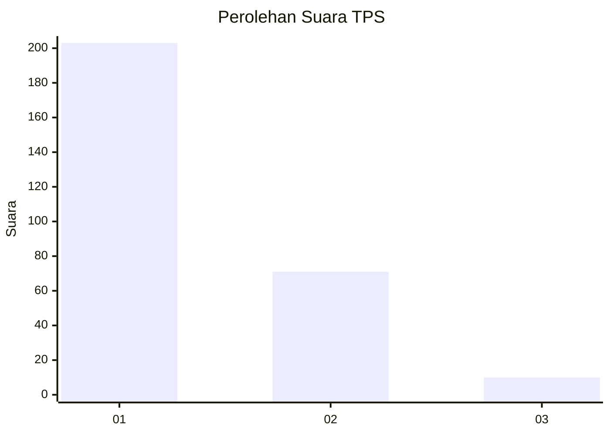
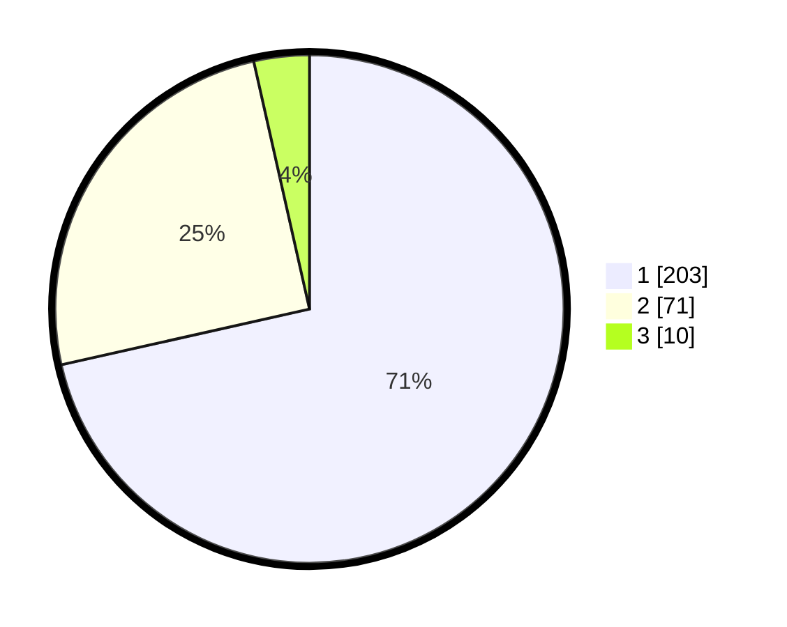

# Hasil

## Grafik

## Tabel

| No. | Nama Paslon    | Suara | Suara (raw) | Persentase |
|:--- |:-------------- | -----:| -----------:| ----------:|
| 1   | ANIES MUHAIMIN | 203   | [203][p-1]  | 71,48      |
| 2   | PRABOWO GIBRAN | 71    | [71][p-2]   | 25,00      |
| 3   | GANJAR MAHFUD  | 10    | [10][p-3]   | 3,52       |

[p-1]: https://github.com/gigit-pemilu/pemilu-2024-35-jawa-timur/blob/main/pilpres/hitung-suara/sub/35-jawa-timur/sub/28-pamekasan/sub/13-pasean/sub/2009-batokerbuy/sub/005-tps/sub/paslon-1.txt
[p-2]: https://github.com/gigit-pemilu/pemilu-2024-35-jawa-timur/blob/main/pilpres/hitung-suara/sub/35-jawa-timur/sub/28-pamekasan/sub/13-pasean/sub/2009-batokerbuy/sub/005-tps/sub/paslon-2.txt
[p-3]: https://github.com/gigit-pemilu/pemilu-2024-35-jawa-timur/blob/main/pilpres/hitung-suara/sub/35-jawa-timur/sub/28-pamekasan/sub/13-pasean/sub/2009-batokerbuy/sub/005-tps/sub/paslon-3.txt

## Foto C Plano

https://sirekap-obj-formc.kpu.go.id/e7ea/pemilu/ppwp/35/28/13/20/09/3528132009005-20240215-005244--6d58b3bd-45e7-454d-85d1-4fe4e8dac0d6.jpg

https://sirekap-obj-formc.kpu.go.id/e7ea/pemilu/ppwp/35/28/13/20/09/3528132009005-20240214-210438--d93d9944-60a2-4142-8461-d9747677d3e4.jpg

https://sirekap-obj-formc.kpu.go.id/e7ea/pemilu/ppwp/35/28/13/20/09/3528132009005-20240214-211041--a47af939-9e6d-4483-83cb-94396f5949d3.jpg

## Metadata

| Key        | Value               |
| ---------- | ------------------- |
| Time Stamp | 2024-02-25 17:00:00 |

