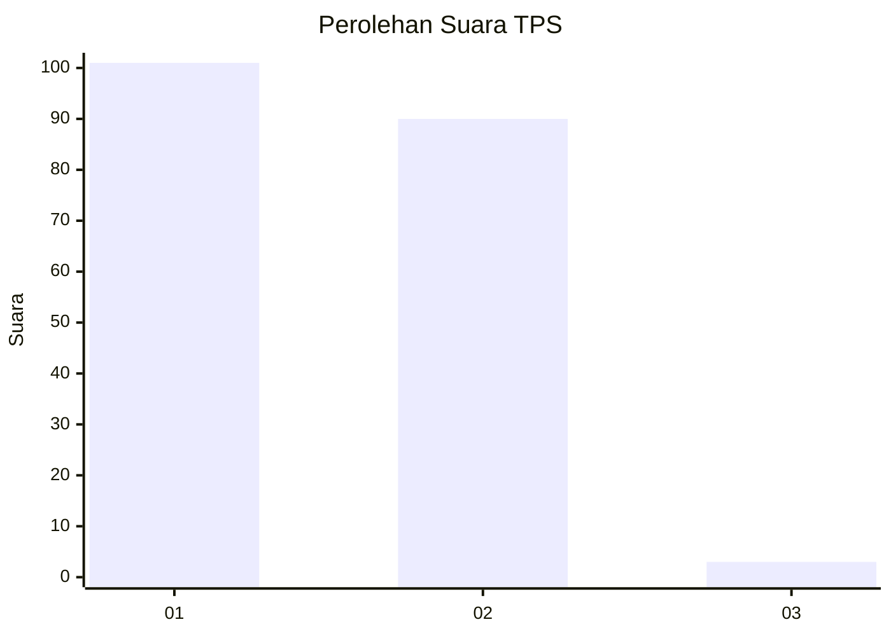
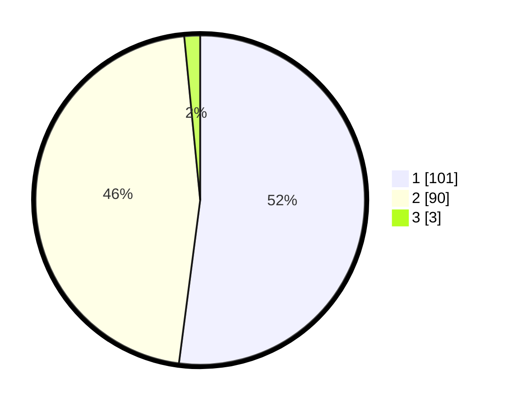

# Hasil

## Grafik

## Tabel

| No. | Nama Paslon    | Suara | Suara (raw) | Persentase |
|:--- |:-------------- | -----:| -----------:| ----------:|
| 1   | ANIES MUHAIMIN | 101   | [101][p-1]  | 52,06      |
| 2   | PRABOWO GIBRAN | 90    | [90][p-2]   | 46,39      |
| 3   | GANJAR MAHFUD  | 3     | [3][p-3]    | 1,55       |

[p-1]: https://github.com/gigit-pemilu/pemilu-2024-35-jawa-timur/blob/main/pilpres/hitung-suara/sub/35-jawa-timur/sub/28-pamekasan/sub/13-pasean/sub/2009-batokerbuy/sub/007-tps/sub/paslon-1.txt
[p-2]: https://github.com/gigit-pemilu/pemilu-2024-35-jawa-timur/blob/main/pilpres/hitung-suara/sub/35-jawa-timur/sub/28-pamekasan/sub/13-pasean/sub/2009-batokerbuy/sub/007-tps/sub/paslon-2.txt
[p-3]: https://github.com/gigit-pemilu/pemilu-2024-35-jawa-timur/blob/main/pilpres/hitung-suara/sub/35-jawa-timur/sub/28-pamekasan/sub/13-pasean/sub/2009-batokerbuy/sub/007-tps/sub/paslon-3.txt

## Foto C Plano

https://sirekap-obj-formc.kpu.go.id/dff8/pemilu/ppwp/35/28/13/20/09/3528132009007-20240215-020504--c2f966b0-3450-4c2b-90e6-363f5f2a134d.jpg

https://sirekap-obj-formc.kpu.go.id/dff8/pemilu/ppwp/35/28/13/20/09/3528132009007-20240215-020551--e421da35-a69e-4378-a330-af5fc57b2e75.jpg

https://sirekap-obj-formc.kpu.go.id/dff8/pemilu/ppwp/35/28/13/20/09/3528132009007-20240215-020640--a8132121-1d19-44ce-87b9-8bc2e3743309.jpg

## Metadata

| Key        | Value               |
| ---------- | ------------------- |
| Time Stamp | 2024-02-25 15:00:00 |

