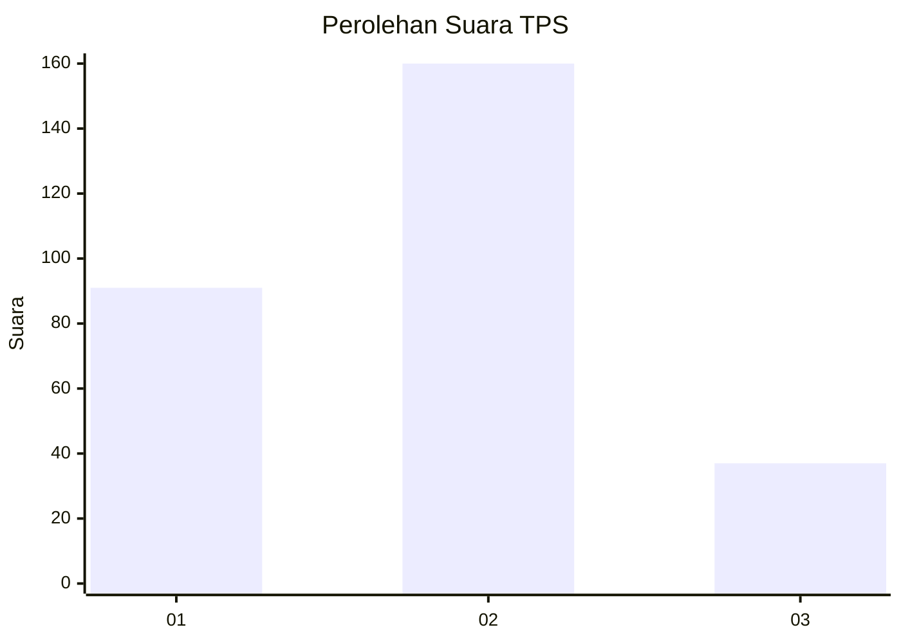
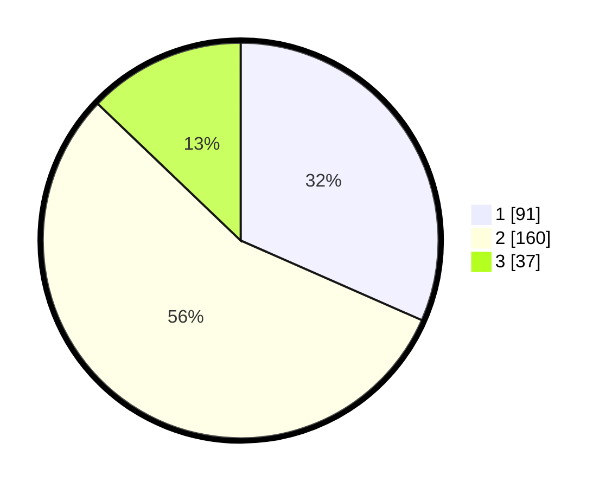

# Hasil

## Grafik

## Tabel

| No. | Nama Paslon    | Suara | Suara (raw) | Persentase |
|:--- |:-------------- | -----:| -----------:| ----------:|
| 1   | ANIES MUHAIMIN | 91    | [91][p-1]   | 31,60      |
| 2   | PRABOWO GIBRAN | 160   | [160][p-2]  | 55,56      |
| 3   | GANJAR MAHFUD  | 37    | [37][p-3]   | 12,85      |

[p-1]: https://github.com/gigit-pemilu/pemilu-2024/blob/main/pilpres/hitung-suara/sub/35-jawa-timur/sub/28-pamekasan/sub/13-pasean/sub/2009-batokerbuy/sub/010-tps/sub/paslon-1.txt
[p-2]: https://github.com/gigit-pemilu/pemilu-2024/blob/main/pilpres/hitung-suara/sub/35-jawa-timur/sub/28-pamekasan/sub/13-pasean/sub/2009-batokerbuy/sub/010-tps/sub/paslon-2.txt
[p-3]: https://github.com/gigit-pemilu/pemilu-2024/blob/main/pilpres/hitung-suara/sub/35-jawa-timur/sub/28-pamekasan/sub/13-pasean/sub/2009-batokerbuy/sub/010-tps/sub/paslon-3.txt

## Foto C Plano

https://sirekap-obj-formc.kpu.go.id/2c21/pemilu/ppwp/35/28/13/20/09/3528132009010-20240215-133755--c5921cc5-7667-47d8-a7b3-697307dc4737.jpg

https://sirekap-obj-formc.kpu.go.id/2c21/pemilu/ppwp/35/28/13/20/09/3528132009010-20240215-133819--daa3b82b-75a0-41e6-8cbb-760345fbfdc6.jpg

https://sirekap-obj-formc.kpu.go.id/2c21/pemilu/ppwp/35/28/13/20/09/3528132009010-20240215-133838--50786a20-5c68-48e7-9a54-dce0dfe7fa1c.jpg

## Metadata

| Key        | Value               |
| ---------- | ------------------- |
| Time Stamp | 2024-02-26 22:00:00 |

