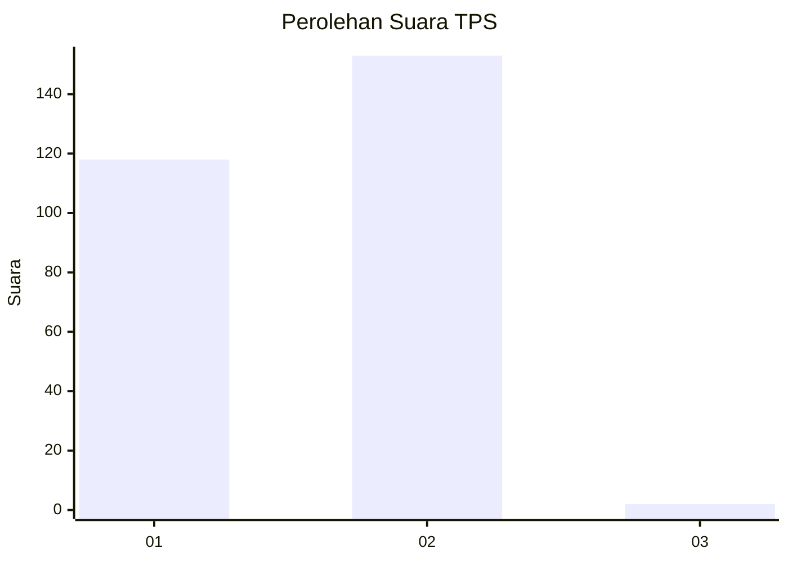
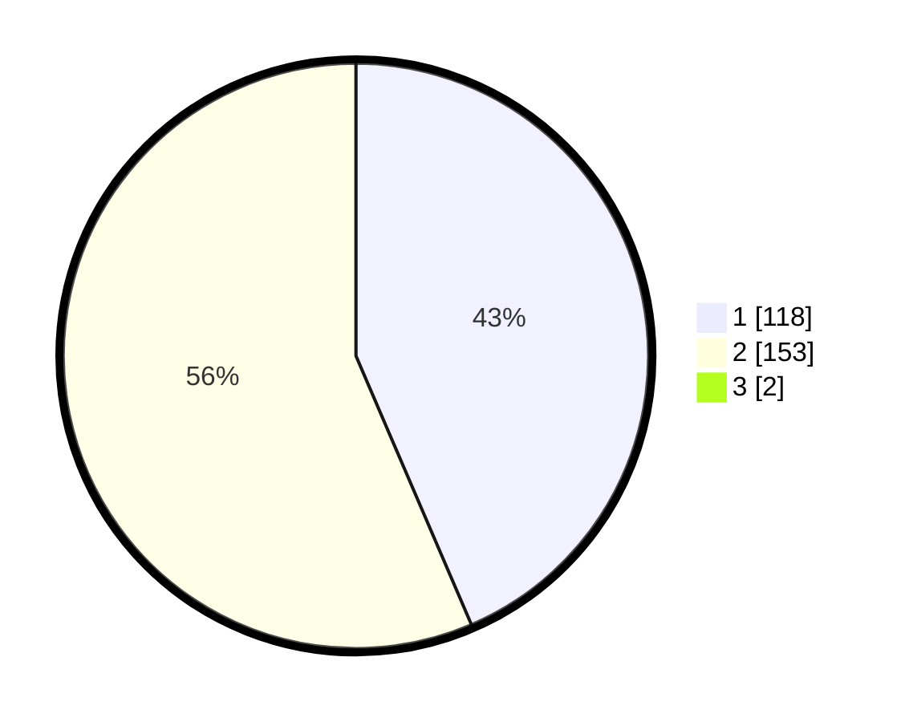

# Hasil

## Grafik

## Tabel

| No. | Nama Paslon    | Suara | Suara (raw) | Persentase |
|:--- |:-------------- | -----:| -----------:| ----------:|
| 1   | ANIES MUHAIMIN | 118   | [118][p-1]  | 43,22      |
| 2   | PRABOWO GIBRAN | 153   | [153][p-2]  | 56,04      |
| 3   | GANJAR MAHFUD  | 2     | [2][p-3]    | 0,73       |

[p-1]: https://github.com/gigit-pemilu/pemilu-2024/blob/main/pilpres/hitung-suara/sub/35-jawa-timur/sub/28-pamekasan/sub/13-pasean/sub/2009-batokerbuy/sub/014-tps/sub/paslon-1.txt
[p-2]: https://github.com/gigit-pemilu/pemilu-2024/blob/main/pilpres/hitung-suara/sub/35-jawa-timur/sub/28-pamekasan/sub/13-pasean/sub/2009-batokerbuy/sub/014-tps/sub/paslon-2.txt
[p-3]: https://github.com/gigit-pemilu/pemilu-2024/blob/main/pilpres/hitung-suara/sub/35-jawa-timur/sub/28-pamekasan/sub/13-pasean/sub/2009-batokerbuy/sub/014-tps/sub/paslon-3.txt

## Foto C Plano

https://sirekap-obj-formc.kpu.go.id/4676/pemilu/ppwp/35/28/13/20/09/3528132009014-20240214-235913--3e1cfaf0-7f06-46cd-9fcd-7a9381044da2.jpg

https://sirekap-obj-formc.kpu.go.id/4676/pemilu/ppwp/35/28/13/20/09/3528132009014-20240215-000125--66218776-13a6-453c-893b-6f1242448d57.jpg

https://sirekap-obj-formc.kpu.go.id/4676/pemilu/ppwp/35/28/13/20/09/3528132009014-20240215-000204--5f809086-313a-4c65-a952-8ddee49d824e.jpg

## Metadata

| Key        | Value               |
| ---------- | ------------------- |
| Time Stamp | 2024-02-26 11:00:00 |

