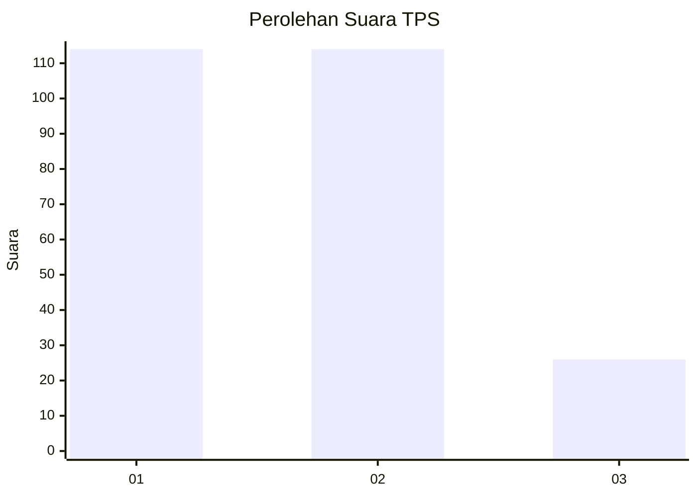
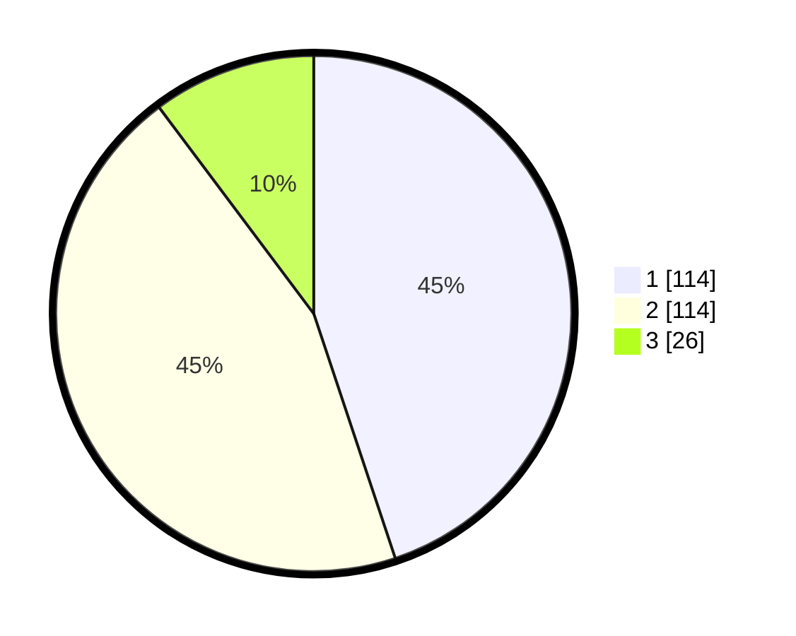

# Hasil

## Grafik

## Tabel

| No. | Nama Paslon    | Suara | Suara (raw) | Persentase |
|:--- |:-------------- | -----:| -----------:| ----------:|
| 1   | ANIES MUHAIMIN | 114   | [114][p-1]  | 44,88      |
| 2   | PRABOWO GIBRAN | 114   | [114][p-2]  | 44,88      |
| 3   | GANJAR MAHFUD  | 26    | [26][p-3]   | 10,24      |

[p-1]: https://github.com/gigit-pemilu/pemilu-2024/blob/main/pilpres/hitung-suara/sub/35-jawa-timur/sub/28-pamekasan/sub/13-pasean/sub/2009-batokerbuy/sub/016-tps/sub/paslon-1.txt
[p-2]: https://github.com/gigit-pemilu/pemilu-2024/blob/main/pilpres/hitung-suara/sub/35-jawa-timur/sub/28-pamekasan/sub/13-pasean/sub/2009-batokerbuy/sub/016-tps/sub/paslon-2.txt
[p-3]: https://github.com/gigit-pemilu/pemilu-2024/blob/main/pilpres/hitung-suara/sub/35-jawa-timur/sub/28-pamekasan/sub/13-pasean/sub/2009-batokerbuy/sub/016-tps/sub/paslon-3.txt

## Foto C Plano

https://sirekap-obj-formc.kpu.go.id/5367/pemilu/ppwp/35/28/13/20/09/3528132009016-20240214-210211--37b5acf9-f054-436f-93a5-b3b4717a4994.jpg

https://sirekap-obj-formc.kpu.go.id/5367/pemilu/ppwp/35/28/13/20/09/3528132009016-20240214-210237--f8aeb4fd-5b8a-4d0c-a6cd-10f7459ae236.jpg

https://sirekap-obj-formc.kpu.go.id/5367/pemilu/ppwp/35/28/13/20/09/3528132009016-20240214-210249--b9326de1-9059-4eba-b6d3-892c91c3dc52.jpg

## Metadata

| Key        | Value               |
| ---------- | ------------------- |
| Time Stamp | 2024-02-15 19:30:26 |

