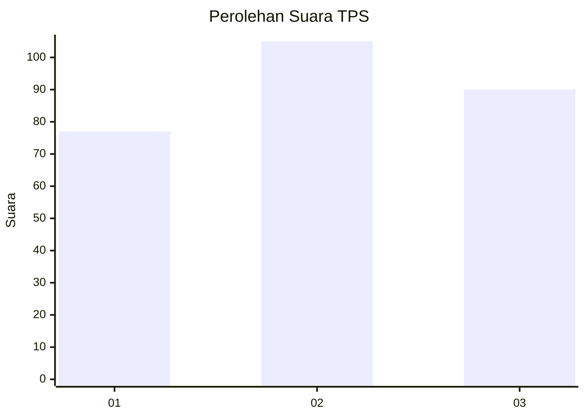
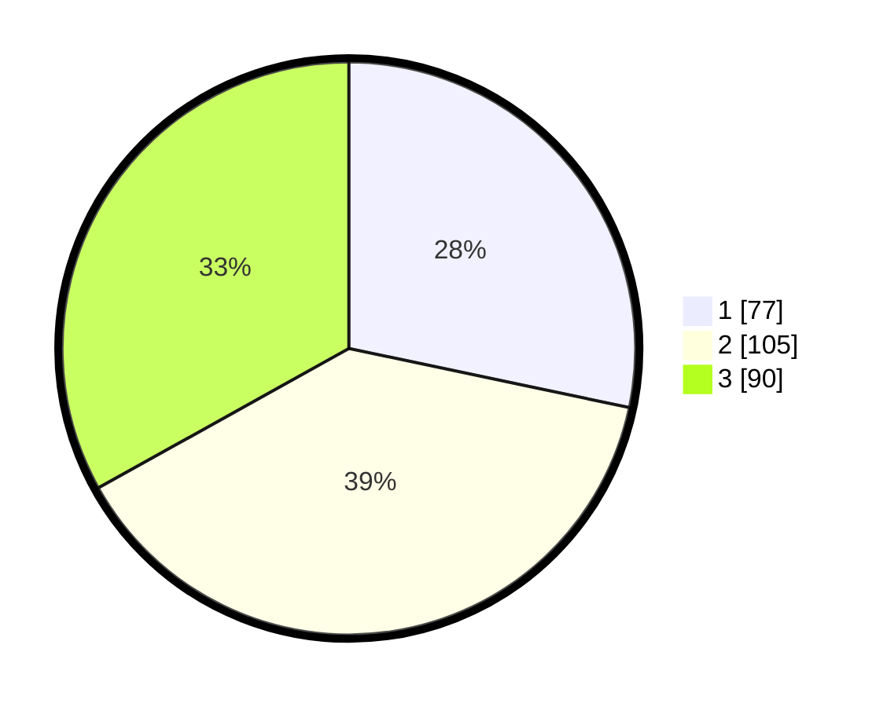

# Hasil

## Grafik

## Tabel

| No. | Nama Paslon    | Suara | Suara (raw) | Persentase |
|:--- |:-------------- | -----:| -----------:| ----------:|
| 1   | ANIES MUHAIMIN | 77    | [77][p-1]   | 28,31      |
| 2   | PRABOWO GIBRAN | 105   | [105][p-2]  | 38,60      |
| 3   | GANJAR MAHFUD  | 90    | [90][p-3]   | 33,09      |

[p-1]: https://github.com/gigit-pemilu/pemilu-2024/blob/main/pilpres/hitung-suara/sub/35-jawa-timur/sub/28-pamekasan/sub/13-pasean/sub/2009-batokerbuy/sub/017-tps/sub/paslon-1.txt
[p-2]: https://github.com/gigit-pemilu/pemilu-2024/blob/main/pilpres/hitung-suara/sub/35-jawa-timur/sub/28-pamekasan/sub/13-pasean/sub/2009-batokerbuy/sub/017-tps/sub/paslon-2.txt
[p-3]: https://github.com/gigit-pemilu/pemilu-2024/blob/main/pilpres/hitung-suara/sub/35-jawa-timur/sub/28-pamekasan/sub/13-pasean/sub/2009-batokerbuy/sub/017-tps/sub/paslon-3.txt

## Foto C Plano

https://sirekap-obj-formc.kpu.go.id/9d53/pemilu/ppwp/35/28/13/20/09/3528132009017-20240215-002011--818a47ee-cb64-43a3-a9d5-582f19195828.jpg

https://sirekap-obj-formc.kpu.go.id/9d53/pemilu/ppwp/35/28/13/20/09/3528132009017-20240215-002157--ee319d3e-3d5c-495f-9e59-412e2231eaa4.jpg

https://sirekap-obj-formc.kpu.go.id/9d53/pemilu/ppwp/35/28/13/20/09/3528132009017-20240215-002217--878caf8a-feb3-424e-9d49-18a01428fe07.jpg

## Metadata

| Key        | Value               |
| ---------- | ------------------- |
| Time Stamp | 2024-02-26 12:00:00 |

