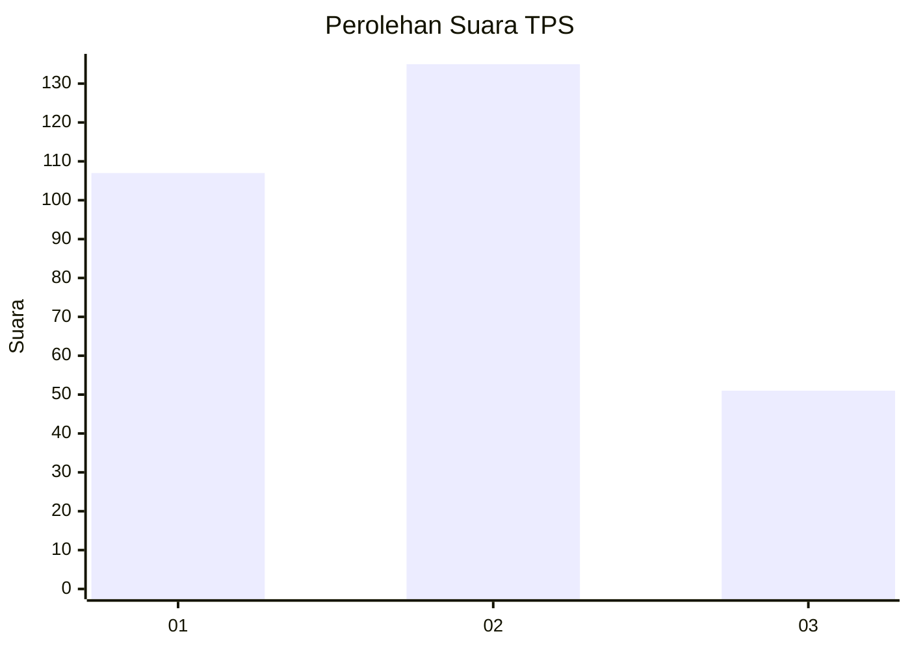
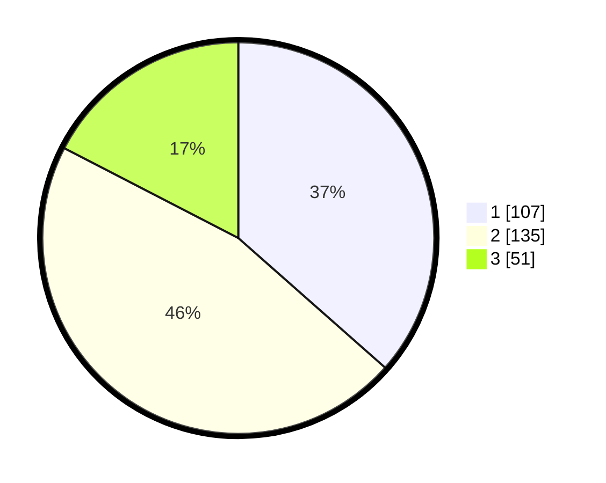

# Hasil

## Grafik

## Tabel

| No. | Nama Paslon    | Suara | Suara (raw) | Persentase |
|:--- |:-------------- | -----:| -----------:| ----------:|
| 1   | ANIES MUHAIMIN | 107   | [107][p-1]  | 36,52      |
| 2   | PRABOWO GIBRAN | 135   | [135][p-2]  | 46,08      |
| 3   | GANJAR MAHFUD  | 51    | [51][p-3]   | 17,41      |

[p-1]: https://github.com/gigit-pemilu/pemilu-2024/blob/main/pilpres/hitung-suara/sub/35-jawa-timur/sub/28-pamekasan/sub/13-pasean/sub/2009-batokerbuy/sub/018-tps/sub/paslon-1.txt
[p-2]: https://github.com/gigit-pemilu/pemilu-2024/blob/main/pilpres/hitung-suara/sub/35-jawa-timur/sub/28-pamekasan/sub/13-pasean/sub/2009-batokerbuy/sub/018-tps/sub/paslon-2.txt
[p-3]: https://github.com/gigit-pemilu/pemilu-2024/blob/main/pilpres/hitung-suara/sub/35-jawa-timur/sub/28-pamekasan/sub/13-pasean/sub/2009-batokerbuy/sub/018-tps/sub/paslon-3.txt

## Foto C Plano

https://sirekap-obj-formc.kpu.go.id/20cd/pemilu/ppwp/35/28/13/20/09/3528132009018-20240214-220501--b1f823c4-84e8-4210-94e8-e17c9560cf45.jpg

https://sirekap-obj-formc.kpu.go.id/20cd/pemilu/ppwp/35/28/13/20/09/3528132009018-20240214-220720--f79d7b86-d975-4dfa-993c-accdf0e3ea3f.jpg

https://sirekap-obj-formc.kpu.go.id/20cd/pemilu/ppwp/35/28/13/20/09/3528132009018-20240214-220907--5ed4dad5-0534-4ef9-a454-c2bff23760da.jpg

## Metadata

| Key        | Value               |
| ---------- | ------------------- |
| Time Stamp | 2024-02-25 23:00:00 |

