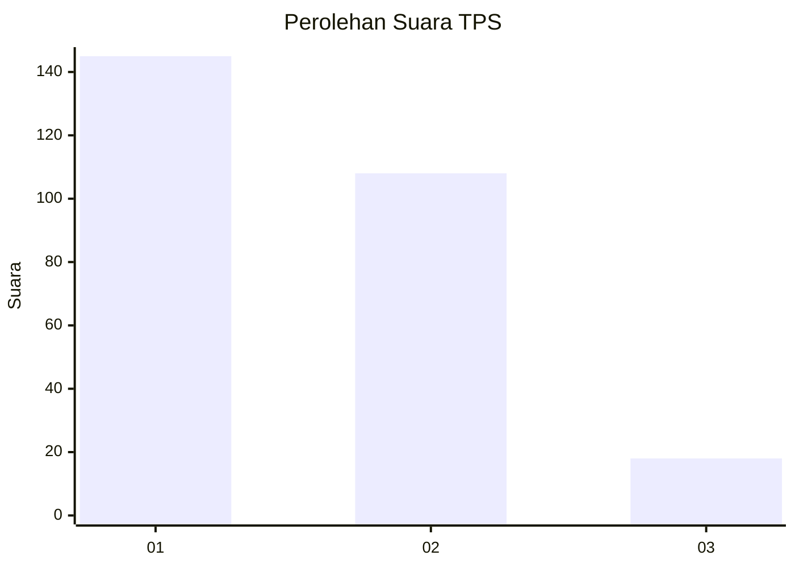
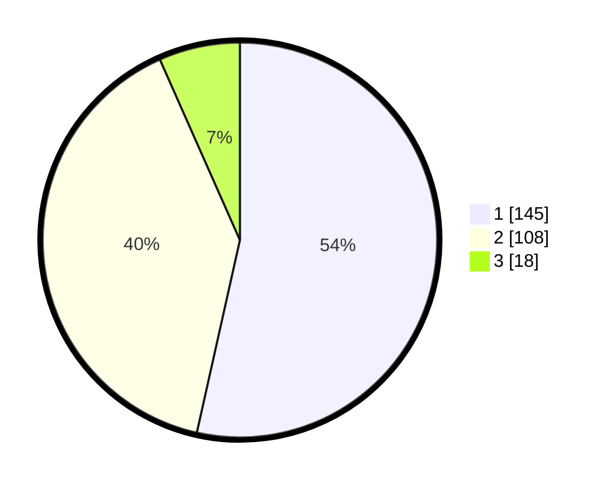

# Hasil

## Grafik

## Tabel

| No. | Nama Paslon    | Suara | Suara (raw) | Persentase |
|:--- |:-------------- | -----:| -----------:| ----------:|
| 1   | ANIES MUHAIMIN | 145   | [145][p-1]  | 53,51      |
| 2   | PRABOWO GIBRAN | 108   | [108][p-2]  | 39,85      |
| 3   | GANJAR MAHFUD  | 18    | [18][p-3]   | 6,64       |

[p-1]: https://github.com/gigit-pemilu/pemilu-2024/blob/main/pilpres/hitung-suara/sub/35-jawa-timur/sub/28-pamekasan/sub/13-pasean/sub/2009-batokerbuy/sub/021-tps/sub/paslon-1.txt
[p-2]: https://github.com/gigit-pemilu/pemilu-2024/blob/main/pilpres/hitung-suara/sub/35-jawa-timur/sub/28-pamekasan/sub/13-pasean/sub/2009-batokerbuy/sub/021-tps/sub/paslon-2.txt
[p-3]: https://github.com/gigit-pemilu/pemilu-2024/blob/main/pilpres/hitung-suara/sub/35-jawa-timur/sub/28-pamekasan/sub/13-pasean/sub/2009-batokerbuy/sub/021-tps/sub/paslon-3.txt

## Foto C Plano

https://sirekap-obj-formc.kpu.go.id/dbfc/pemilu/ppwp/35/28/13/20/09/3528132009021-20240215-084639--8efadcb5-8026-48e3-90e5-fa0948bd9e7a.jpg

https://sirekap-obj-formc.kpu.go.id/dbfc/pemilu/ppwp/35/28/13/20/09/3528132009021-20240214-222630--18287bf8-0dd4-417b-808c-e9c8ed79677e.jpg

https://sirekap-obj-formc.kpu.go.id/dbfc/pemilu/ppwp/35/28/13/20/09/3528132009021-20240215-085054--1060c25f-a2eb-489c-9ce4-805d51666b4a.jpg

## Metadata

| Key        | Value               |
| ---------- | ------------------- |
| Time Stamp | 2024-02-15 20:00:44 |

