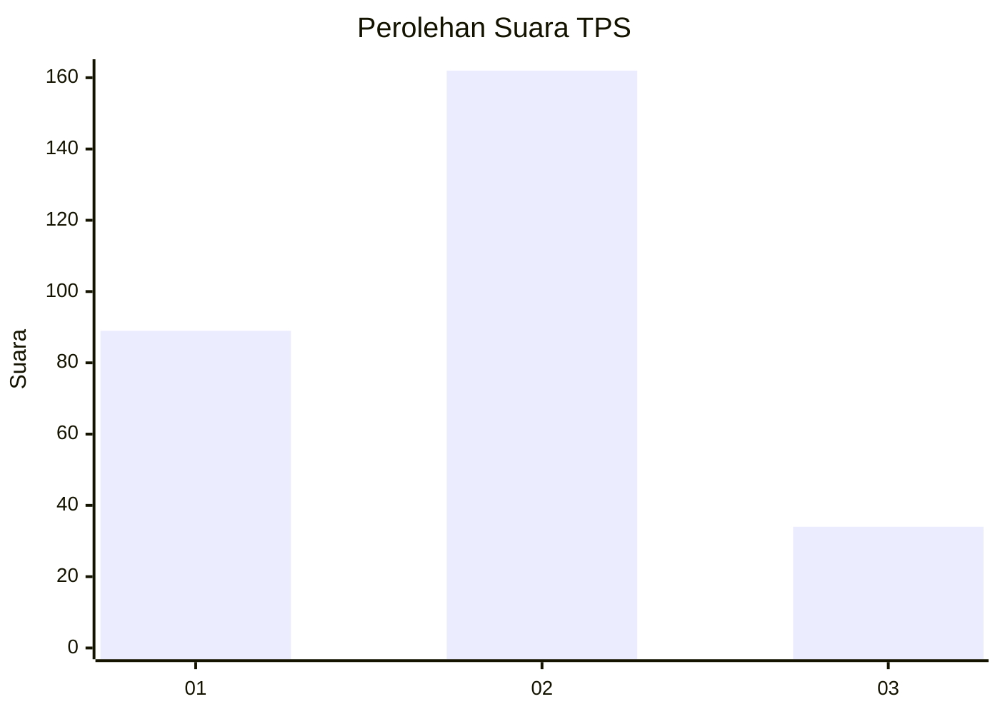
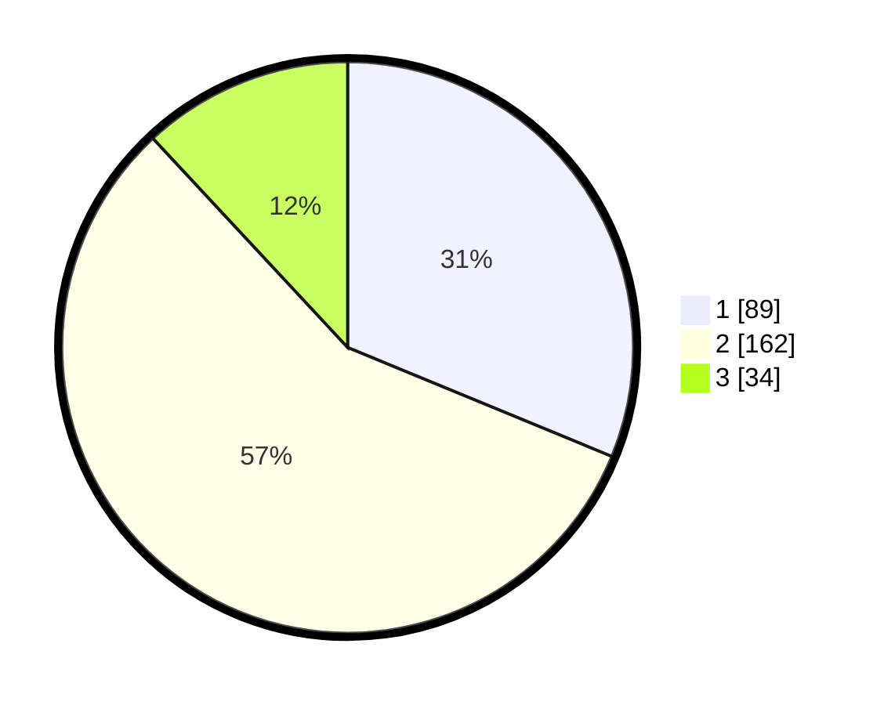

# Hasil

## Grafik

## Tabel

| No. | Nama Paslon    | Suara | Suara (raw) | Persentase |
|:--- |:-------------- | -----:| -----------:| ----------:|
| 1   | ANIES MUHAIMIN | 89    | [89][p-1]   | 31,23      |
| 2   | PRABOWO GIBRAN | 162   | [162][p-2]  | 56,84      |
| 3   | GANJAR MAHFUD  | 34    | [34][p-3]   | 11,93      |

[p-1]: https://github.com/gigit-pemilu/pemilu-2024/blob/main/pilpres/hitung-suara/sub/35-jawa-timur/sub/28-pamekasan/sub/13-pasean/sub/2009-batokerbuy/sub/025-tps/sub/paslon-1.txt
[p-2]: https://github.com/gigit-pemilu/pemilu-2024/blob/main/pilpres/hitung-suara/sub/35-jawa-timur/sub/28-pamekasan/sub/13-pasean/sub/2009-batokerbuy/sub/025-tps/sub/paslon-2.txt
[p-3]: https://github.com/gigit-pemilu/pemilu-2024/blob/main/pilpres/hitung-suara/sub/35-jawa-timur/sub/28-pamekasan/sub/13-pasean/sub/2009-batokerbuy/sub/025-tps/sub/paslon-3.txt

## Foto C Plano

https://sirekap-obj-formc.kpu.go.id/fd20/pemilu/ppwp/35/28/13/20/09/3528132009025-20240215-034033--7fe4cafe-cf99-42ef-a754-b40be255e1c8.jpg

https://sirekap-obj-formc.kpu.go.id/fd20/pemilu/ppwp/35/28/13/20/09/3528132009025-20240215-034100--7da9f174-3a0b-44fd-be2e-6fd62838a1a1.jpg

https://sirekap-obj-formc.kpu.go.id/fd20/pemilu/ppwp/35/28/13/20/09/3528132009025-20240215-034044--f4e8f09b-bda3-481d-92d1-cc3b96bd12e5.jpg

## Metadata

| Key        | Value               |
| ---------- | ------------------- |
| Time Stamp | 2024-02-24 22:31:28 |

## DATA PEMILIH TETAP

Jumlah pemilih dalam DPT: **0**.
 * L: **0**.
 * P: **0**.

## DATA PENGGUNA HAK PILIH

Jumlah pengguna hak pilih dalam DPT: **294**.
 * L: **141**.
 * P: **153**.

Jumlah pengguna hak pilih dalam DPTb: **283**.
 * L: **149**.
 * P: **134**.

Jumlah pengguna hak pilih dalam DPK: **0**.
 * L: **0**.
 * P: **0**.

Jumlah pengguna hak pilih: **2**.
 * L: **1**.
 * P: **1**.

## JUMLAH SUARA SAH DAN TIDAK SAH

JUMLAH SELURUH SUARA SAH: **285**.

JUMLAH SUARA TIDAK SAH: **3**.

JUMLAH SELURUH SUARA SAH DAN SUARA TIDAK SAH: **288**.

