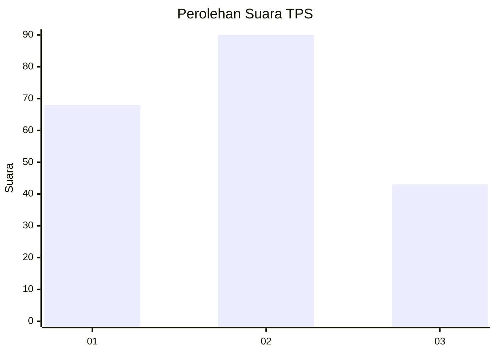
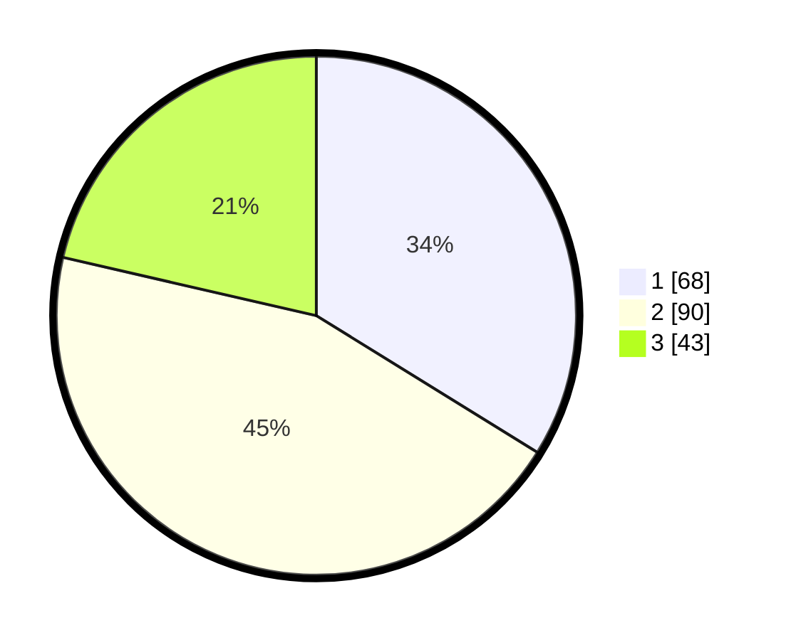

# Hasil

## Grafik

## Tabel

| No. | Nama Paslon    | Suara | Suara (raw) | Persentase |
|:--- |:-------------- | -----:| -----------:| ----------:|
| 1   | ANIES MUHAIMIN | 68    | [68][p-1]   | 33,83      |
| 2   | PRABOWO GIBRAN | 90    | [90][p-2]   | 44,78      |
| 3   | GANJAR MAHFUD  | 43    | [43][p-3]   | 21,39      |

[p-1]: https://github.com/gigit-pemilu/pemilu-2024/blob/main/pilpres/hitung-suara/sub/35-jawa-timur/sub/29-sumenep/sub/01-kota-sumenep/sub/1015-kepanjin/sub/005-tps/sub/paslon-1.txt
[p-2]: https://github.com/gigit-pemilu/pemilu-2024/blob/main/pilpres/hitung-suara/sub/35-jawa-timur/sub/29-sumenep/sub/01-kota-sumenep/sub/1015-kepanjin/sub/005-tps/sub/paslon-2.txt
[p-3]: https://github.com/gigit-pemilu/pemilu-2024/blob/main/pilpres/hitung-suara/sub/35-jawa-timur/sub/29-sumenep/sub/01-kota-sumenep/sub/1015-kepanjin/sub/005-tps/sub/paslon-3.txt

## Foto C Plano

https://sirekap-obj-formc.kpu.go.id/4f55/pemilu/ppwp/35/29/01/10/15/3529011015005-20240215-014924--d37e62f4-40a4-4907-8d8f-7a096059291b.jpg

https://sirekap-obj-formc.kpu.go.id/4f55/pemilu/ppwp/35/29/01/10/15/3529011015005-20240215-015237--f1e6cec3-95ea-4894-99ea-aba89a3b5985.jpg

https://sirekap-obj-formc.kpu.go.id/4f55/pemilu/ppwp/35/29/01/10/15/3529011015005-20240215-015346--64a2f21e-fc34-4f9c-9bff-75d23b34b8fe.jpg

## Metadata

| Key        | Value               |
| ---------- | ------------------- |
| Time Stamp | 2024-02-15 15:30:25 |

