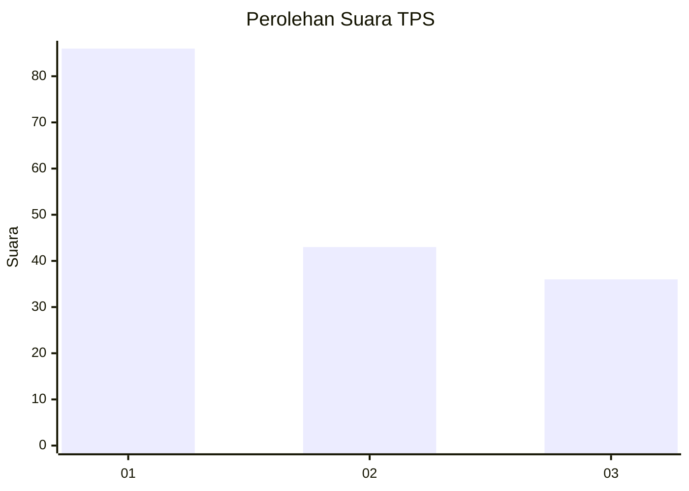
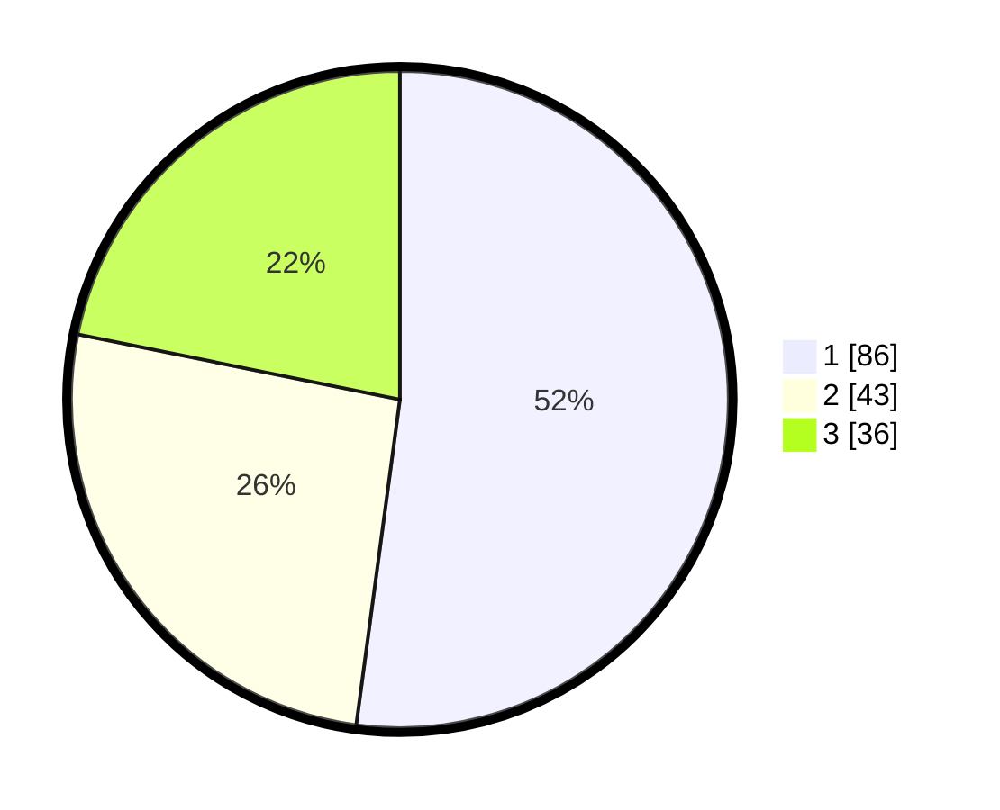

# Hasil

## Grafik

## Tabel

| No. | Nama Paslon    | Suara | Suara (raw) | Persentase |
|:--- |:-------------- | -----:| -----------:| ----------:|
| 1   | ANIES MUHAIMIN | 86    | [86][p-1]   | 52,12      |
| 2   | PRABOWO GIBRAN | 43    | [43][p-2]   | 26,06      |
| 3   | GANJAR MAHFUD  | 36    | [36][p-3]   | 21,82      |

[p-1]: https://github.com/gigit-pemilu/pemilu-2024/blob/main/pilpres/hitung-suara/sub/35-jawa-timur/sub/29-sumenep/sub/01-kota-sumenep/sub/1015-kepanjin/sub/007-tps/sub/paslon-1.txt
[p-2]: https://github.com/gigit-pemilu/pemilu-2024/blob/main/pilpres/hitung-suara/sub/35-jawa-timur/sub/29-sumenep/sub/01-kota-sumenep/sub/1015-kepanjin/sub/007-tps/sub/paslon-2.txt
[p-3]: https://github.com/gigit-pemilu/pemilu-2024/blob/main/pilpres/hitung-suara/sub/35-jawa-timur/sub/29-sumenep/sub/01-kota-sumenep/sub/1015-kepanjin/sub/007-tps/sub/paslon-3.txt

## Foto C Plano

https://sirekap-obj-formc.kpu.go.id/11d7/pemilu/ppwp/35/29/01/10/15/3529011015007-20240215-022802--49e97b89-eb3d-46aa-8c41-958cd0b828a5.jpg

https://sirekap-obj-formc.kpu.go.id/11d7/pemilu/ppwp/35/29/01/10/15/3529011015007-20240215-023101--9fe60d61-6720-446f-baa2-81856a0d5c3b.jpg

https://sirekap-obj-formc.kpu.go.id/11d7/pemilu/ppwp/35/29/01/10/15/3529011015007-20240215-023345--8acdf1b2-8d04-4473-8f90-5a55117d37e4.jpg

## Metadata

| Key        | Value               |
| ---------- | ------------------- |
| Time Stamp | 2024-02-15 16:30:25 |

## DATA PEMILIH TETAP

Jumlah pemilih dalam DPT: **203**.
 * L: **85**.
 * P: **118**.

## DATA PENGGUNA HAK PILIH

Jumlah pengguna hak pilih dalam DPT: **167**.
 * L: **65**.
 * P: **102**.

Jumlah pengguna hak pilih dalam DPTb: **0**.
 * L: **0**.
 * P: **0**.

Jumlah pengguna hak pilih dalam DPK: **6**.
 * L: **1**.
 * P: **5**.

Jumlah pengguna hak pilih: **173**.
 * L: **66**.
 * P: **107**.

## JUMLAH SUARA SAH DAN TIDAK SAH

JUMLAH SELURUH SUARA SAH: **165**.

JUMLAH SUARA TIDAK SAH: **2**.

JUMLAH SELURUH SUARA SAH DAN SUARA TIDAK SAH: **167**.

