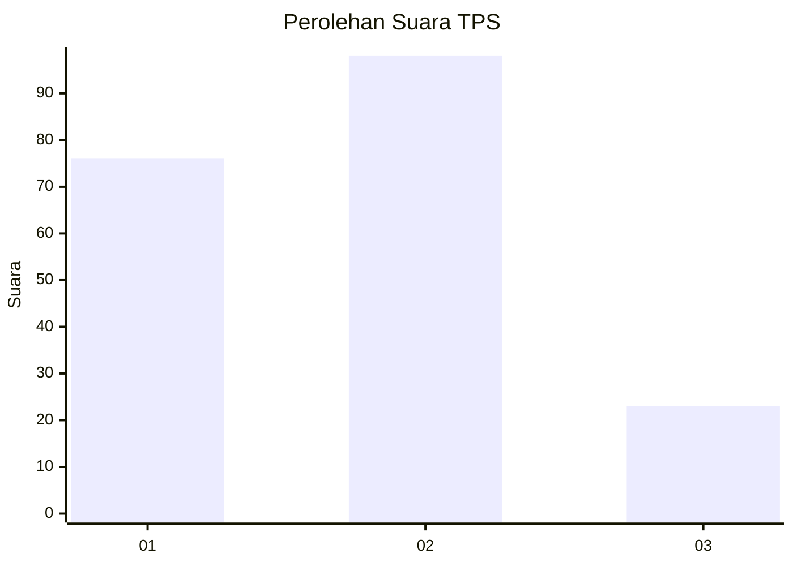
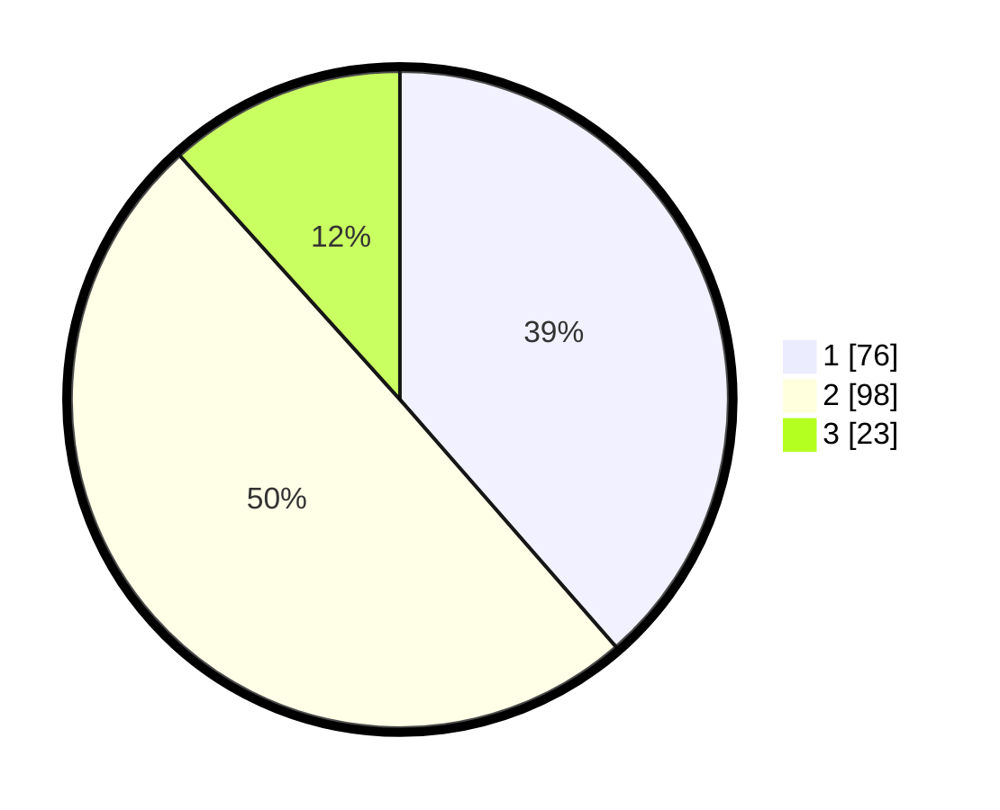

# Hasil

## Grafik

## Tabel

| No. | Nama Paslon    | Suara | Suara (raw) | Persentase |
|:--- |:-------------- | -----:| -----------:| ----------:|
| 1   | ANIES MUHAIMIN | 76    | [76][p-1]   | 38,58      |
| 2   | PRABOWO GIBRAN | 98    | [98][p-2]   | 49,75      |
| 3   | GANJAR MAHFUD  | 23    | [23][p-3]   | 11,68      |

[p-1]: https://github.com/gigit-pemilu/pemilu-2024-35-jawa-timur/blob/main/pilpres/hitung-suara/sub/35-jawa-timur/sub/29-sumenep/sub/01-kota-sumenep/sub/1017-bangselok/sub/012-tps/sub/paslon-1.txt
[p-2]: https://github.com/gigit-pemilu/pemilu-2024-35-jawa-timur/blob/main/pilpres/hitung-suara/sub/35-jawa-timur/sub/29-sumenep/sub/01-kota-sumenep/sub/1017-bangselok/sub/012-tps/sub/paslon-2.txt
[p-3]: https://github.com/gigit-pemilu/pemilu-2024-35-jawa-timur/blob/main/pilpres/hitung-suara/sub/35-jawa-timur/sub/29-sumenep/sub/01-kota-sumenep/sub/1017-bangselok/sub/012-tps/sub/paslon-3.txt

## Foto C Plano

https://sirekap-obj-formc.kpu.go.id/224d/pemilu/ppwp/35/29/01/10/17/3529011017012-20240214-211648--b16be8e9-53ab-47a1-90c9-2a7968421bc2.jpg

https://sirekap-obj-formc.kpu.go.id/224d/pemilu/ppwp/35/29/01/10/17/3529011017012-20240214-211710--26b27a0e-7adb-4e35-ad2d-1f787843b9f1.jpg

https://sirekap-obj-formc.kpu.go.id/224d/pemilu/ppwp/35/29/01/10/17/3529011017012-20240214-211723--6e0fdbff-83a1-4b15-b6d4-47f52c8dfb3e.jpg

## Metadata

| Key        | Value               |
| ---------- | ------------------- |
| Time Stamp | 2024-02-15 16:30:25 |

