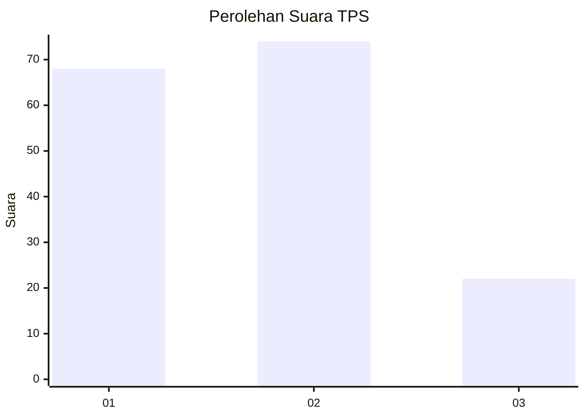
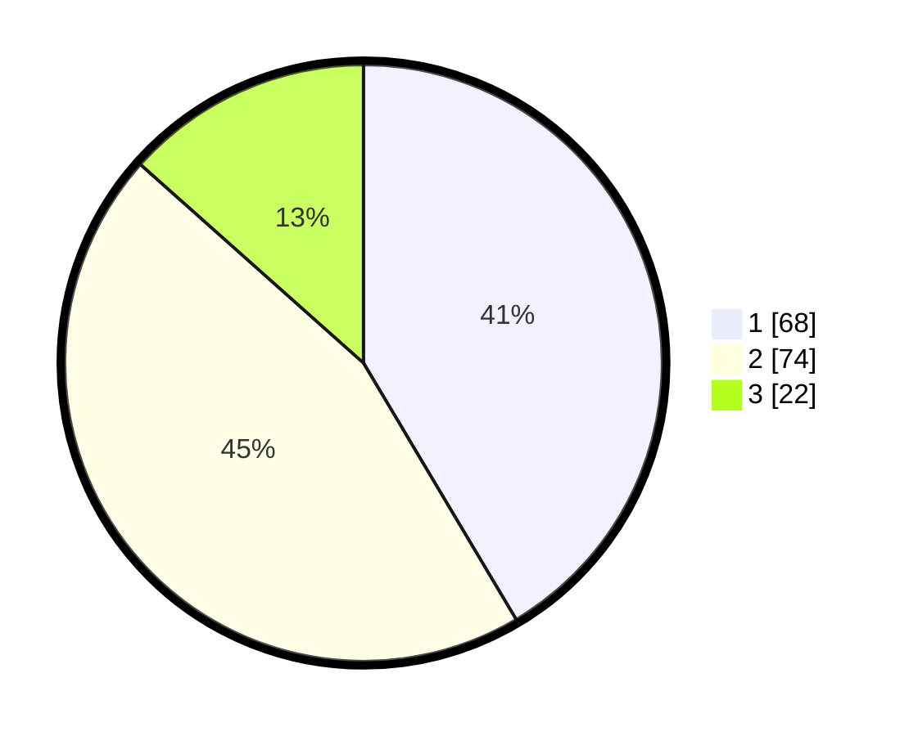

# Hasil

## Grafik

## Tabel

| No. | Nama Paslon    | Suara | Suara (raw) | Persentase |
|:--- |:-------------- | -----:| -----------:| ----------:|
| 1   | ANIES MUHAIMIN | 68    | [68][p-1]   | 41,46      |
| 2   | PRABOWO GIBRAN | 74    | [74][p-2]   | 45,12      |
| 3   | GANJAR MAHFUD  | 22    | [22][p-3]   | 13,41      |

[p-1]: https://github.com/gigit-pemilu/pemilu-2024/blob/main/pilpres/hitung-suara/sub/35-jawa-timur/sub/29-sumenep/sub/01-kota-sumenep/sub/1018-karangduak/sub/004-tps/sub/paslon-1.txt
[p-2]: https://github.com/gigit-pemilu/pemilu-2024/blob/main/pilpres/hitung-suara/sub/35-jawa-timur/sub/29-sumenep/sub/01-kota-sumenep/sub/1018-karangduak/sub/004-tps/sub/paslon-2.txt
[p-3]: https://github.com/gigit-pemilu/pemilu-2024/blob/main/pilpres/hitung-suara/sub/35-jawa-timur/sub/29-sumenep/sub/01-kota-sumenep/sub/1018-karangduak/sub/004-tps/sub/paslon-3.txt

## Foto C Plano

https://sirekap-obj-formc.kpu.go.id/2bfb/pemilu/ppwp/35/29/01/10/18/3529011018004-20240214-210946--7e522444-cd7d-4960-8bc5-b7a5a605f7ba.jpg

https://sirekap-obj-formc.kpu.go.id/2bfb/pemilu/ppwp/35/29/01/10/18/3529011018004-20240214-211406--08ff824c-002e-4156-9ef8-a96af317490b.jpg

https://sirekap-obj-formc.kpu.go.id/2bfb/pemilu/ppwp/35/29/01/10/18/3529011018004-20240214-211456--53dbe777-71d3-42e1-9013-19bd304ed8cd.jpg

## Metadata

| Key        | Value               |
| ---------- | ------------------- |
| Time Stamp | 2024-02-15 19:30:26 |

