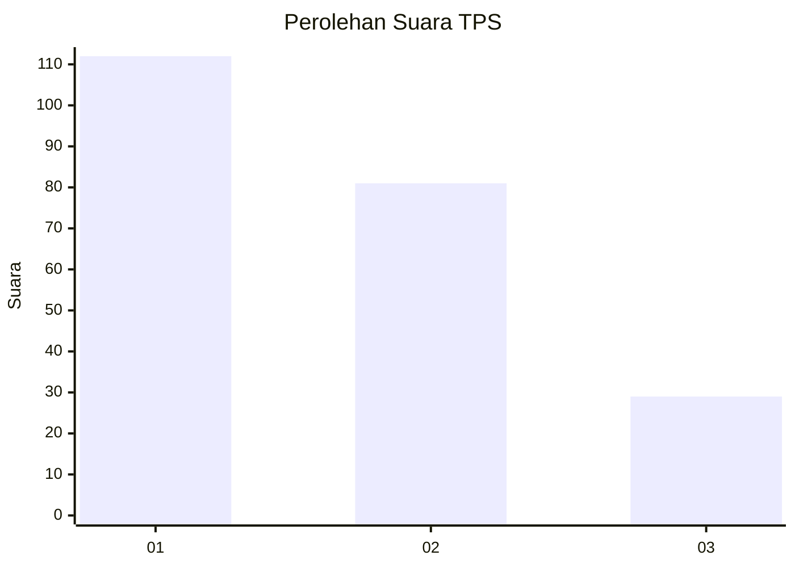
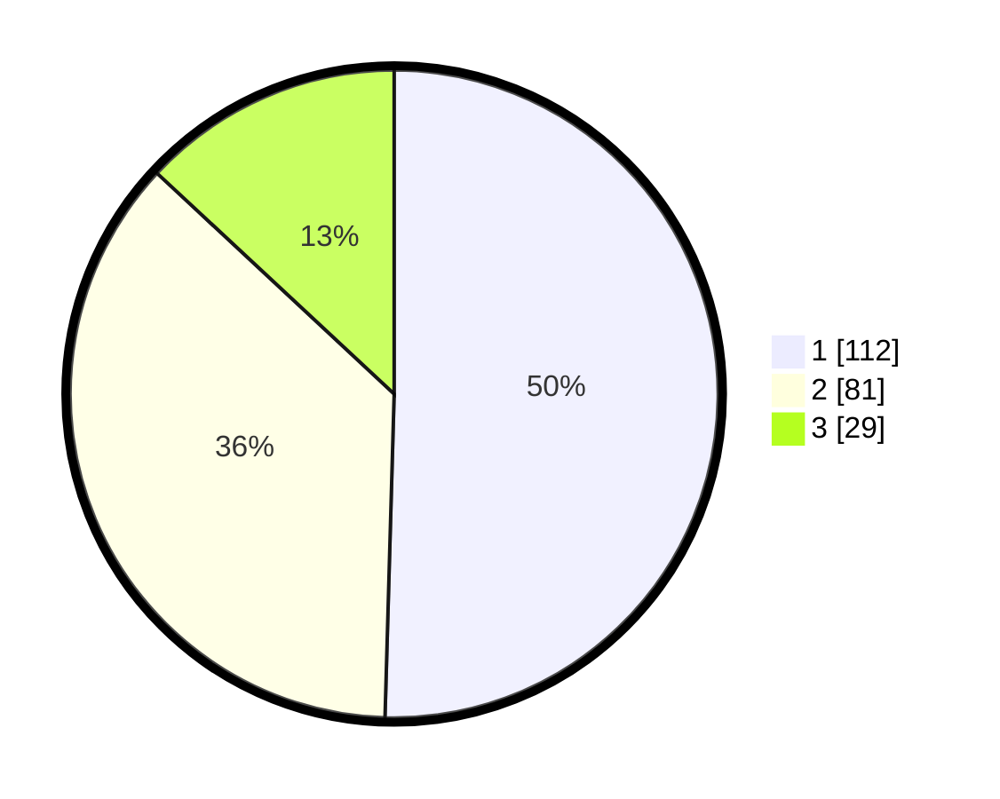

# Hasil

## Grafik

## Tabel

| No. | Nama Paslon    | Suara | Suara (raw) | Persentase |
|:--- |:-------------- | -----:| -----------:| ----------:|
| 1   | ANIES MUHAIMIN | 112   | [112][p-1]  | 50,45      |
| 2   | PRABOWO GIBRAN | 81    | [81][p-2]   | 36,49      |
| 3   | GANJAR MAHFUD  | 29    | [29][p-3]   | 13,06      |

[p-1]: https://github.com/gigit-pemilu/pemilu-2024/blob/main/pilpres/hitung-suara/sub/35-jawa-timur/sub/29-sumenep/sub/01-kota-sumenep/sub/2006-pabian/sub/013-tps/sub/paslon-1.txt
[p-2]: https://github.com/gigit-pemilu/pemilu-2024/blob/main/pilpres/hitung-suara/sub/35-jawa-timur/sub/29-sumenep/sub/01-kota-sumenep/sub/2006-pabian/sub/013-tps/sub/paslon-2.txt
[p-3]: https://github.com/gigit-pemilu/pemilu-2024/blob/main/pilpres/hitung-suara/sub/35-jawa-timur/sub/29-sumenep/sub/01-kota-sumenep/sub/2006-pabian/sub/013-tps/sub/paslon-3.txt

## Foto C Plano

https://sirekap-obj-formc.kpu.go.id/be52/pemilu/ppwp/35/29/01/20/06/3529012006013-20240215-105325--ee7a6d26-3079-48c3-8024-b875e435321f.jpg

https://sirekap-obj-formc.kpu.go.id/be52/pemilu/ppwp/35/29/01/20/06/3529012006013-20240215-105532--14ad8333-5848-4656-91e7-73bc8deb4eec.jpg

https://sirekap-obj-formc.kpu.go.id/be52/pemilu/ppwp/35/29/01/20/06/3529012006013-20240215-105635--60e39aee-d465-4490-93ed-5400178cd138.jpg

## Metadata

| Key        | Value               |
| ---------- | ------------------- |
| Time Stamp | 2024-02-15 18:00:26 |

