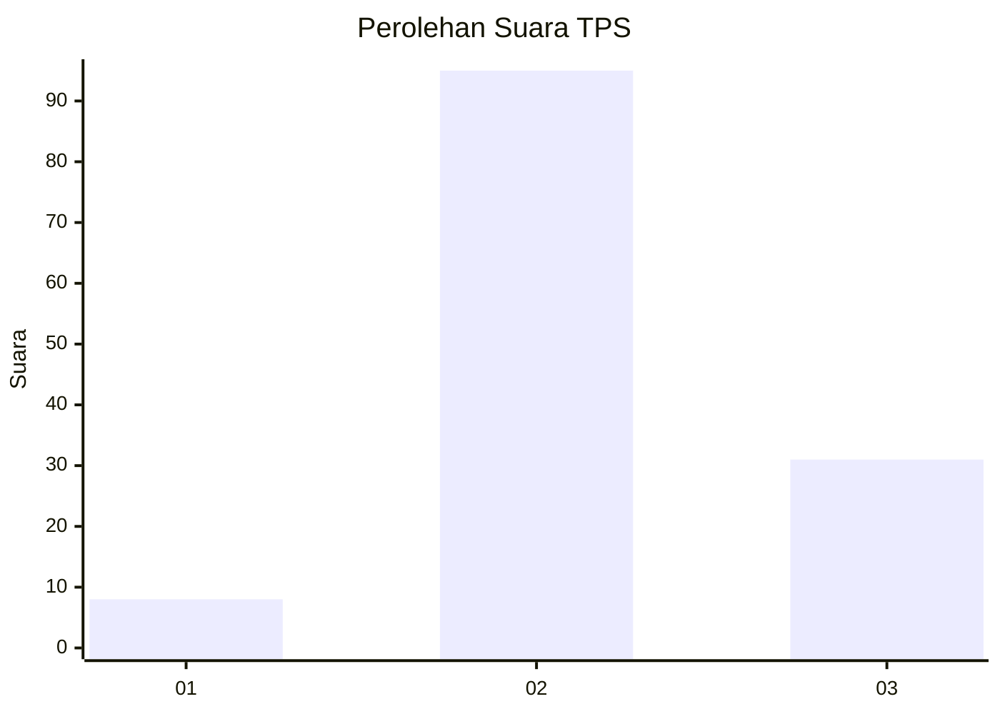
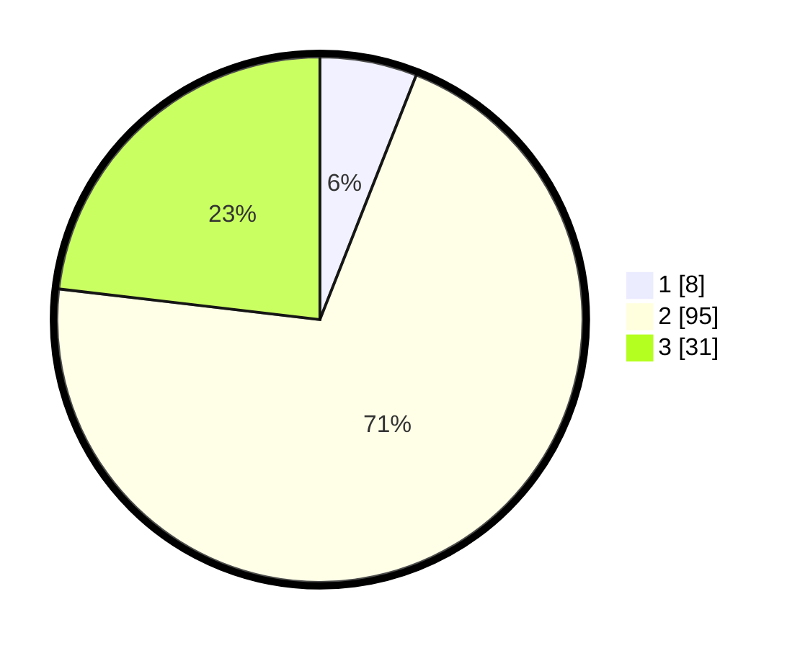

# Hasil

## Grafik

## Tabel

| No. | Nama Paslon    | Suara | Suara (raw) | Persentase |
|:--- |:-------------- | -----:| -----------:| ----------:|
| 1   | ANIES MUHAIMIN | 8     | [8][p-1]    | 5,97       |
| 2   | PRABOWO GIBRAN | 95    | [95][p-2]   | 70,90      |
| 3   | GANJAR MAHFUD  | 31    | [31][p-3]   | 23,13      |

[p-1]: https://github.com/gigit-pemilu/pemilu-2024-35-jawa-timur/blob/main/pilpres/hitung-suara/sub/35-jawa-timur/sub/29-sumenep/sub/01-kota-sumenep/sub/2006-pabian/sub/901-tps/sub/paslon-1.txt
[p-2]: https://github.com/gigit-pemilu/pemilu-2024-35-jawa-timur/blob/main/pilpres/hitung-suara/sub/35-jawa-timur/sub/29-sumenep/sub/01-kota-sumenep/sub/2006-pabian/sub/901-tps/sub/paslon-2.txt
[p-3]: https://github.com/gigit-pemilu/pemilu-2024-35-jawa-timur/blob/main/pilpres/hitung-suara/sub/35-jawa-timur/sub/29-sumenep/sub/01-kota-sumenep/sub/2006-pabian/sub/901-tps/sub/paslon-3.txt

## Foto C Plano

https://sirekap-obj-formc.kpu.go.id/9ead/pemilu/ppwp/35/29/01/20/06/3529012006901-20240214-140940--dac4106c-700f-49c7-8c6c-33c4ef822678.jpg

https://sirekap-obj-formc.kpu.go.id/9ead/pemilu/ppwp/35/29/01/20/06/3529012006901-20240214-141105--2d3dab9e-a99f-4bb3-981a-1b4d076ce497.jpg

https://sirekap-obj-formc.kpu.go.id/9ead/pemilu/ppwp/35/29/01/20/06/3529012006901-20240214-141214--c336b951-72c0-4826-ba6f-ad3d2cc9199d.jpg

## Metadata

| Key        | Value               |
| ---------- | ------------------- |
| Time Stamp | 2024-02-14 21:46:01 |

## DATA PEMILIH TETAP

Jumlah pemilih dalam DPT: **156**.
 * L: **147**.
 * P: **9**.

## DATA PENGGUNA HAK PILIH

Jumlah pengguna hak pilih dalam DPT: **85**.
 * L: **82**.
 * P: **3**.

Jumlah pengguna hak pilih dalam DPTb: **53**.
 * L: **53**.
 * P: **0**.

Jumlah pengguna hak pilih dalam DPK: **0**.
 * L: **0**.
 * P: **0**.

Jumlah pengguna hak pilih: **138**.
 * L: **135**.
 * P: **3**.

## JUMLAH SUARA SAH DAN TIDAK SAH

JUMLAH SELURUH SUARA SAH: **134**.

JUMLAH SUARA TIDAK SAH: **4**.

JUMLAH SELURUH SUARA SAH DAN SUARA TIDAK SAH: **138**.

