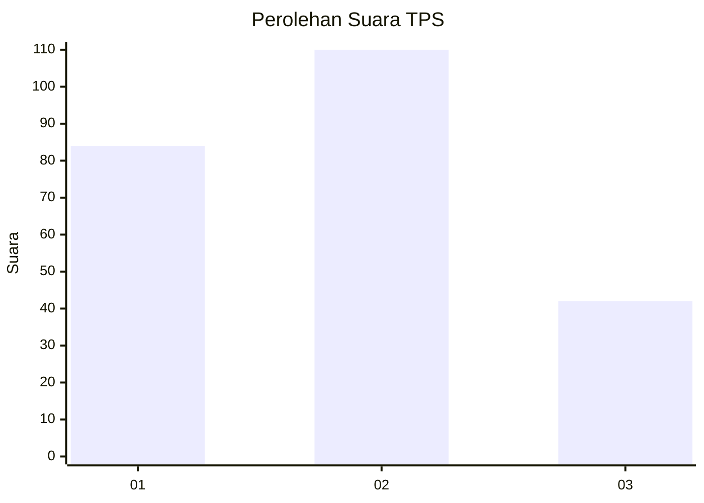
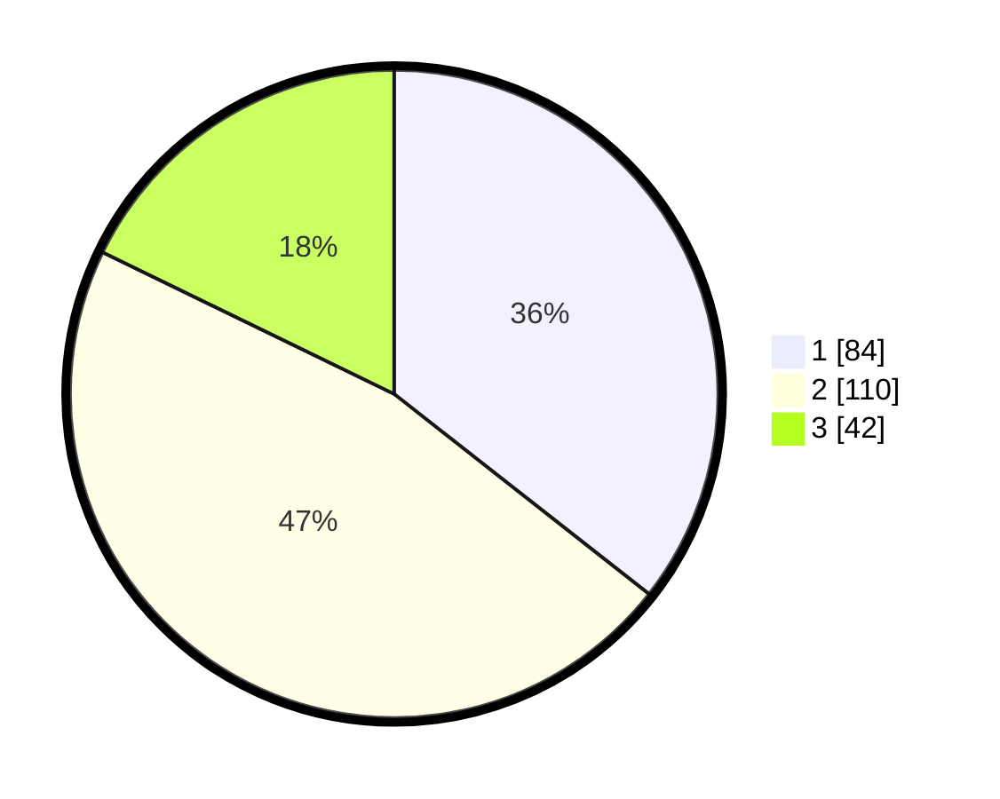

# Hasil

## Grafik

## Tabel

| No. | Nama Paslon    | Suara | Suara (raw) | Persentase |
|:--- |:-------------- | -----:| -----------:| ----------:|
| 1   | ANIES MUHAIMIN | 84    | [84][p-1]   | 35,59      |
| 2   | PRABOWO GIBRAN | 110   | [110][p-2]  | 46,61      |
| 3   | GANJAR MAHFUD  | 42    | [42][p-3]   | 17,80      |

[p-1]: https://github.com/gigit-pemilu/pemilu-2024/blob/main/pilpres/hitung-suara/sub/35-jawa-timur/sub/29-sumenep/sub/01-kota-sumenep/sub/2007-marengan-daya/sub/004-tps/sub/paslon-1.txt
[p-2]: https://github.com/gigit-pemilu/pemilu-2024/blob/main/pilpres/hitung-suara/sub/35-jawa-timur/sub/29-sumenep/sub/01-kota-sumenep/sub/2007-marengan-daya/sub/004-tps/sub/paslon-2.txt
[p-3]: https://github.com/gigit-pemilu/pemilu-2024/blob/main/pilpres/hitung-suara/sub/35-jawa-timur/sub/29-sumenep/sub/01-kota-sumenep/sub/2007-marengan-daya/sub/004-tps/sub/paslon-3.txt

## Foto C Plano

https://sirekap-obj-formc.kpu.go.id/3a56/pemilu/ppwp/35/29/01/20/07/3529012007004-20240214-225331--284aa095-772c-40ef-8ec6-a720c45ed76c.jpg

https://sirekap-obj-formc.kpu.go.id/3a56/pemilu/ppwp/35/29/01/20/07/3529012007004-20240214-225854--e56e64c8-818c-41ed-9e24-ad72d363a7b8.jpg

https://sirekap-obj-formc.kpu.go.id/3a56/pemilu/ppwp/35/29/01/20/07/3529012007004-20240214-225948--219c76d0-368b-4577-b0c0-eeb3bdb10a40.jpg

## Metadata

| Key        | Value               |
| ---------- | ------------------- |
| Time Stamp | 2024-02-15 18:30:25 |

