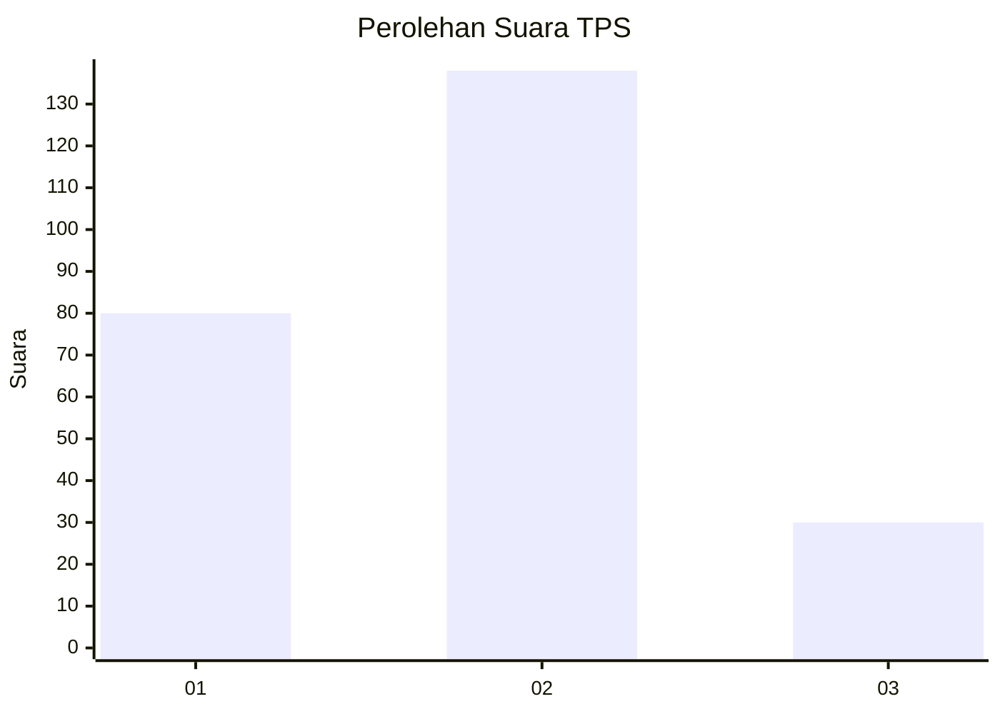
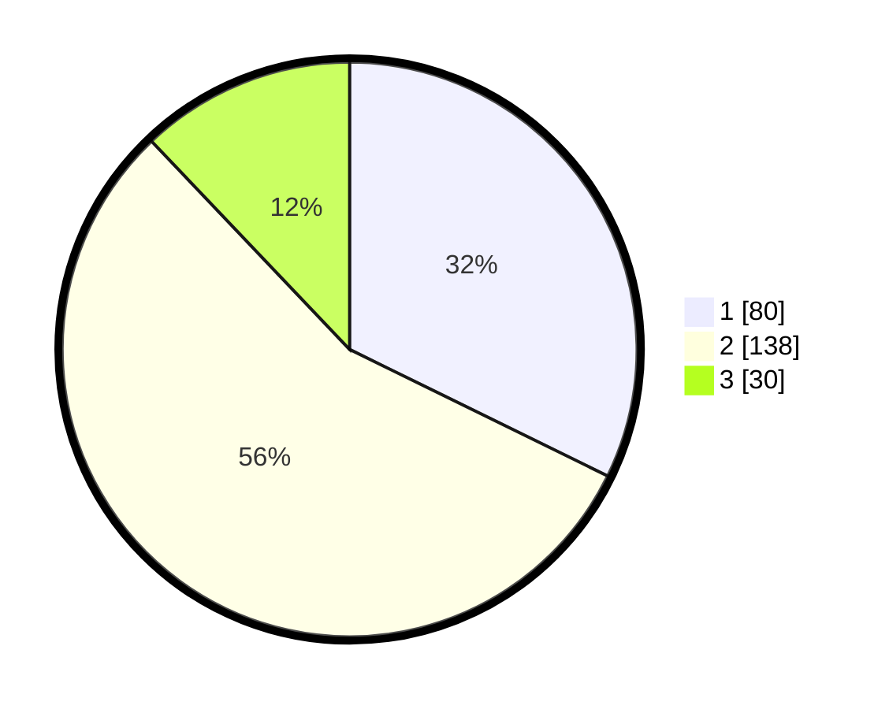

# Hasil

## Grafik

## Tabel

| No. | Nama Paslon    | Suara | Suara (raw) | Persentase |
|:--- |:-------------- | -----:| -----------:| ----------:|
| 1   | ANIES MUHAIMIN | 80    | [80][p-1]   | 32,26      |
| 2   | PRABOWO GIBRAN | 138   | [138][p-2]  | 55,65      |
| 3   | GANJAR MAHFUD  | 30    | [30][p-3]   | 12,10      |

[p-1]: https://github.com/gigit-pemilu/pemilu-2024/blob/main/pilpres/hitung-suara/sub/35-jawa-timur/sub/29-sumenep/sub/01-kota-sumenep/sub/2010-parsanga/sub/001-tps/sub/paslon-1.txt
[p-2]: https://github.com/gigit-pemilu/pemilu-2024/blob/main/pilpres/hitung-suara/sub/35-jawa-timur/sub/29-sumenep/sub/01-kota-sumenep/sub/2010-parsanga/sub/001-tps/sub/paslon-2.txt
[p-3]: https://github.com/gigit-pemilu/pemilu-2024/blob/main/pilpres/hitung-suara/sub/35-jawa-timur/sub/29-sumenep/sub/01-kota-sumenep/sub/2010-parsanga/sub/001-tps/sub/paslon-3.txt

## Foto C Plano

https://sirekap-obj-formc.kpu.go.id/1aa0/pemilu/ppwp/35/29/01/20/10/3529012010001-20240214-225108--a2d1b33c-6c2b-4790-a00d-b103a2fc29d5.jpg

https://sirekap-obj-formc.kpu.go.id/1aa0/pemilu/ppwp/35/29/01/20/10/3529012010001-20240214-225533--873ad53f-7511-43dd-9780-2051bb179338.jpg

https://sirekap-obj-formc.kpu.go.id/1aa0/pemilu/ppwp/35/29/01/20/10/3529012010001-20240214-225747--a3ef8b47-8d7a-47fc-b88f-6c2c83fc1462.jpg

## Metadata

| Key        | Value               |
| ---------- | ------------------- |
| Time Stamp | 2024-02-15 16:00:26 |

