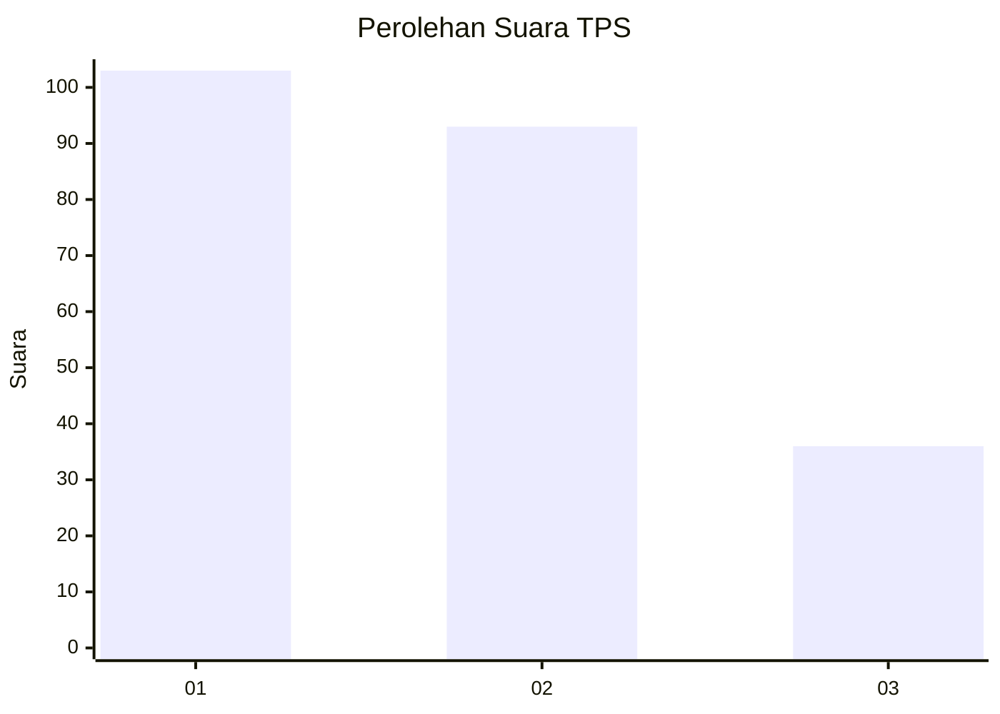
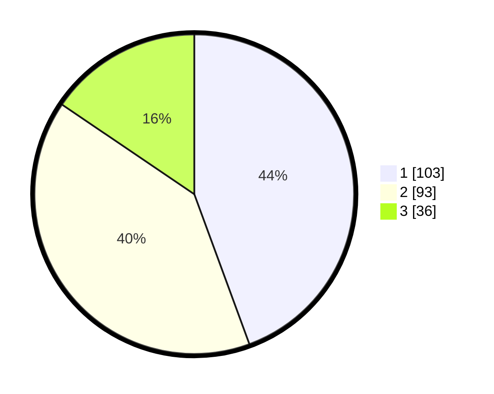

# Hasil

## Grafik

## Tabel

| No. | Nama Paslon    | Suara | Suara (raw) | Persentase |
|:--- |:-------------- | -----:| -----------:| ----------:|
| 1   | ANIES MUHAIMIN | 103   | [103][p-1]  | 44,40      |
| 2   | PRABOWO GIBRAN | 93    | [93][p-2]   | 40,09      |
| 3   | GANJAR MAHFUD  | 36    | [36][p-3]   | 15,52      |

[p-1]: https://github.com/gigit-pemilu/pemilu-2024-35-jawa-timur/blob/main/pilpres/hitung-suara/sub/35-jawa-timur/sub/29-sumenep/sub/01-kota-sumenep/sub/2013-pamolokan/sub/022-tps/sub/paslon-1.txt
[p-2]: https://github.com/gigit-pemilu/pemilu-2024-35-jawa-timur/blob/main/pilpres/hitung-suara/sub/35-jawa-timur/sub/29-sumenep/sub/01-kota-sumenep/sub/2013-pamolokan/sub/022-tps/sub/paslon-2.txt
[p-3]: https://github.com/gigit-pemilu/pemilu-2024-35-jawa-timur/blob/main/pilpres/hitung-suara/sub/35-jawa-timur/sub/29-sumenep/sub/01-kota-sumenep/sub/2013-pamolokan/sub/022-tps/sub/paslon-3.txt

## Foto C Plano

https://sirekap-obj-formc.kpu.go.id/8db7/pemilu/ppwp/35/29/01/20/13/3529012013022-20240214-202816--d2c00633-78c5-41fc-9d1b-7f2f9a006593.jpg

https://sirekap-obj-formc.kpu.go.id/8db7/pemilu/ppwp/35/29/01/20/13/3529012013022-20240214-193212--160556b9-38f5-4aca-b2a6-750255f34cf1.jpg

https://sirekap-obj-formc.kpu.go.id/8db7/pemilu/ppwp/35/29/01/20/13/3529012013022-20240215-001237--f28517ec-d1df-4889-a8bf-18ad45792e8b.jpg

## Metadata

| Key        | Value               |
| ---------- | ------------------- |
| Time Stamp | 2024-02-15 15:00:29 |

