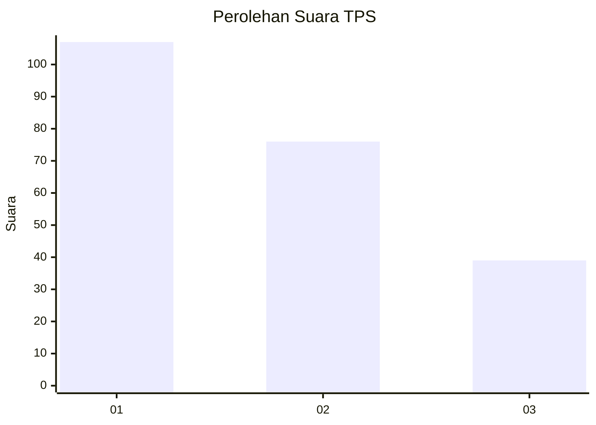
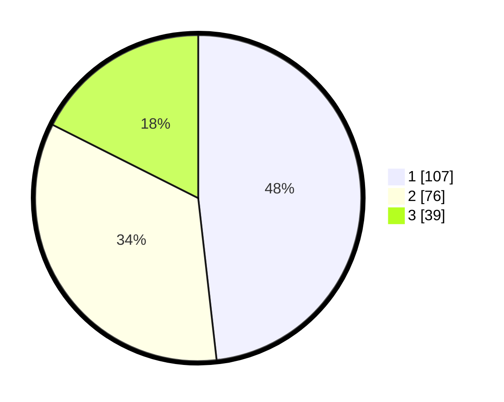

# Hasil

## Grafik

## Tabel

| No. | Nama Paslon    | Suara | Suara (raw) | Persentase |
|:--- |:-------------- | -----:| -----------:| ----------:|
| 1   | ANIES MUHAIMIN | 107   | [107][p-1]  | 48,20      |
| 2   | PRABOWO GIBRAN | 76    | [76][p-2]   | 34,23      |
| 3   | GANJAR MAHFUD  | 39    | [39][p-3]   | 17,57      |

[p-1]: https://github.com/gigit-pemilu/pemilu-2024-35-jawa-timur/blob/main/pilpres/hitung-suara/sub/35-jawa-timur/sub/29-sumenep/sub/01-kota-sumenep/sub/2014-pangarangan/sub/001-tps/sub/paslon-1.txt
[p-2]: https://github.com/gigit-pemilu/pemilu-2024-35-jawa-timur/blob/main/pilpres/hitung-suara/sub/35-jawa-timur/sub/29-sumenep/sub/01-kota-sumenep/sub/2014-pangarangan/sub/001-tps/sub/paslon-2.txt
[p-3]: https://github.com/gigit-pemilu/pemilu-2024-35-jawa-timur/blob/main/pilpres/hitung-suara/sub/35-jawa-timur/sub/29-sumenep/sub/01-kota-sumenep/sub/2014-pangarangan/sub/001-tps/sub/paslon-3.txt

## Foto C Plano

https://sirekap-obj-formc.kpu.go.id/e62c/pemilu/ppwp/35/29/01/20/14/3529012014001-20240214-205241--18308cbe-cddd-46fb-913f-d91f713f8989.jpg

https://sirekap-obj-formc.kpu.go.id/e62c/pemilu/ppwp/35/29/01/20/14/3529012014001-20240214-222302--51d2ebe4-9f62-4f5f-b4a1-44c346285c72.jpg

https://sirekap-obj-formc.kpu.go.id/e62c/pemilu/ppwp/35/29/01/20/14/3529012014001-20240214-205625--006eed36-96ed-4bc8-9f16-7b1a2e82e0e1.jpg

## Metadata

| Key        | Value               |
| ---------- | ------------------- |
| Time Stamp | 2024-02-15 17:00:25 |

