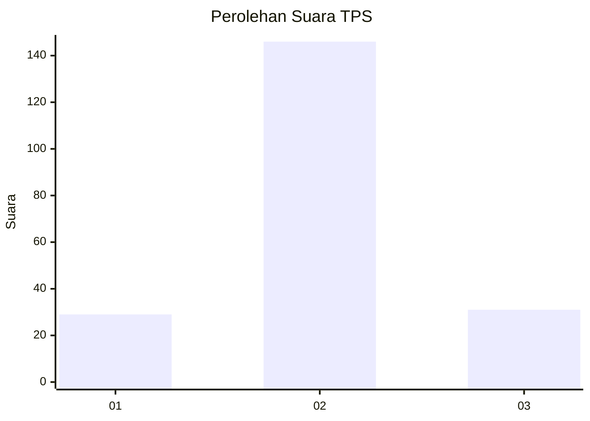

# Hasil

## Grafik

## Tabel

| No. | Nama Paslon    | Suara | Suara (raw) | Persentase |
|:--- |:-------------- | -----:| -----------:| ----------:|
| 1   | ANIES MUHAIMIN | 29    | [29][p-1]   | 14,08      |
| 2   | PRABOWO GIBRAN | 146   | [146][p-2]  | 70,87      |
| 3   | GANJAR MAHFUD  | 31    | [31][p-3]   | 15,05      |

[p-1]: https://github.com/gigit-pemilu/pemilu-2024-35-jawa-timur/blob/main/pilpres/hitung-suara/sub/35-jawa-timur/sub/29-sumenep/sub/02-kalianget/sub/2002-karanganyar/sub/006-tps/sub/paslon-1.txt
[p-2]: https://github.com/gigit-pemilu/pemilu-2024-35-jawa-timur/blob/main/pilpres/hitung-suara/sub/35-jawa-timur/sub/29-sumenep/sub/02-kalianget/sub/2002-karanganyar/sub/006-tps/sub/paslon-2.txt
[p-3]: https://github.com/gigit-pemilu/pemilu-2024-35-jawa-timur/blob/main/pilpres/hitung-suara/sub/35-jawa-timur/sub/29-sumenep/sub/02-kalianget/sub/2002-karanganyar/sub/006-tps/sub/paslon-3.txt

## Foto C Plano

https://sirekap-obj-formc.kpu.go.id/d4db/pemilu/ppwp/35/29/02/20/02/3529022002006-20240222-094052--0d25204b-23c0-4785-a486-18be43f04956.jpg

https://sirekap-obj-formc.kpu.go.id/d4db/pemilu/ppwp/35/29/02/20/02/3529022002006-20240222-094128--c5b29552-0f37-423c-a85d-d7482fb0abe4.jpg

https://sirekap-obj-formc.kpu.go.id/d4db/pemilu/ppwp/35/29/02/20/02/3529022002006-20240222-094206--a7ff9500-b751-4e28-ade0-f72513fb7b97.jpg

## Metadata

| Key        | Value               |
| ---------- | ------------------- |
| Time Stamp | 2024-02-25 17:00:00 |

