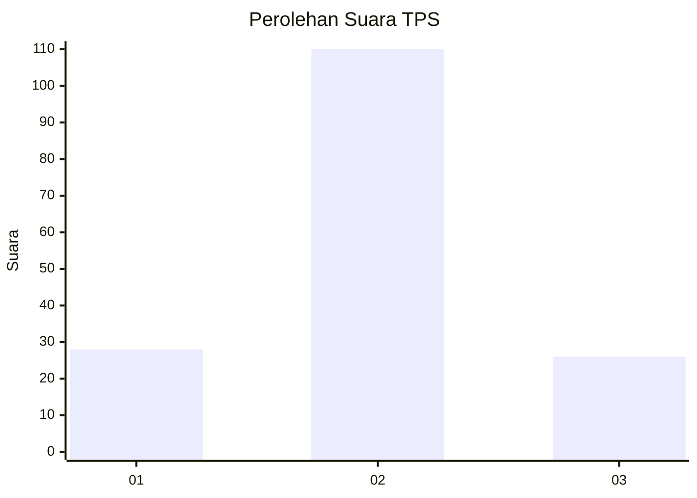
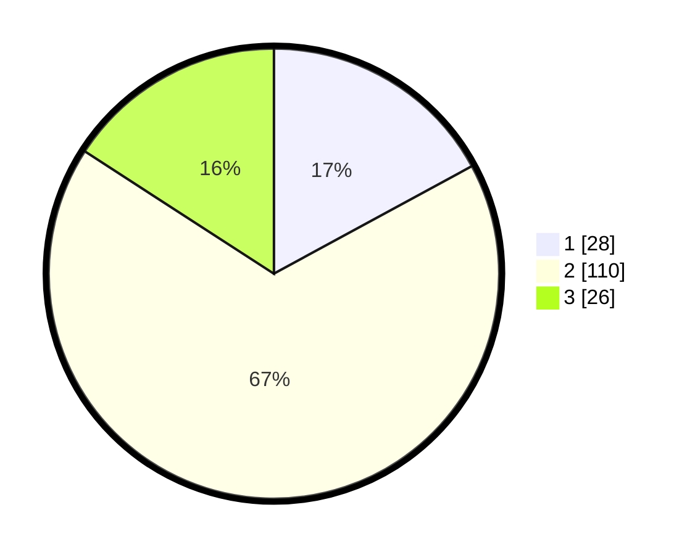

# Hasil

## Grafik

## Tabel

| No. | Nama Paslon    | Suara | Suara (raw) | Persentase |
|:--- |:-------------- | -----:| -----------:| ----------:|
| 1   | ANIES MUHAIMIN | 28    | [28][p-1]   | 17,07      |
| 2   | PRABOWO GIBRAN | 110   | [110][p-2]  | 67,07      |
| 3   | GANJAR MAHFUD  | 26    | [26][p-3]   | 15,85      |

[p-1]: https://github.com/gigit-pemilu/pemilu-2024/blob/main/pilpres/hitung-suara/sub/35-jawa-timur/sub/29-sumenep/sub/02-kalianget/sub/2003-marengan-laok/sub/002-tps/sub/paslon-1.txt
[p-2]: https://github.com/gigit-pemilu/pemilu-2024/blob/main/pilpres/hitung-suara/sub/35-jawa-timur/sub/29-sumenep/sub/02-kalianget/sub/2003-marengan-laok/sub/002-tps/sub/paslon-2.txt
[p-3]: https://github.com/gigit-pemilu/pemilu-2024/blob/main/pilpres/hitung-suara/sub/35-jawa-timur/sub/29-sumenep/sub/02-kalianget/sub/2003-marengan-laok/sub/002-tps/sub/paslon-3.txt

## Foto C Plano

https://sirekap-obj-formc.kpu.go.id/a945/pemilu/ppwp/35/29/02/20/03/3529022003002-20240224-083159--5ce16a70-8393-4d35-bd0e-28fd30bc4421.jpg

https://sirekap-obj-formc.kpu.go.id/a945/pemilu/ppwp/35/29/02/20/03/3529022003002-20240224-084120--234f0fe4-d932-432b-bc4b-79e4692f8321.jpg

https://sirekap-obj-formc.kpu.go.id/a945/pemilu/ppwp/35/29/02/20/03/3529022003002-20240224-083130--8ad6c084-8933-4a7b-9c9a-8eac4c371f47.jpg

## Metadata

| Key        | Value               |
| ---------- | ------------------- |
| Time Stamp | 2024-02-24 22:31:28 |

