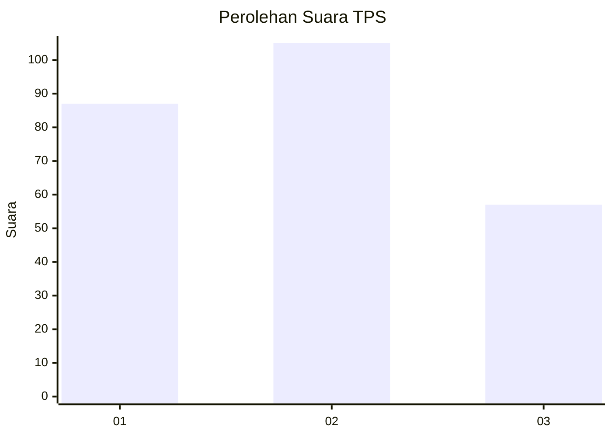
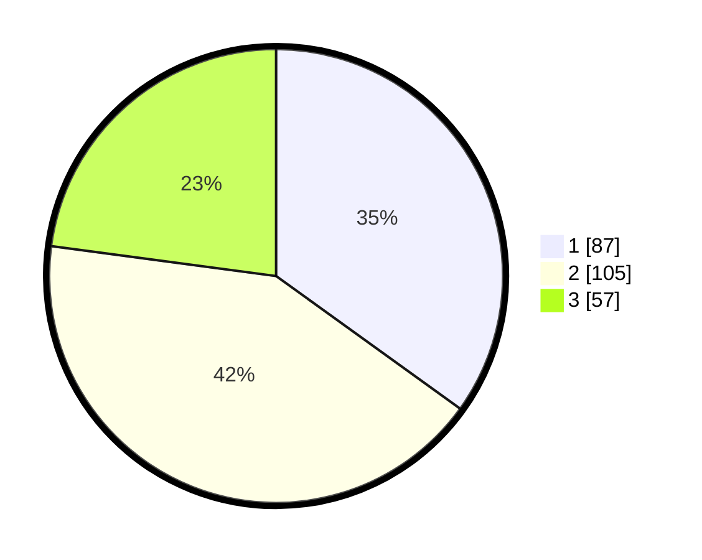

# Hasil

## Grafik

## Tabel

| No. | Nama Paslon    | Suara | Suara (raw) | Persentase |
|:--- |:-------------- | -----:| -----------:| ----------:|
| 1   | ANIES MUHAIMIN | 87    | [87][p-1]   | 34,94      |
| 2   | PRABOWO GIBRAN | 105   | [105][p-2]  | 42,17      |
| 3   | GANJAR MAHFUD  | 57    | [57][p-3]   | 22,89      |

[p-1]: https://github.com/gigit-pemilu/pemilu-2024-35-jawa-timur/blob/main/pilpres/hitung-suara/sub/35-jawa-timur/sub/29-sumenep/sub/02-kalianget/sub/2003-marengan-laok/sub/012-tps/sub/paslon-1.txt
[p-2]: https://github.com/gigit-pemilu/pemilu-2024-35-jawa-timur/blob/main/pilpres/hitung-suara/sub/35-jawa-timur/sub/29-sumenep/sub/02-kalianget/sub/2003-marengan-laok/sub/012-tps/sub/paslon-2.txt
[p-3]: https://github.com/gigit-pemilu/pemilu-2024-35-jawa-timur/blob/main/pilpres/hitung-suara/sub/35-jawa-timur/sub/29-sumenep/sub/02-kalianget/sub/2003-marengan-laok/sub/012-tps/sub/paslon-3.txt

## Foto C Plano

https://sirekap-obj-formc.kpu.go.id/2c4e/pemilu/ppwp/35/29/02/20/03/3529022003012-20240220-212014--44eff693-2d2b-4ba1-a55b-322691ed170c.jpg

https://sirekap-obj-formc.kpu.go.id/2c4e/pemilu/ppwp/35/29/02/20/03/3529022003012-20240220-211853--00415685-58be-4d5c-97ec-32bfaf2a777f.jpg

https://sirekap-obj-formc.kpu.go.id/2c4e/pemilu/ppwp/35/29/02/20/03/3529022003012-20240220-212136--1bfe0570-125f-4531-b5fb-84a0d075c121.jpg

## Metadata

| Key        | Value               |
| ---------- | ------------------- |
| Time Stamp | 2024-02-24 22:31:28 |

