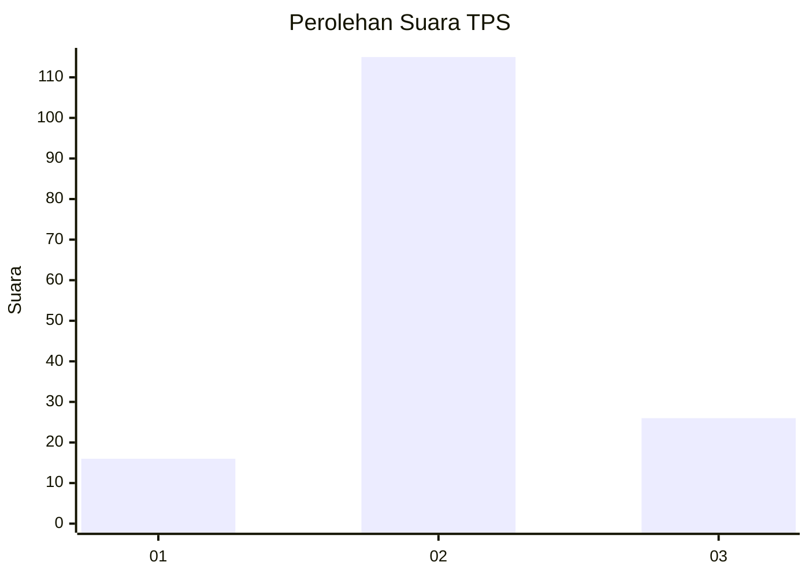
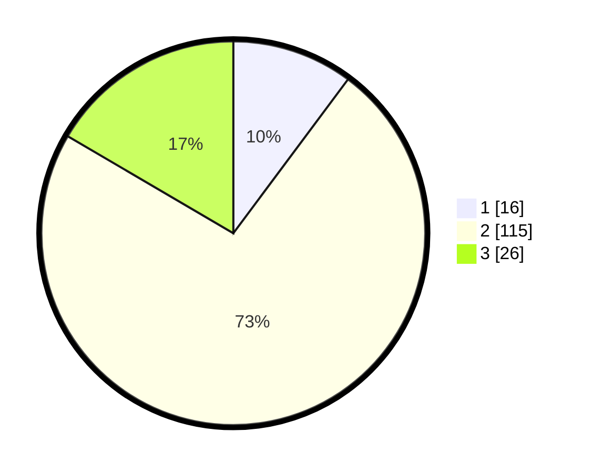

# Hasil

## Grafik

## Tabel

| No. | Nama Paslon    | Suara | Suara (raw) | Persentase |
|:--- |:-------------- | -----:| -----------:| ----------:|
| 1   | ANIES MUHAIMIN | 16    | [16][p-1]   | 10,19      |
| 2   | PRABOWO GIBRAN | 115   | [115][p-2]  | 73,25      |
| 3   | GANJAR MAHFUD  | 26    | [26][p-3]   | 16,56      |

[p-1]: https://github.com/gigit-pemilu/pemilu-2024/blob/main/pilpres/hitung-suara/sub/35-jawa-timur/sub/29-sumenep/sub/02-kalianget/sub/2004-kertasada/sub/003-tps/sub/paslon-1.txt
[p-2]: https://github.com/gigit-pemilu/pemilu-2024/blob/main/pilpres/hitung-suara/sub/35-jawa-timur/sub/29-sumenep/sub/02-kalianget/sub/2004-kertasada/sub/003-tps/sub/paslon-2.txt
[p-3]: https://github.com/gigit-pemilu/pemilu-2024/blob/main/pilpres/hitung-suara/sub/35-jawa-timur/sub/29-sumenep/sub/02-kalianget/sub/2004-kertasada/sub/003-tps/sub/paslon-3.txt

## Foto C Plano

https://sirekap-obj-formc.kpu.go.id/35aa/pemilu/ppwp/35/29/02/20/04/3529022004003-20240222-211931--9c135a6c-7472-48fd-818c-b26b16917691.jpg

https://sirekap-obj-formc.kpu.go.id/35aa/pemilu/ppwp/35/29/02/20/04/3529022004003-20240222-212044--4a6ae883-3bf2-4b43-b65d-dfe869ecd694.jpg

https://sirekap-obj-formc.kpu.go.id/35aa/pemilu/ppwp/35/29/02/20/04/3529022004003-20240222-212128--d15474e1-1590-404c-b23d-fbe9d1712873.jpg

## Metadata

| Key        | Value               |
| ---------- | ------------------- |
| Time Stamp | 2024-02-22 23:00:00 |

