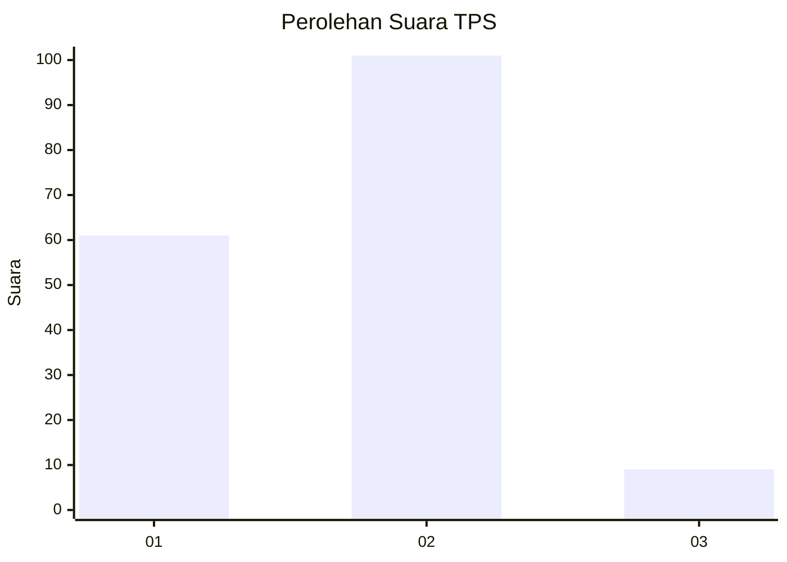
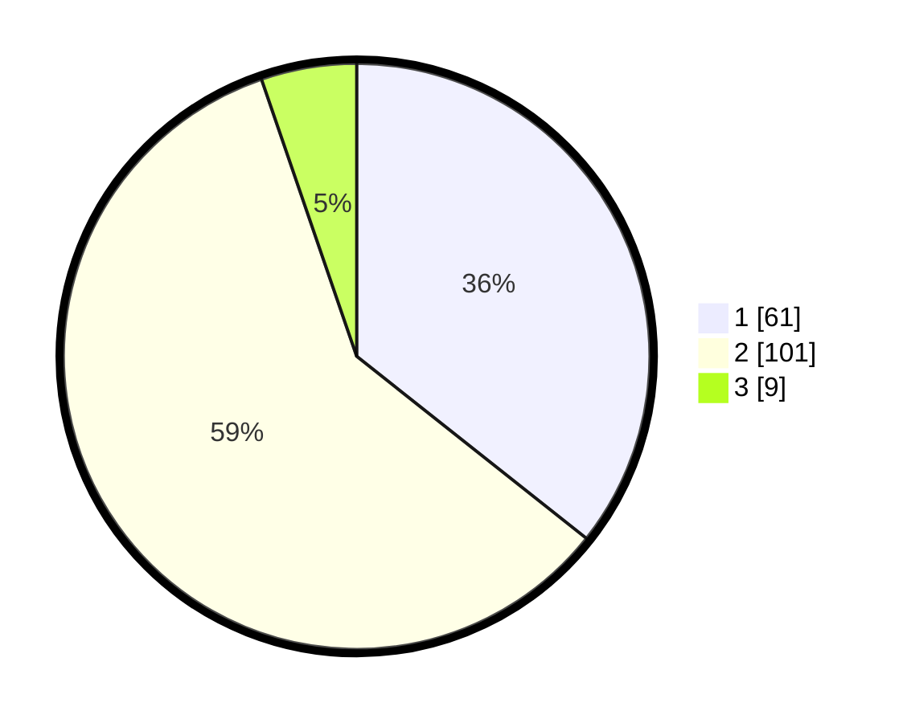

# Hasil

## Grafik

## Tabel

| No. | Nama Paslon    | Suara | Suara (raw) | Persentase |
|:--- |:-------------- | -----:| -----------:| ----------:|
| 1   | ANIES MUHAIMIN | 61    | [61][p-1]   | 35,67      |
| 2   | PRABOWO GIBRAN | 101   | [101][p-2]  | 59,06      |
| 3   | GANJAR MAHFUD  | 9     | [9][p-3]    | 5,26       |

[p-1]: https://github.com/gigit-pemilu/pemilu-2024/blob/main/pilpres/hitung-suara/sub/35-jawa-timur/sub/29-sumenep/sub/03-manding/sub/2001-kasengan/sub/002-tps/sub/paslon-1.txt
[p-2]: https://github.com/gigit-pemilu/pemilu-2024/blob/main/pilpres/hitung-suara/sub/35-jawa-timur/sub/29-sumenep/sub/03-manding/sub/2001-kasengan/sub/002-tps/sub/paslon-2.txt
[p-3]: https://github.com/gigit-pemilu/pemilu-2024/blob/main/pilpres/hitung-suara/sub/35-jawa-timur/sub/29-sumenep/sub/03-manding/sub/2001-kasengan/sub/002-tps/sub/paslon-3.txt

## Foto C Plano

https://sirekap-obj-formc.kpu.go.id/9bb7/pemilu/ppwp/35/29/03/20/01/3529032001002-20240214-214302--0c753b9f-58a2-4f72-82a3-139564737f82.jpg

https://sirekap-obj-formc.kpu.go.id/9bb7/pemilu/ppwp/35/29/03/20/01/3529032001002-20240214-214514--50d03a6c-113d-4d10-82da-14e2cb9771fa.jpg

https://sirekap-obj-formc.kpu.go.id/9bb7/pemilu/ppwp/35/29/03/20/01/3529032001002-20240214-214906--31aae9f3-9fca-4f5d-a9ca-5b889ee7e411.jpg

## Metadata

| Key        | Value               |
| ---------- | ------------------- |
| Time Stamp | 2024-02-15 16:30:25 |

