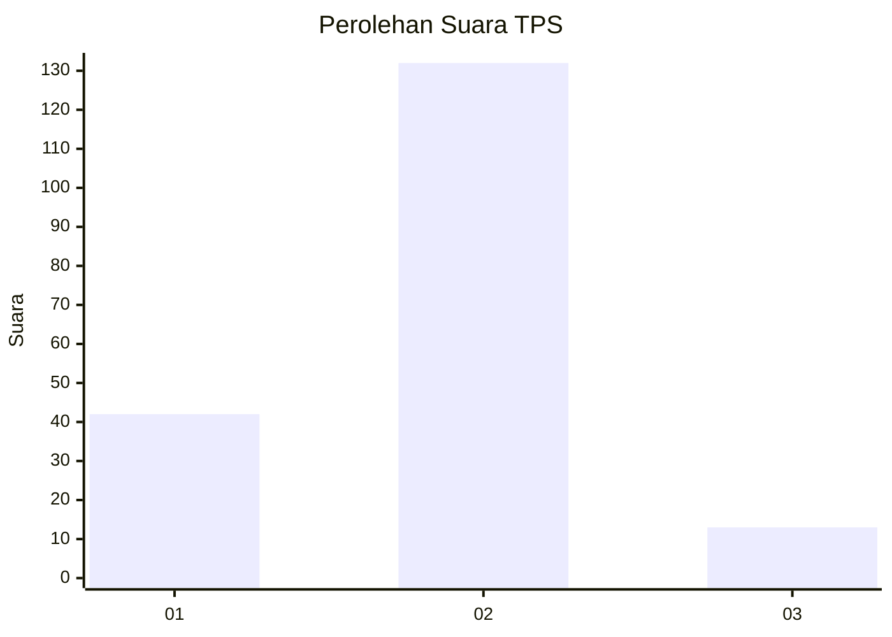
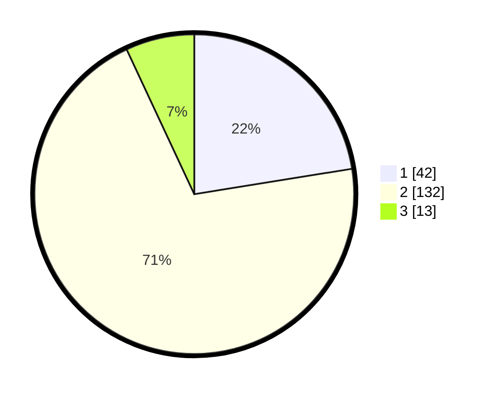

# Hasil

## Grafik

## Tabel

| No. | Nama Paslon    | Suara | Suara (raw) | Persentase |
|:--- |:-------------- | -----:| -----------:| ----------:|
| 1   | ANIES MUHAIMIN | 42    | [42][p-1]   | 22,46      |
| 2   | PRABOWO GIBRAN | 132   | [132][p-2]  | 70,59      |
| 3   | GANJAR MAHFUD  | 13    | [13][p-3]   | 6,95       |

[p-1]: https://github.com/gigit-pemilu/pemilu-2024-35-jawa-timur/blob/main/pilpres/hitung-suara/sub/35-jawa-timur/sub/29-sumenep/sub/03-manding/sub/2001-kasengan/sub/004-tps/sub/paslon-1.txt
[p-2]: https://github.com/gigit-pemilu/pemilu-2024-35-jawa-timur/blob/main/pilpres/hitung-suara/sub/35-jawa-timur/sub/29-sumenep/sub/03-manding/sub/2001-kasengan/sub/004-tps/sub/paslon-2.txt
[p-3]: https://github.com/gigit-pemilu/pemilu-2024-35-jawa-timur/blob/main/pilpres/hitung-suara/sub/35-jawa-timur/sub/29-sumenep/sub/03-manding/sub/2001-kasengan/sub/004-tps/sub/paslon-3.txt

## Foto C Plano

https://sirekap-obj-formc.kpu.go.id/ace4/pemilu/ppwp/35/29/03/20/01/3529032001004-20240214-220809--e8600707-5c8a-4b4c-9467-2f42a59a8967.jpg

https://sirekap-obj-formc.kpu.go.id/ace4/pemilu/ppwp/35/29/03/20/01/3529032001004-20240214-220956--f62dbe42-0f9c-43e3-b7db-0a355adc36d6.jpg

https://sirekap-obj-formc.kpu.go.id/ace4/pemilu/ppwp/35/29/03/20/01/3529032001004-20240214-221051--4327c1a7-e94d-4a64-982e-a8ca5de4f19f.jpg

## Metadata

| Key        | Value               |
| ---------- | ------------------- |
| Time Stamp | 2024-02-24 22:31:28 |

