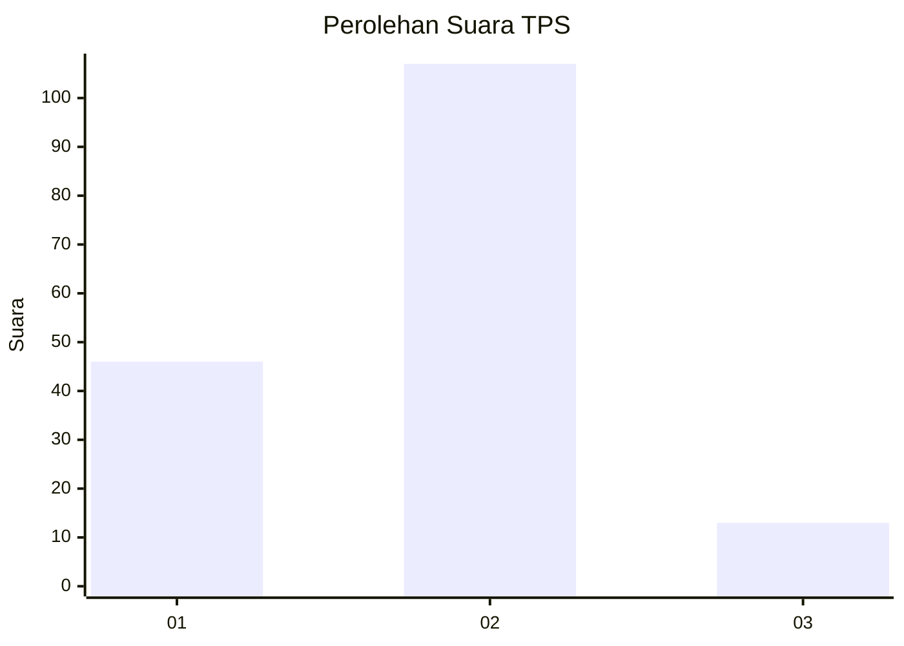
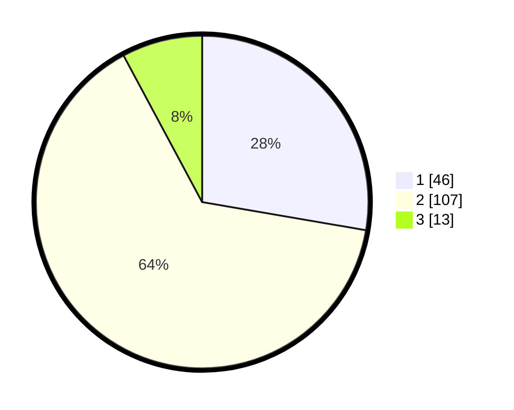

# Hasil

## Grafik

## Tabel

| No. | Nama Paslon    | Suara | Suara (raw) | Persentase |
|:--- |:-------------- | -----:| -----------:| ----------:|
| 1   | ANIES MUHAIMIN | 46    | [46][p-1]   | 27,71      |
| 2   | PRABOWO GIBRAN | 107   | [107][p-2]  | 64,46      |
| 3   | GANJAR MAHFUD  | 13    | [13][p-3]   | 7,83       |

[p-1]: https://github.com/gigit-pemilu/pemilu-2024/blob/main/pilpres/hitung-suara/sub/35-jawa-timur/sub/29-sumenep/sub/03-manding/sub/2001-kasengan/sub/007-tps/sub/paslon-1.txt
[p-2]: https://github.com/gigit-pemilu/pemilu-2024/blob/main/pilpres/hitung-suara/sub/35-jawa-timur/sub/29-sumenep/sub/03-manding/sub/2001-kasengan/sub/007-tps/sub/paslon-2.txt
[p-3]: https://github.com/gigit-pemilu/pemilu-2024/blob/main/pilpres/hitung-suara/sub/35-jawa-timur/sub/29-sumenep/sub/03-manding/sub/2001-kasengan/sub/007-tps/sub/paslon-3.txt

## Foto C Plano

https://sirekap-obj-formc.kpu.go.id/eeb8/pemilu/ppwp/35/29/03/20/01/3529032001007-20240214-215123--f5aee458-8bcb-45b2-bacb-b6062a555a4a.jpg

https://sirekap-obj-formc.kpu.go.id/eeb8/pemilu/ppwp/35/29/03/20/01/3529032001007-20240214-215258--f375f8ad-f260-4a1e-8a6d-aaac216f1dd9.jpg

https://sirekap-obj-formc.kpu.go.id/eeb8/pemilu/ppwp/35/29/03/20/01/3529032001007-20240214-215442--6b0c79e4-3fdd-4451-8376-92bd3252b505.jpg

## Metadata

| Key        | Value               |
| ---------- | ------------------- |
| Time Stamp | 2024-02-25 13:00:00 |

