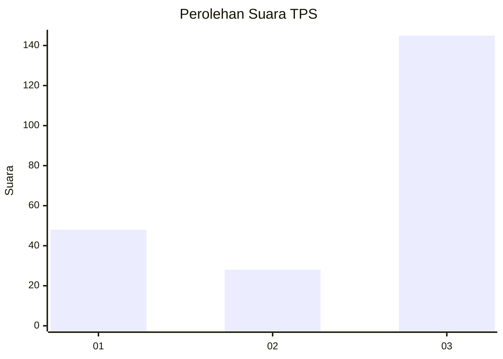
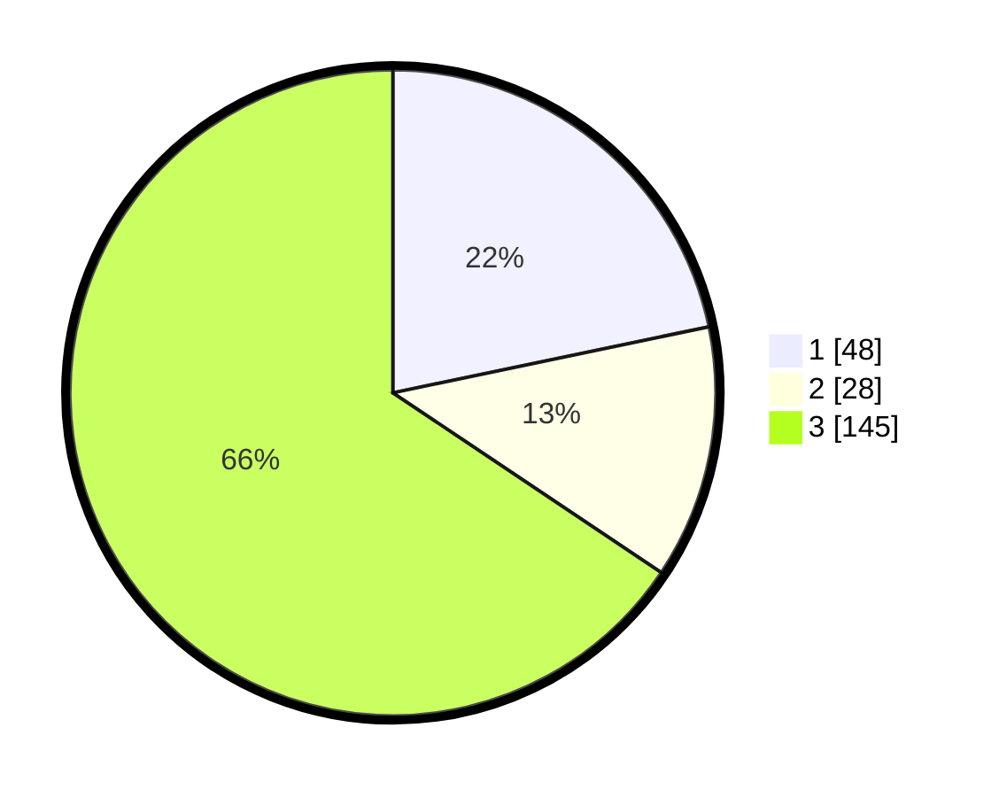

# Hasil

## Grafik

## Tabel

| No. | Nama Paslon    | Suara | Suara (raw) | Persentase |
|:--- |:-------------- | -----:| -----------:| ----------:|
| 1   | ANIES MUHAIMIN | 48    | [48][p-1]   | 21,72      |
| 2   | PRABOWO GIBRAN | 28    | [28][p-2]   | 12,67      |
| 3   | GANJAR MAHFUD  | 145   | [145][p-3]  | 65,61      |

[p-1]: https://github.com/gigit-pemilu/pemilu-2024-35-jawa-timur/blob/main/pilpres/hitung-suara/sub/35-jawa-timur/sub/29-sumenep/sub/03-manding/sub/2004-lanjuk/sub/008-tps/sub/paslon-1.txt
[p-2]: https://github.com/gigit-pemilu/pemilu-2024-35-jawa-timur/blob/main/pilpres/hitung-suara/sub/35-jawa-timur/sub/29-sumenep/sub/03-manding/sub/2004-lanjuk/sub/008-tps/sub/paslon-2.txt
[p-3]: https://github.com/gigit-pemilu/pemilu-2024-35-jawa-timur/blob/main/pilpres/hitung-suara/sub/35-jawa-timur/sub/29-sumenep/sub/03-manding/sub/2004-lanjuk/sub/008-tps/sub/paslon-3.txt

## Foto C Plano

https://sirekap-obj-formc.kpu.go.id/096e/pemilu/ppwp/35/29/03/20/04/3529032004008-20240219-150108--cc8b5124-7b02-4f61-aed5-c78af26a8c0c.jpg

https://sirekap-obj-formc.kpu.go.id/096e/pemilu/ppwp/35/29/03/20/04/3529032004008-20240219-150829--d1147d05-2437-44a9-9791-11cea5415a45.jpg

https://sirekap-obj-formc.kpu.go.id/096e/pemilu/ppwp/35/29/03/20/04/3529032004008-20240219-150452--3592d7fb-c2cb-4f58-8dca-74392f60e359.jpg

## Metadata

| Key        | Value               |
| ---------- | ------------------- |
| Time Stamp | 2024-02-24 22:31:28 |

