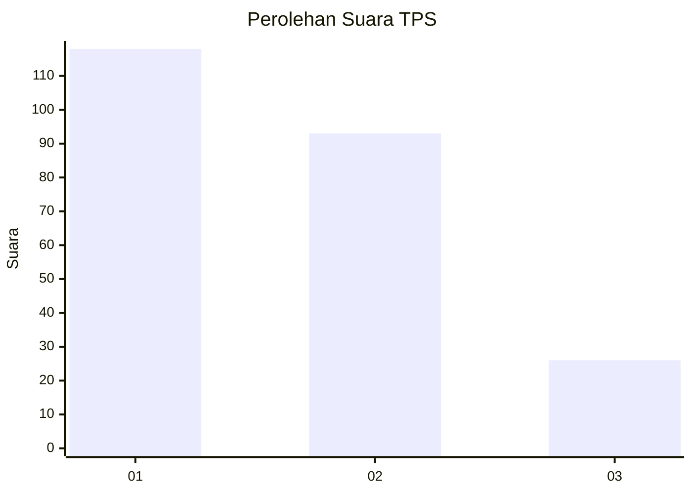
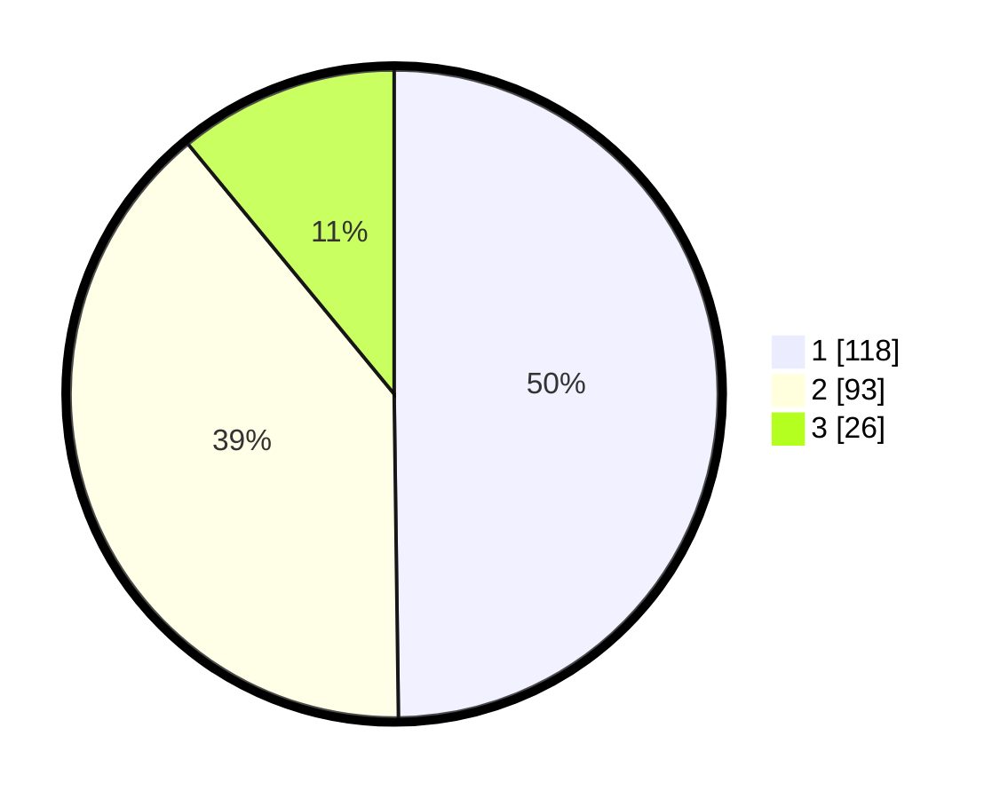

# Hasil

## Grafik

## Tabel

| No. | Nama Paslon    | Suara | Suara (raw) | Persentase |
|:--- |:-------------- | -----:| -----------:| ----------:|
| 1   | ANIES MUHAIMIN | 118   | [118][p-1]  | 49,79      |
| 2   | PRABOWO GIBRAN | 93    | [93][p-2]   | 39,24      |
| 3   | GANJAR MAHFUD  | 26    | [26][p-3]   | 10,97      |

[p-1]: https://github.com/gigit-pemilu/pemilu-2024/blob/main/pilpres/hitung-suara/sub/35-jawa-timur/sub/29-sumenep/sub/03-manding/sub/2005-gadding/sub/002-tps/sub/paslon-1.txt
[p-2]: https://github.com/gigit-pemilu/pemilu-2024/blob/main/pilpres/hitung-suara/sub/35-jawa-timur/sub/29-sumenep/sub/03-manding/sub/2005-gadding/sub/002-tps/sub/paslon-2.txt
[p-3]: https://github.com/gigit-pemilu/pemilu-2024/blob/main/pilpres/hitung-suara/sub/35-jawa-timur/sub/29-sumenep/sub/03-manding/sub/2005-gadding/sub/002-tps/sub/paslon-3.txt

## Foto C Plano

https://sirekap-obj-formc.kpu.go.id/af96/pemilu/ppwp/35/29/03/20/05/3529032005002-20240215-005201--e8a41013-3683-4abd-ae44-90434d92d52c.jpg

https://sirekap-obj-formc.kpu.go.id/af96/pemilu/ppwp/35/29/03/20/05/3529032005002-20240215-005204--1e06d549-b61e-4563-a418-ae405a32556b.jpg

https://sirekap-obj-formc.kpu.go.id/af96/pemilu/ppwp/35/29/03/20/05/3529032005002-20240215-005208--4de39d5a-cc16-430d-ac3c-2767b75e16af.jpg

## Metadata

| Key        | Value               |
| ---------- | ------------------- |
| Time Stamp | 2024-02-15 17:30:25 |

