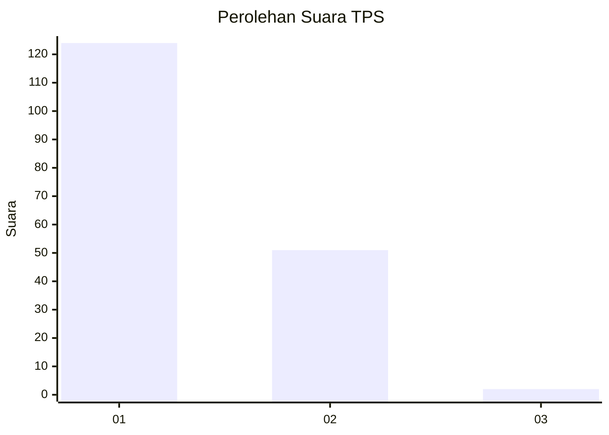
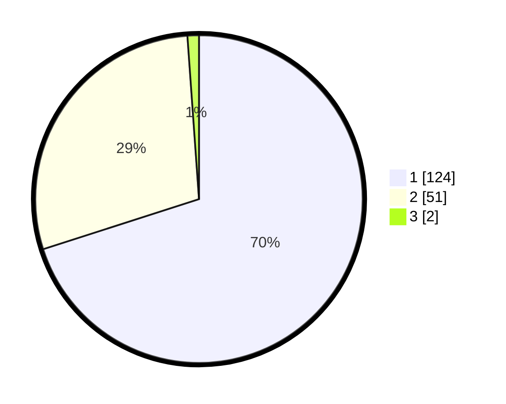

# Hasil

## Grafik

## Tabel

| No. | Nama Paslon    | Suara | Suara (raw) | Persentase |
|:--- |:-------------- | -----:| -----------:| ----------:|
| 1   | ANIES MUHAIMIN | 124   | [124][p-1]  | 70,06      |
| 2   | PRABOWO GIBRAN | 51    | [51][p-2]   | 28,81      |
| 3   | GANJAR MAHFUD  | 2     | [2][p-3]    | 1,13       |

[p-1]: https://github.com/gigit-pemilu/pemilu-2024-35-jawa-timur/blob/main/pilpres/hitung-suara/sub/35-jawa-timur/sub/29-sumenep/sub/03-manding/sub/2005-gadding/sub/005-tps/sub/paslon-1.txt
[p-2]: https://github.com/gigit-pemilu/pemilu-2024-35-jawa-timur/blob/main/pilpres/hitung-suara/sub/35-jawa-timur/sub/29-sumenep/sub/03-manding/sub/2005-gadding/sub/005-tps/sub/paslon-2.txt
[p-3]: https://github.com/gigit-pemilu/pemilu-2024-35-jawa-timur/blob/main/pilpres/hitung-suara/sub/35-jawa-timur/sub/29-sumenep/sub/03-manding/sub/2005-gadding/sub/005-tps/sub/paslon-3.txt

## Foto C Plano

https://sirekap-obj-formc.kpu.go.id/51d7/pemilu/ppwp/35/29/03/20/05/3529032005005-20240215-020452--4d098673-0bf3-405d-b03e-bcb706ce859a.jpg

https://sirekap-obj-formc.kpu.go.id/51d7/pemilu/ppwp/35/29/03/20/05/3529032005005-20240215-020555--643c11b9-93c3-4e33-8c13-d37564c621c1.jpg

https://sirekap-obj-formc.kpu.go.id/51d7/pemilu/ppwp/35/29/03/20/05/3529032005005-20240215-020713--fd684bd0-8263-45f7-9128-a25ac1a876d1.jpg

## Metadata

| Key        | Value               |
| ---------- | ------------------- |
| Time Stamp | 2024-02-25 00:00:00 |

