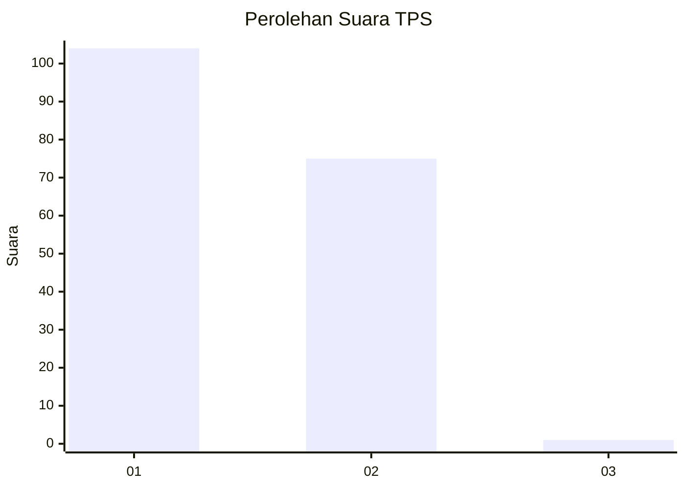
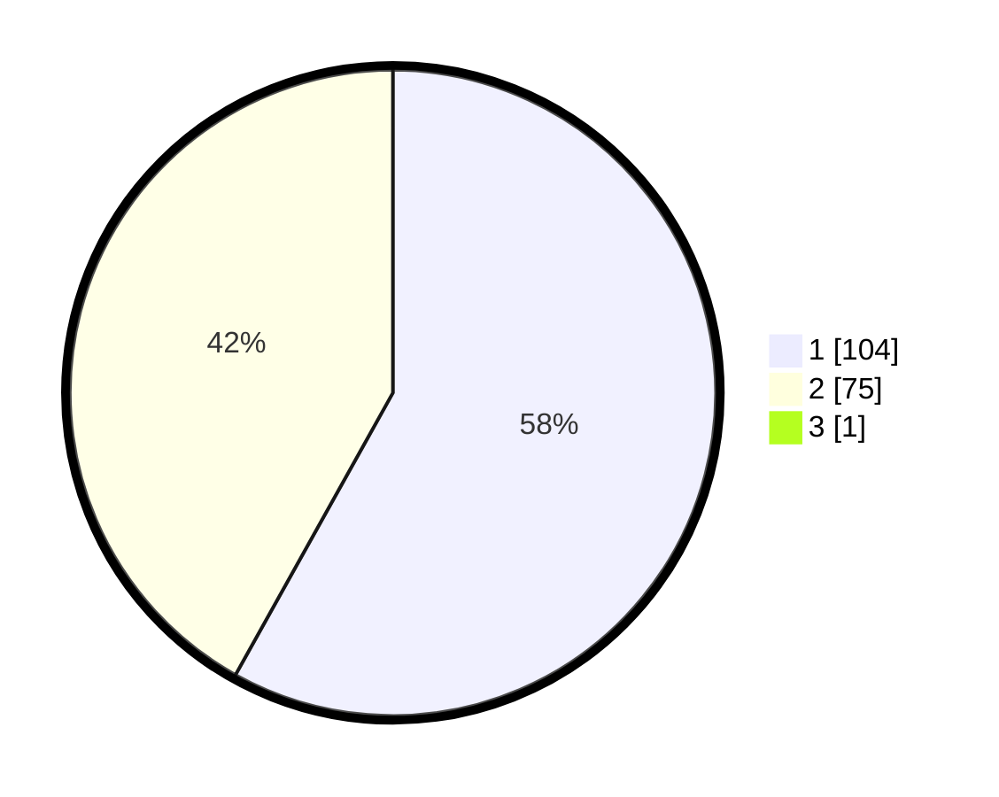

# Hasil

## Grafik

## Tabel

| No. | Nama Paslon    | Suara | Suara (raw) | Persentase |
|:--- |:-------------- | -----:| -----------:| ----------:|
| 1   | ANIES MUHAIMIN | 104   | [104][p-1]  | 57,78      |
| 2   | PRABOWO GIBRAN | 75    | [75][p-2]   | 41,67      |
| 3   | GANJAR MAHFUD  | 1     | [1][p-3]    | 0,56       |

[p-1]: https://github.com/gigit-pemilu/pemilu-2024/blob/main/pilpres/hitung-suara/sub/35-jawa-timur/sub/29-sumenep/sub/03-manding/sub/2005-gadding/sub/008-tps/sub/paslon-1.txt
[p-2]: https://github.com/gigit-pemilu/pemilu-2024/blob/main/pilpres/hitung-suara/sub/35-jawa-timur/sub/29-sumenep/sub/03-manding/sub/2005-gadding/sub/008-tps/sub/paslon-2.txt
[p-3]: https://github.com/gigit-pemilu/pemilu-2024/blob/main/pilpres/hitung-suara/sub/35-jawa-timur/sub/29-sumenep/sub/03-manding/sub/2005-gadding/sub/008-tps/sub/paslon-3.txt

## Foto C Plano

https://sirekap-obj-formc.kpu.go.id/e0aa/pemilu/ppwp/35/29/03/20/05/3529032005008-20240215-031955--a8691244-45bb-406a-ae6f-4857ef663a05.jpg

https://sirekap-obj-formc.kpu.go.id/e0aa/pemilu/ppwp/35/29/03/20/05/3529032005008-20240215-032117--4bfb16a1-359a-4c99-bc90-f7933b4b5de3.jpg

https://sirekap-obj-formc.kpu.go.id/e0aa/pemilu/ppwp/35/29/03/20/05/3529032005008-20240215-032218--4144e680-49f2-418f-87f3-fe5c0176df43.jpg

## Metadata

| Key        | Value               |
| ---------- | ------------------- |
| Time Stamp | 2024-02-25 14:00:00 |

