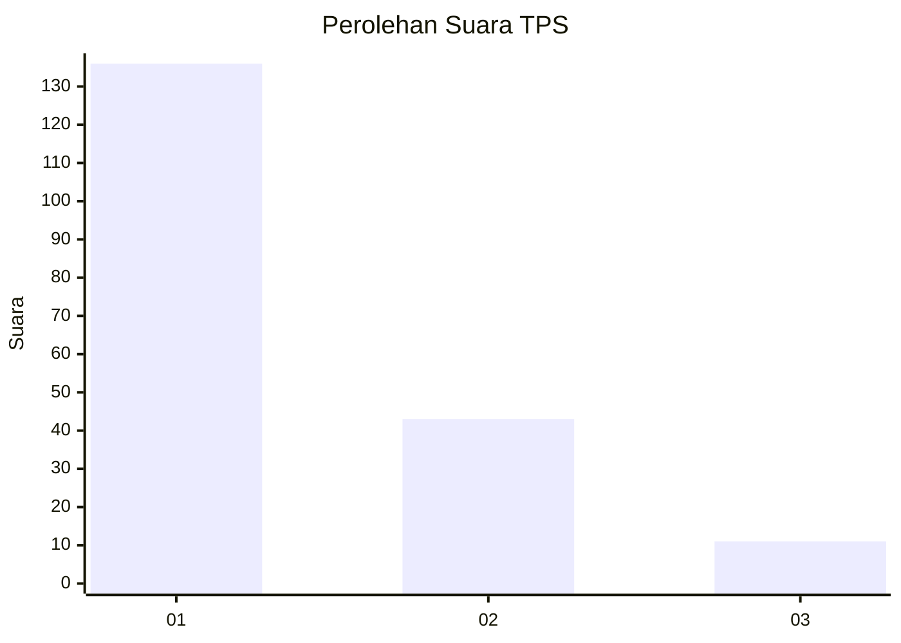
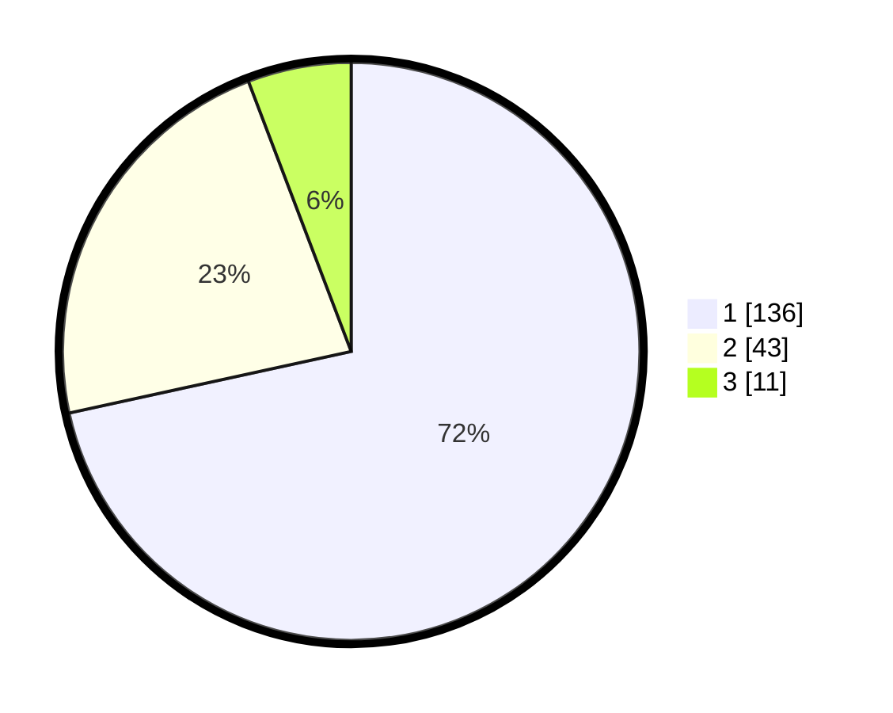

# Hasil

## Grafik

## Tabel

| No. | Nama Paslon    | Suara | Suara (raw) | Persentase |
|:--- |:-------------- | -----:| -----------:| ----------:|
| 1   | ANIES MUHAIMIN | 136   | [136][p-1]  | 71,58      |
| 2   | PRABOWO GIBRAN | 43    | [43][p-2]   | 22,63      |
| 3   | GANJAR MAHFUD  | 11    | [11][p-3]   | 5,79       |

[p-1]: https://github.com/gigit-pemilu/pemilu-2024-35-jawa-timur/blob/main/pilpres/hitung-suara/sub/35-jawa-timur/sub/29-sumenep/sub/03-manding/sub/2008-jaba'an/sub/003-tps/sub/paslon-1.txt
[p-2]: https://github.com/gigit-pemilu/pemilu-2024-35-jawa-timur/blob/main/pilpres/hitung-suara/sub/35-jawa-timur/sub/29-sumenep/sub/03-manding/sub/2008-jaba'an/sub/003-tps/sub/paslon-2.txt
[p-3]: https://github.com/gigit-pemilu/pemilu-2024-35-jawa-timur/blob/main/pilpres/hitung-suara/sub/35-jawa-timur/sub/29-sumenep/sub/03-manding/sub/2008-jaba'an/sub/003-tps/sub/paslon-3.txt

## Foto C Plano

https://sirekap-obj-formc.kpu.go.id/eed8/pemilu/ppwp/35/29/03/20/08/3529032008003-20240215-093450--3fcb569f-754d-4c3c-aeab-bb00d7f04e24.jpg

https://sirekap-obj-formc.kpu.go.id/eed8/pemilu/ppwp/35/29/03/20/08/3529032008003-20240215-093756--77196148-9c5f-4bc9-915d-0d064943cd59.jpg

https://sirekap-obj-formc.kpu.go.id/eed8/pemilu/ppwp/35/29/03/20/08/3529032008003-20240215-094026--6fa6e80b-0e02-41db-a287-3a6b1db5039b.jpg

## Metadata

| Key        | Value               |
| ---------- | ------------------- |
| Time Stamp | 2024-02-15 15:00:29 |

