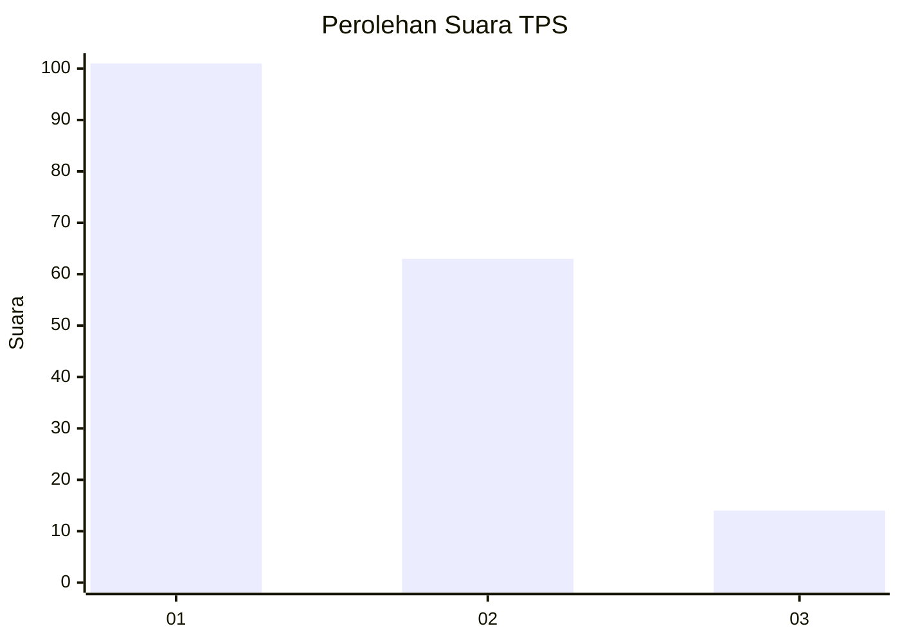
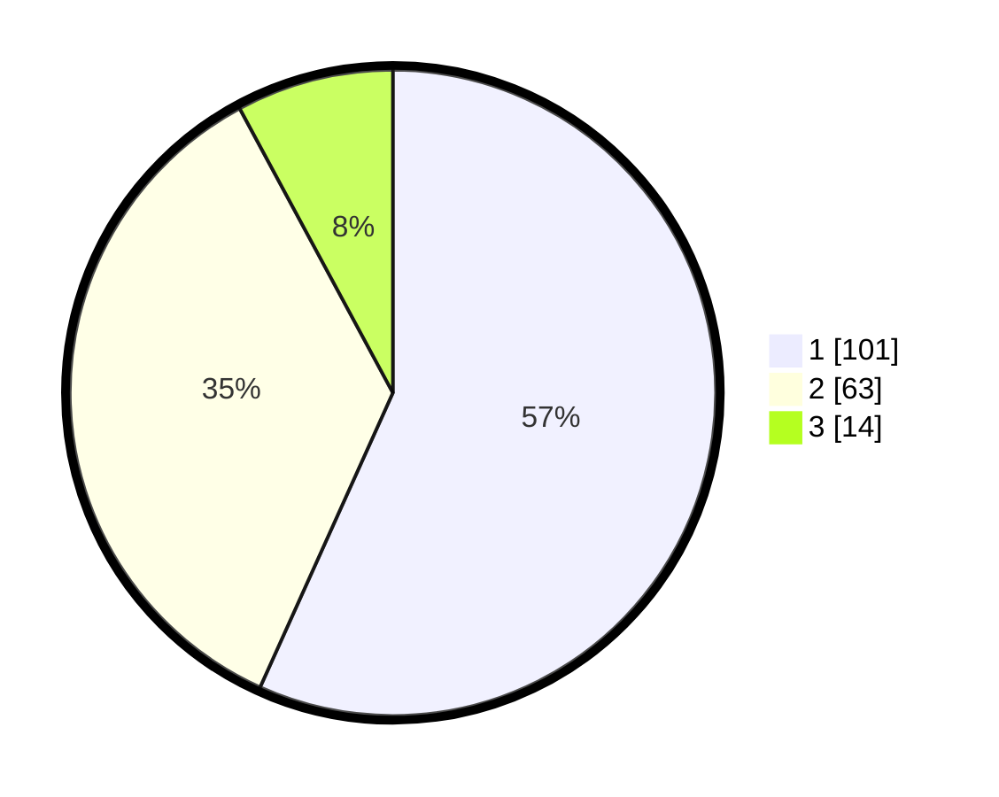

# Hasil

## Grafik

## Tabel

| No. | Nama Paslon    | Suara | Suara (raw) | Persentase |
|:--- |:-------------- | -----:| -----------:| ----------:|
| 1   | ANIES MUHAIMIN | 101   | [101][p-1]  | 56,74      |
| 2   | PRABOWO GIBRAN | 63    | [63][p-2]   | 35,39      |
| 3   | GANJAR MAHFUD  | 14    | [14][p-3]   | 7,87       |

[p-1]: https://github.com/gigit-pemilu/pemilu-2024/blob/main/pilpres/hitung-suara/sub/35-jawa-timur/sub/29-sumenep/sub/03-manding/sub/2010-manding-timur/sub/006-tps/sub/paslon-1.txt
[p-2]: https://github.com/gigit-pemilu/pemilu-2024/blob/main/pilpres/hitung-suara/sub/35-jawa-timur/sub/29-sumenep/sub/03-manding/sub/2010-manding-timur/sub/006-tps/sub/paslon-2.txt
[p-3]: https://github.com/gigit-pemilu/pemilu-2024/blob/main/pilpres/hitung-suara/sub/35-jawa-timur/sub/29-sumenep/sub/03-manding/sub/2010-manding-timur/sub/006-tps/sub/paslon-3.txt

## Foto C Plano

https://sirekap-obj-formc.kpu.go.id/fcf7/pemilu/ppwp/35/29/03/20/10/3529032010006-20240214-192930--b5979c4b-ce8c-4c1a-85ae-e609c1135e7d.jpg

https://sirekap-obj-formc.kpu.go.id/fcf7/pemilu/ppwp/35/29/03/20/10/3529032010006-20240214-193312--81fe9602-a8cc-480f-aa33-106d8163d775.jpg

https://sirekap-obj-formc.kpu.go.id/fcf7/pemilu/ppwp/35/29/03/20/10/3529032010006-20240214-201703--4544721c-c84b-46ae-9103-30077bec8875.jpg

## Metadata

| Key        | Value               |
| ---------- | ------------------- |
| Time Stamp | 2024-02-14 21:46:01 |

