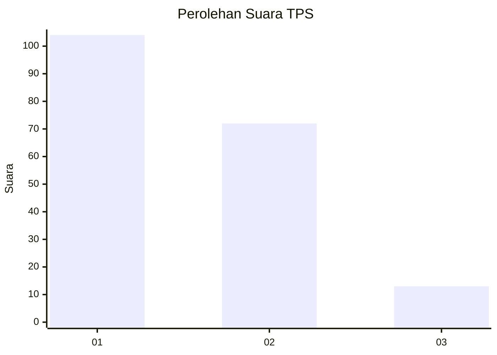
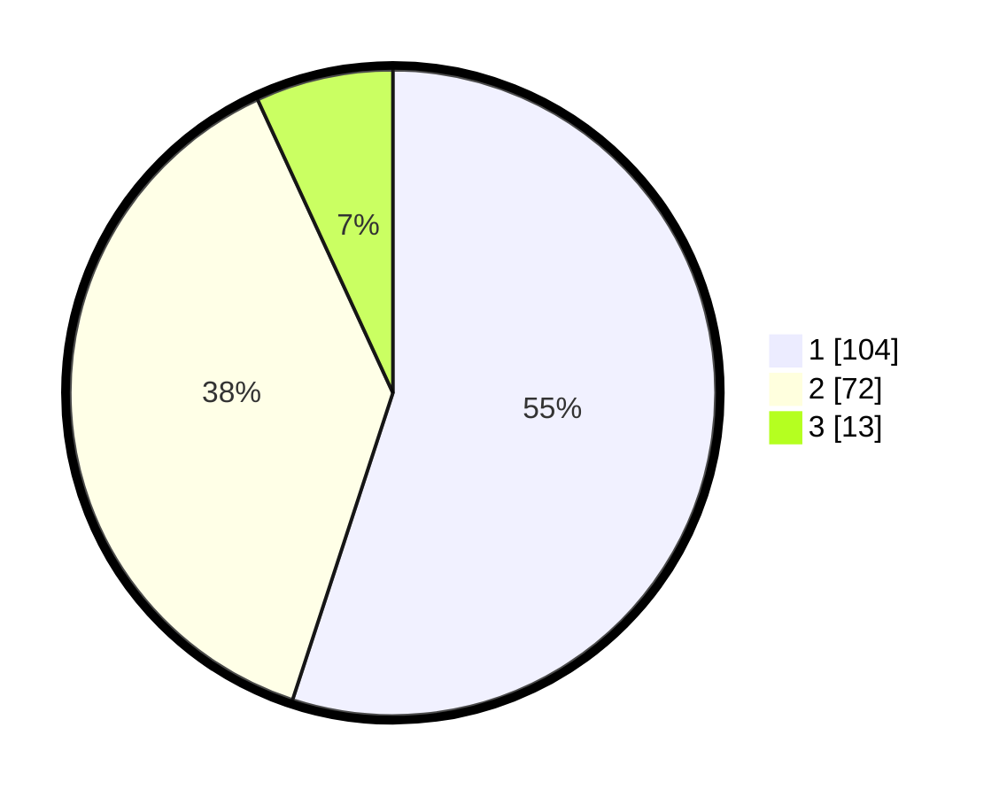

# Hasil

## Grafik

## Tabel

| No. | Nama Paslon    | Suara | Suara (raw) | Persentase |
|:--- |:-------------- | -----:| -----------:| ----------:|
| 1   | ANIES MUHAIMIN | 104   | [104][p-1]  | 55,03      |
| 2   | PRABOWO GIBRAN | 72    | [72][p-2]   | 38,10      |
| 3   | GANJAR MAHFUD  | 13    | [13][p-3]   | 6,88       |

[p-1]: https://github.com/gigit-pemilu/pemilu-2024/blob/main/pilpres/hitung-suara/sub/35-jawa-timur/sub/29-sumenep/sub/03-manding/sub/2010-manding-timur/sub/008-tps/sub/paslon-1.txt
[p-2]: https://github.com/gigit-pemilu/pemilu-2024/blob/main/pilpres/hitung-suara/sub/35-jawa-timur/sub/29-sumenep/sub/03-manding/sub/2010-manding-timur/sub/008-tps/sub/paslon-2.txt
[p-3]: https://github.com/gigit-pemilu/pemilu-2024/blob/main/pilpres/hitung-suara/sub/35-jawa-timur/sub/29-sumenep/sub/03-manding/sub/2010-manding-timur/sub/008-tps/sub/paslon-3.txt

## Foto C Plano

https://sirekap-obj-formc.kpu.go.id/b521/pemilu/ppwp/35/29/03/20/10/3529032010008-20240214-214543--7f2c8c8d-97a8-4174-a470-cc094c895895.jpg

https://sirekap-obj-formc.kpu.go.id/b521/pemilu/ppwp/35/29/03/20/10/3529032010008-20240214-214732--f68840e0-a343-4703-9154-5f0f6f6ea214.jpg

https://sirekap-obj-formc.kpu.go.id/b521/pemilu/ppwp/35/29/03/20/10/3529032010008-20240214-214850--3190edf3-81fb-4b30-be9a-b5bd4888ee7f.jpg

## Metadata

| Key        | Value               |
| ---------- | ------------------- |
| Time Stamp | 2024-02-15 19:00:26 |

