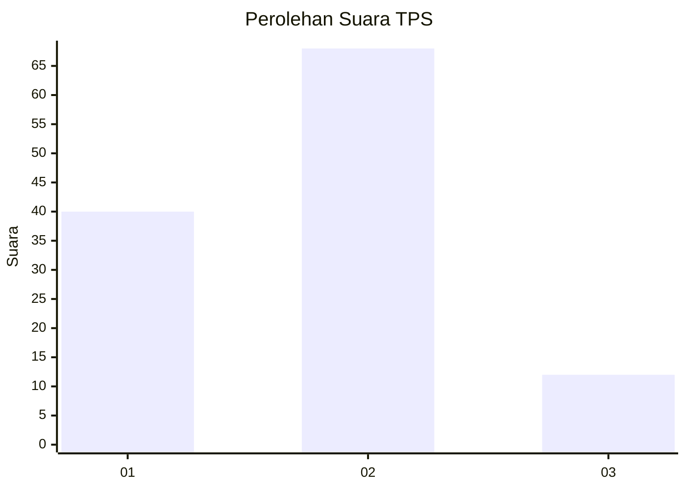
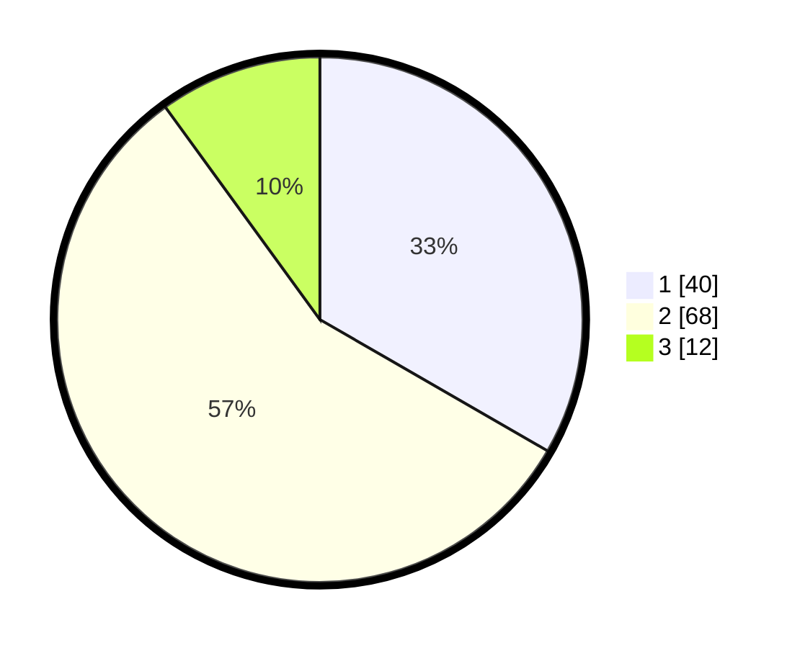

# Hasil

## Grafik

## Tabel

| No. | Nama Paslon    | Suara | Suara (raw) | Persentase |
|:--- |:-------------- | -----:| -----------:| ----------:|
| 1   | ANIES MUHAIMIN | 40    | [40][p-1]   | 33,33      |
| 2   | PRABOWO GIBRAN | 68    | [68][p-2]   | 56,67      |
| 3   | GANJAR MAHFUD  | 12    | [12][p-3]   | 10,00      |

[p-1]: https://github.com/gigit-pemilu/pemilu-2024/blob/main/pilpres/hitung-suara/sub/35-jawa-timur/sub/29-sumenep/sub/04-talango/sub/2001-talango/sub/009-tps/sub/paslon-1.txt
[p-2]: https://github.com/gigit-pemilu/pemilu-2024/blob/main/pilpres/hitung-suara/sub/35-jawa-timur/sub/29-sumenep/sub/04-talango/sub/2001-talango/sub/009-tps/sub/paslon-2.txt
[p-3]: https://github.com/gigit-pemilu/pemilu-2024/blob/main/pilpres/hitung-suara/sub/35-jawa-timur/sub/29-sumenep/sub/04-talango/sub/2001-talango/sub/009-tps/sub/paslon-3.txt

## Foto C Plano

https://sirekap-obj-formc.kpu.go.id/6a46/pemilu/ppwp/35/29/04/20/01/3529042001009-20240216-144013--d3bbee75-b77a-45fa-9dc4-facc65b99887.jpg

https://sirekap-obj-formc.kpu.go.id/6a46/pemilu/ppwp/35/29/04/20/01/3529042001009-20240216-144014--95d9d461-cdb1-4202-a67a-cd8ee9f16f0e.jpg

https://sirekap-obj-formc.kpu.go.id/6a46/pemilu/ppwp/35/29/04/20/01/3529042001009-20240216-144014--8752b78f-037e-418c-88f6-bb48335d2c2a.jpg

## Metadata

| Key        | Value               |
| ---------- | ------------------- |
| Time Stamp | 2024-02-16 16:25:10 |

## DATA PEMILIH TETAP

Jumlah pemilih dalam DPT: **198**.
 * L: **92**.
 * P: **106**.

## DATA PENGGUNA HAK PILIH

Jumlah pengguna hak pilih dalam DPT: **123**.
 * L: **53**.
 * P: **70**.

Jumlah pengguna hak pilih dalam DPTb: **0**.
 * L: **0**.
 * P: **0**.

Jumlah pengguna hak pilih dalam DPK: **0**.
 * L: **0**.
 * P: **4**.

Jumlah pengguna hak pilih: **127**.
 * L: **53**.
 * P: **74**.

## JUMLAH SUARA SAH DAN TIDAK SAH

JUMLAH SELURUH SUARA SAH: **120**.

JUMLAH SUARA TIDAK SAH: **7**.

JUMLAH SELURUH SUARA SAH DAN SUARA TIDAK SAH: **127**.

